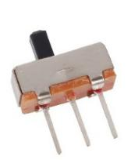
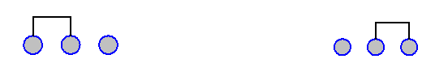
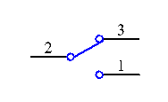
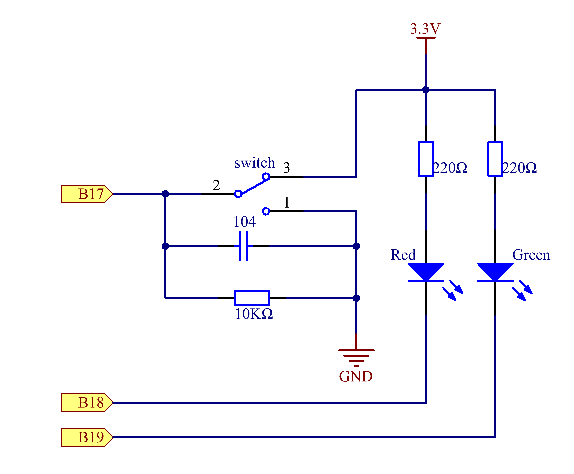
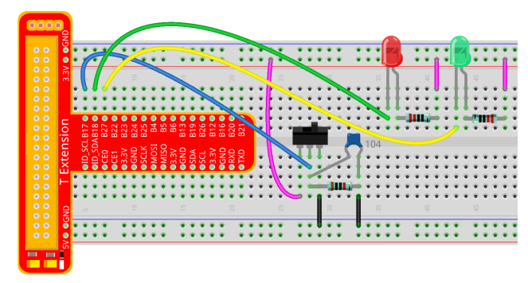
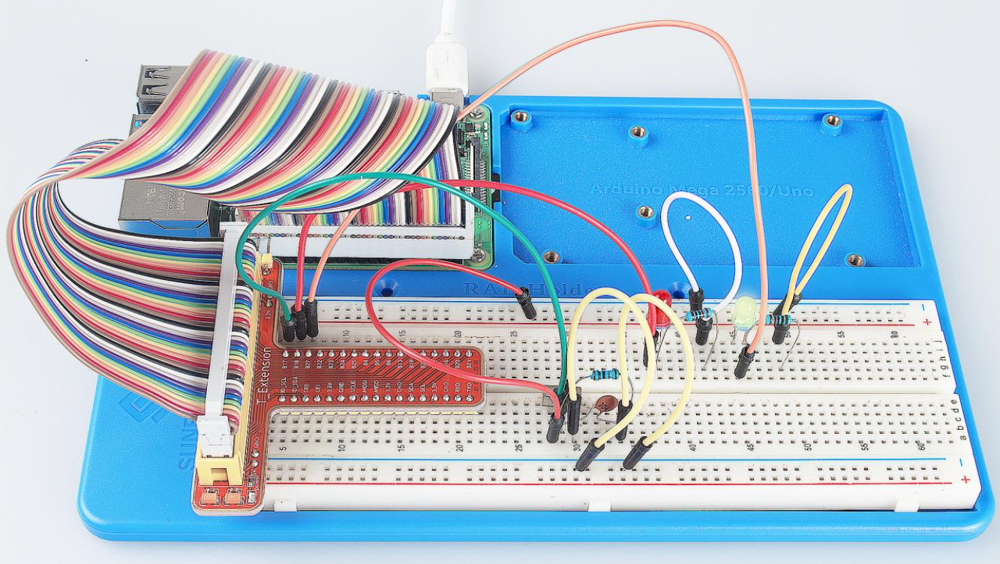

Lesson 10 Slide Switch
========================

Introduction
----------------

In this lesson, we will learn how to use a Slide Switch. Usually, the
slide switch is soldered on PCB as a power switch, but here we need to
insert it into the breadboard, thus it may not be tightened. And we use
it on the breadboard is to show its function.

Components
----------------

\- 1 \* Raspberry Pi

\- 1 \* T-Extension Board

\- 1 \* 40-Pin GPIO Cable

\- 1 \* Breadboard

\- 1 \* Slide Switch

\- 2 \* LED

\- 3 \* Resistors (220Ω,10kΩ)

\- 1 \* USB cable

\- Jumper wires

\- 1 \* 104 Capacitor Ceramic

Principle
----------------

**Slide Switch**

A slide switch, just as its name implies, is to slide the switch bar to
connect or break the circuit, and further switch circuits. The
common-used types are SPDT, SPTT, DPDT, DPTT etc. The Slide Switch is
commonly used in low-voltage circuit. It features flexibility and
stability, and widely applies in electric instruments and electric toys.

How it works: Use the middle pin as the fixed one. When you pull the
slide to the left, the left two pins are connected; to the right, the
right two pins connected. Thus, it connects and disconnects circuits as
a switch. See the figure below:

The circuit symbol of the slide switch is as shown below. 2 in the
figure means the middle pin.

**Principle:** Connect the middle pin of the Slide Switch to B17, and
two LEDs to pin B18 and B27 respectively. Then when you pull the slide,
you can see the two LEDs light up alternately.

   
Experimental Procedures
----------------------------

**Step 1:** Build the circuit.

For C Language Users:
^^^^^^^^^^^^^^^^^^^^^^^^^^

**Step 2**: Go to the folder of the code.

.. raw:: html

   <run></run>
   
.. code-block::

   cd /home/pi/SunFounder_Super_Kit_V3.0_for_Raspberry_Pi/C

**Step 3:** Compile.

.. raw:: html

   <run></run>
   
.. code-block::

   make 10_slideSwitch

**Step 4:** Run the executable file above.

.. raw:: html

   <run></run>
   
.. code-block::

   sudo ./10_slideSwitch

.. note::
   
   If it does not work after running, please refer to :ref:`C code is not working?`

**Code**

.. code-block:: C

   #include <wiringPi.h>
   #include <stdio.h>
   
   #define slidePin		0
   #define led1			1
   #define led2 			2
   
   int main(void)
   {
      // When initialize wiring failed, print messageto screen
      if(wiringPiSetup() == -1){
         printf("setup wiringPi failed !");
         return 1; 
      }
      
      pinMode(slidePin, INPUT);
      pinMode(led1, OUTPUT);
      pinMode(led2, OUTPUT);
   
      printf("\n");
      printf("\n");
      printf("========================================\n");
      printf("|              Slide Switch            |\n");
      printf("|    ------------------------------    |\n");
      printf("|      Middle pin of slide switch      |\n");
      printf("|         connect to gpio0；           |\n");
      printf("|                                      |\n");
      printf("|slide switch to contral which led on. |\n");
      printf("|                                      |\n");
      printf("|                            SunFounder|\n");
      printf("========================================");
      printf("\n");
      printf("\n");
      
      while(1){
         // slide switch high, led1 on
         if(digitalRead(slidePin) == 1){
            digitalWrite(led1, LOW);
            digitalWrite(led2, HIGH);
            printf("LED1 on\n");
            delay(100);
         }
         // slide switch low, led2 on
         if(digitalRead(slidePin) == 0){
            digitalWrite(led2, LOW);
            digitalWrite(led1, HIGH);
            printf(".....LED2 on\n");
            delay(100);
         }
      }
   
      return 0;
   }

**Code Explanation**

.. code-block:: C

   /* When the slide is pulled to the left, the middle pin and left one are
   connected; the Raspberry Pi reads a high level at the middle pin, so the
   LED1 is on and LED2 off */

   if(digitalRead(slidePin) == 1)
   {

      digitalWrite(led1, LOW);

      digitalWrite(led2, HIGH);

      printf("LED1 on\n");
      delay(100);

   }

   /* When the slide is pulled to the right, the middle pin and right one
   are connected; the Raspberry Pi reads a low, so the LED2 is on and LED1
   off */

   if(digitalRead(slidePin) == 0)
   {

      digitalWrite(led2, LOW);

      digitalWrite(led1, HIGH);

      printf(".....LED2 on\n");
      delay(100);

   }

For Python Users:
^^^^^^^^^^^^^^^^^^^^^^^^

**Step 2:** Get into the folder of the code.

.. raw:: html

   <run></run>
   
.. code-block::

   cd /home/pi/SunFounder_Super_Kit_V3.0_for_Raspberry_Pi/Python

**Step 3:** Run.

.. raw:: html

   <run></run>
   
.. code-block::

   sudo python3 10_slideSwitch.py

**Code**

.. raw:: html

   <run></run>
   
.. code-block:: python

   import RPi.GPIO as GPIO
   import time
   from sys import version_info
   
   if version_info.major == 3:
      raw_input = input
   
   # Set #17 as slide switch pin, #18 as led1 pin, #27 as led2 pin
   slidePin = 17
   led1Pin = 18
   led2Pin = 27
   
   # Define a function to print message at the beginning
   def print_message():
      print ("========================================")
      print ("|              Slide Switch            |")
      print ("|    ------------------------------    |")
      print ("|      Middle pin of slide switch      |")
      print ("|         connect to gpio17;           |")
      print ("|                                      |")
      print ("|slide switch to contral which led on. |")
      print ("|                                      |")
      print ("|                            SunFounder|")
      print ("========================================\n")
      print ("Program is running...")
      print ("Please press Ctrl+C to end the program...")
      #raw_input ("Press Enter to begin\n")
   
   # Define a setup function for some setup
   def setup():
      # Set the GPIO modes to BCM Numbering
      GPIO.setmode(GPIO.BCM)
      # Set slidePin input
      # Set ledPin output, 
      # and initial level to High(3.3v)
      GPIO.setup(slidePin, GPIO.IN)
      GPIO.setup(led1Pin, GPIO.OUT, initial=GPIO.HIGH)
      GPIO.setup(led2Pin, GPIO.OUT, initial=GPIO.HIGH)
   
   # Define a main function for main process
   def main():
      # Print messages
      print_message()
      while True:
         # slide switch high, led1 on
         if GPIO.input(slidePin) == 1:
            print ("   LED1 ON    ")
            GPIO.output(led1Pin, GPIO.LOW)
            GPIO.output(led2Pin, GPIO.HIGH)
   
         # slide switch low, led2 on
         if GPIO.input(slidePin) == 0:
            print ("   LED2 ON    ")
            GPIO.output(led2Pin, GPIO.LOW)
            GPIO.output(led1Pin, GPIO.HIGH)
   
         time.sleep(0.5)
   # Define a destroy function for clean up everything after
   # the script finished 
   def destroy():
      # Turn off LED
      GPIO.output(led1Pin, GPIO.HIGH)
      GPIO.output(led2Pin, GPIO.HIGH)
      # Release resource
      GPIO.cleanup()                     
   
   # If run this script directly, do:
   if __name__ == '__main__':
      setup()
      try:
         main()
      # When 'Ctrl+C' is pressed, the child program 
      # destroy() will be  executed.
      except KeyboardInterrupt:
         destroy()	
         

**Code Explanation**

.. code-block:: python

   '''When the slide is pulled to the left, the middle pin and left one are
   connected; the Raspberry Pi reads a high level at the middle pin, so the
   LED1 is on and LED2 off. '''

   if GPIO.input(slidePin) == 1:

      print (" LED1 ON ")

      GPIO.output(led1Pin, GPIO.LOW)

      GPIO.output(led2Pin, GPIO.HIGH)

   '''When the slide is pulled to the right, the middle pin and right one are
   connected; the Raspberry Pi reads a low, so the LED2 is on and LED1 off.'''

   if GPIO.input(slidePin) == 0:

      print (" LED2 ON ")

      GPIO.output(led2Pin, GPIO.LOW)

      GPIO.output(led1Pin, GPIO.HIGH)

Now pull the slide, and you can see the two LEDs light up alternately.

