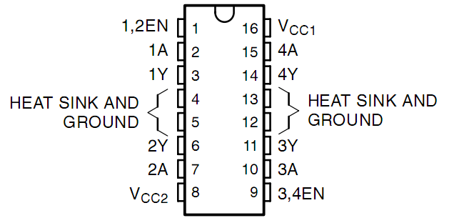
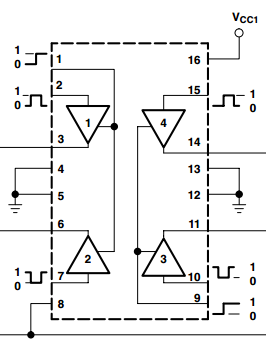
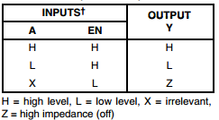
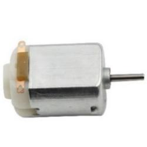
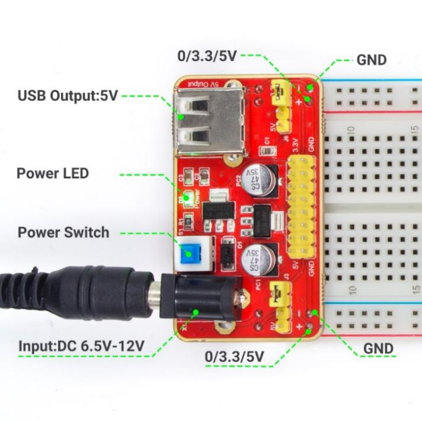
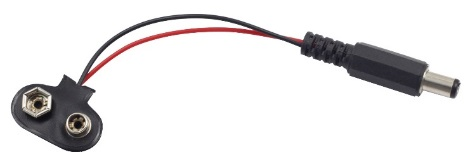
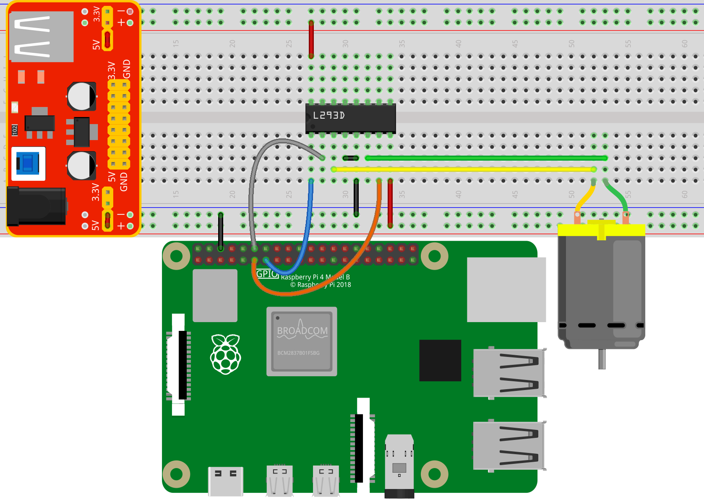
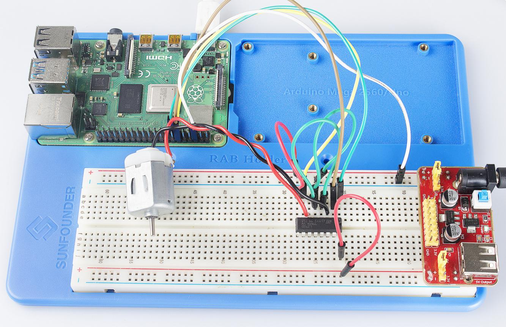

Lesson 11 How to Drive a DC Motor
====================================

Introduction
---------------

In this lesson, we will learn to how to use L293D to drive a DC motor
and make it rotate clockwise and counterclockwise. Since the DC Motor
needs a larger current, for safety purpose, here we use the Power Supply
Module to supply motors.

Components
---------------

\- 1 \* Raspberry Pi

\- 1 \* Breadboard

\- 1 \* L293D

\- 1 \* DC motor

\- 1 \* Power Module

\- Jumper wires

\- 1 \* T-Extension Board

\- 1 \* 40-Pin GPIO Cable

Principle
---------------

**L293D**

L293D is a 4-channel motor driver integrated by chip with high voltage
and high current. It's designed to connect to standard DTL, TTL logic
level, and drive inductive loads (such as relay coils, DC, stepping
motors) and power switching transistors etc. DC Motors are devices that
turn DC electrical energy into mechanical energy. They are widely used
in electrical drive for their superior speed regulation performance.

See the figure of pins below. L293D has two pins (Vcc1 and Vcc2) for
power supply. Vcc2 is used to supply power for the motor, while Vcc1 to
supply for the chip. Since a small-sized DC motor is used here, connect
both pins to +5V.

The following is the internal structure of L293D. Pin **EN** is an
enable pin and only works with high level; **A** stands for input and
**Y** for output. You can see the relationship among them at the right
bottom. When pin **EN** is High level, if **A** is High, **Y** outputs
high level; if A is Low, Y outputs Low level. When pin **EN** is Low
level, the L293D does not work.

In this experiment, it just needs to drive one motor, so here only half
of the L293D will be used.

**DC Motor**

This is a 5V DC motor. It will rotate when you give the two terminals of
the copper sheet one high and one low level. For convenience, you can
weld the pins to it.

Size: 25*20*15MM                      

Operation Voltage: 1-6V

Free-run current (3V): 70m            

A Free-run speed (3V): 13000RPM

Stall current (3V): 800mA             

Shaft diameter: 2mm

**Power Supply Module**

In this experiment, it needs large currents to drive the motor
especially when it starts and stops, which will severely interfere with
the normal work of Raspberry Pi. Therefore, we separately supply power
for the motor by this module to make it run safely and steadily.

You can just plug it in the breadboard to supply power. It provides a
voltage of 3.3V and 5V, and you can connect either via a jumper cap
included.

**Schematic Diagram:**

**Principle:** Plug the power supply module in breadboard, and insert
the jumper cap to pin of 5V, then it will output voltage of 5V. Connect
pin 1 of L293D to B27, and set it as high level. Connect pin2 to B18,
and pin7 to B27, then set one pin high, while the other low. Thus you
can change the motor’s rotation direction.

.. image:: media/image168.png
   :align: center

**Experimental Procedures**

**Step 1:** Build the circuit. Since the power supply module and T-cable
are incompatible, we will not use the T-Cable in this experiment.

**Note:** The power module can apply a 9V battery with the 9V Battery
Buckle in the kit. Insert the jumper cap of the power module into the 5V
bus strips of the breadboard.

For C Language Users:
^^^^^^^^^^^^^^^^^^^^^^^

**Step 2:** Get into the folder of the code.

.. code-block::
    
    cd/home/pi/SunFounder_Super_Kit_V3.0_for_Raspberry_Pi/C

**Step 3:** Compile.

.. code-block::
    
    make 11_motor

**Step 4:** Run the executable file above.

.. code-block::
    
    sudo ./11_motor

**Code Explanation**

.. code-block:: C
        
    digitalWrite(MotorEnable, HIGH) // Enable the L239D

    digitalWrite(MotorPin1, HIGH); 
    // Set a high level for 2A(pin 7); since 1,2EN(pin 1) is in high level, 2Y will output high level
    digitalWrite(MotorPin2, LOW) /* Set a low level for 1A, then 1Y
    will output low level, and the motor will rotate.*/

    for(i=0;i<3;i++)
    {

        delay(1000);

    } // this loop is to delay for 3*1000ms

    digitalWrite(MotorEnable, LOW) 
    // If 1,2EN (pin1) is in low level, L293D does not work. Motor stops rotating.

    digitalWrite(MotorPin1, LOW)

    digitalWrite(MotorPin2, HIGH) 
    // Reverse the current flow of the motor, then the motor will rotate reversely.

For Python Users:
^^^^^^^^^^^^^^^^^^^^

**Step 2:** Get into the folder of the code.

.. code-block::
    
    cd/home/pi/SunFounder_Super_Kit_V3.0_for_Raspberry_Pi/Python

**Step 3:** Run.

sudo python3 11_motor.py

**Code Explanation**

.. code-block:: python
    
        
    GPIO.setup(MotorPin1, GPIO.OUT) 
    # Set pin1 and pin2 for motor’s rotation direction as output pin

    GPIO.setup(MotorPin2, GPIO.OUT)

    GPIO.setup(MotorEnable, GPIO.OUT) 
    # Set pins for motor’s working condition as output pin

    GPIO.output(MotorEnable, GPIO.LOW) 
    # Set the motor low level for initial state

    GPIO.output(MotorEnable, GPIO.HIGH) # Set the motor in high level

    GPIO.output(MotorPin1, GPIO.HIGH) 
    # Set pin1 in high level and pin2 in low level

    GPIO.output(MotorPin2, GPIO.LOW) # Make the motor rotate clockwise

    time.sleep(5) # rotate for 5 seconds

    GPIO.output(MotorEnable, GPIO.LOW) # Stop the motor

    time.sleep(5) #wait for 5 seconds

    #Code for motor counter-clockwise rotation is similar to sketch above

Now, you should see the motor blade rotating.

**Further Exploration**

You can use buttons to control the clockwise and counterclockwise
rotation of the motor blade based on the previous lessons. Also you can
apply the PWM technology to control the rotation.