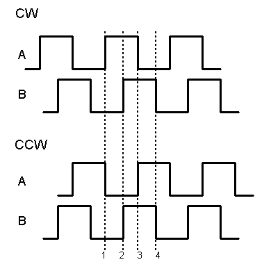
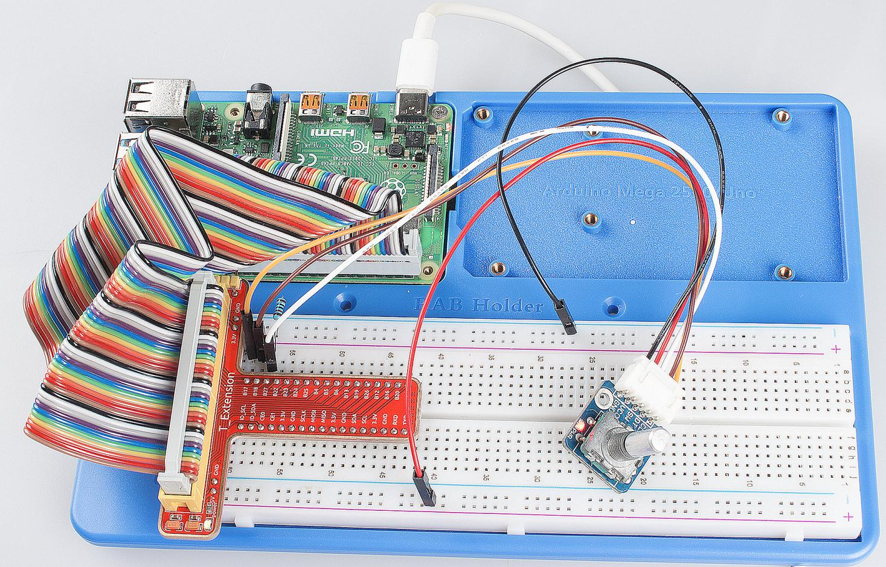

Lesson 12 Rotary Encoder
==========================

Introduction
-------------------------

A rotary encoder is an electro-mechanical device that converts the
angular position or motion of a shaft or axle to analog or digital code.
Rotary encoders are usually placed at the side which is perpendicular to
the shaft. They act as sensors for detecting angle, speed, length,
position, and acceleration in automation field.

Components
-------------------------

\- 1 \* Raspberry Pi

\- 1 \* Breadboard

\- 4 \* Jumper wires (Male to Male, 2 red and 2 black)

\- 1 \* Network cable (or USB wireless network adapter)

\- 1 \* Rotary Encoder module

\- 1 \* 5-Pin anti-reverse cable

\- 1 \* T-Extension Board

\- 1 \* 40-Pin GPIO Cable

Experimental Principle
-------------------------

.. image:: media/image172.png
   :align: center

A rotary encoder is an electronic switch with a set of regular pulses
with strictly timing sequence. When used with IC, it can achieve
increment, decrement, page turning， and other operations such as mouse
scrolling, menu selection, and so on.

There are mainly two types of rotary encoders: absolute and incremental
(relative) encoders. Here we use an incremental (relative) encoders.

Most rotary encoders have 5 pins with three functions of turning left &
right and pressing down. Pin 1 and pin 2 are switch wiring terminals
used to press. Pin 4 is generally connected to ground. Pin 3 and pin 5
are first connected to pull-up resistor and connect to VCC. Pin 3 and
pin 5 generate two-phase square waves whose phase difference is 90°.
Usually the two-phase square waves are called channel A and channel B as
shown below:

We can see from the figure above: If channel A is in low level, and
channel B converts from high level to low, it indicates the Rotary
Encoder has spun clockwise (CW). If channel A is in low level, and
channel B converts from low level to high, it indicates the Rotary
Encoder has spun counter-clockwise (CCW). Thus when channel A is in low
level, we can know the direction that Rotary Encoder spun by channel B.

The schematic diagram of the Rotary Encoder is shown as below. We can
see that pin 3 on the Rotary Encoder is CLK of the module, while pin 5
is DT. Then we can know the Rotary’s rotating direction by the value of
CLK and DT.

It is summarized by using oscilloscope to observe the output waveform of
CLK and DT and operating the rotary encoder. You can try yourself.

Experimental Procedures
------------------------------

**Step 1:** Build the circuit.

For C Language Users:
^^^^^^^^^^^^^^^^^^^^^^^^

**Step 2:** Get into the folder of the code.

.. code-bock::
    
    cd/home/pi/SunFounder_Super_Kit_V3.0_for_Raspberry_Pi/C

**Step 3:** Compile.

.. code-bock::
    
    make 12_rotaryEncoder

**Step 4:** Run the executable file above.

.. code-bock::
    
    sudo ./12_rotaryEncoder

**Code Explanation**

.. code-block:: C
        
    #define RoAPin 0 // CLK connects to B17, define B17 as 0 in wiring Pi.

    #define RoBPin 1 // DT connects to GPIO1, define B18 as 1 in wiring Pi.

    #define SWPin 2 // SW connects to GPIO2

    void rotaryDeal(void) 
    /* Pi detects the pulse when spinning the rotary
    encoder, and judge the spinning direction, then increase or decrease the
    value of globalCounter to record the angular displacement. */
    {
        Last_RoB_Status = digitalRead(RoBPin); // Read the value of DT

        while(!digitalRead(RoAPin))  // If CLK is low, run the program below.
        {
            Current_RoB_Status = digitalRead(RoBPin); 
            // Read the value of DT, and store it in Current_RoB_Status.
            flag = 1;
        }

        if(flag == 1) // If CLK outputs low level, then flag=1
        {
            flag = 0;
            if((Last_RoB_Status == 0)&&(Current_RoB_Status == 1))
            // If DT value converts from low to high, the globalCounter adds 1.
            {
                globalCounter ++;	
            }
            if((Last_RoB_Status == 1)&&(Current_RoB_Status == 0))
            //If DT value converts from high to low                     
            {
                globalCounter --;  // the globalCounter decreases 1.
            }
        }
    }

    printf("globalCounter : %d\n",globalCounter); // Print the value of globaCounter.

    void btnISR(void): // If the rotary encoder is pressed down, reset the value.

For Python Users:
^^^^^^^^^^^^^^^^^^^^^

**Step 2:** Get into the folder of the code.

.. code-block::

    cd/home/pi/SunFounder_Super_Kit_V3.0_for_Raspberry_Pi/Python

**Step 3:** Run.

.. code-block::

    sudo python3 12_rotaryEncoder.py

**Code Explanation**

.. code-block:: python

    
    globalCounter = 0 # Set a global variable to count

    flag = 0 # Set a flag for reverse spinning.

    Last_RoB_Status = 0 # Set a variable to store the previous state of pinB

    Current_RoB_Status = 0 # Set a variable to store the present state of pinB

    
    # Define a function to deal with rotary encoder

    def rotaryDeal():

        global counter

        global Last_RoB_Status, Current_RoB_Status

        flag = 0

        Last_RoB_Status = GPIO.input(RoBPin) # Store channel B state

        # When RoAPin level changes

        while(not GPIO.input(RoAPin)): # When channel A is not in low, exit the while loop

            Current_RoB_Status = GPIO.input(RoBPin)

            flag = 1

        if flag == 1: # If flag value is 1, the rotary encoder is CW rotating

            # Reset flag

            flag = 0

            if (Last_RoB_Status == 0) and (Current_RoB_Status == 1):

            counter = counter + 1

            if (Last_RoB_Status == 1) and (Current_RoB_Status == 0):

            counter = counter - 1

            print ("counter = %d" % counter)

    
        # Define a callback function on switch, to clean "counter"

    def clear(ev=None):

        global counter

        counter = 0

Now, gently rotate the encoder to change the value of the variable in
the above program， and you will see the value printed on the screen.
Rotate the encoder clockwise, the value will increase; or rotate it
counterclockwise, the value will decrease.

   

