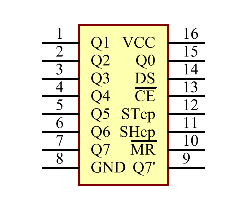
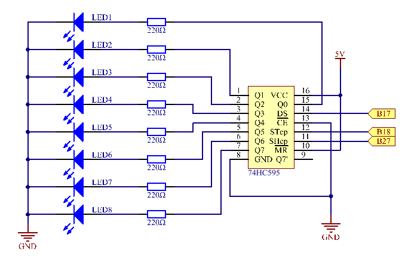
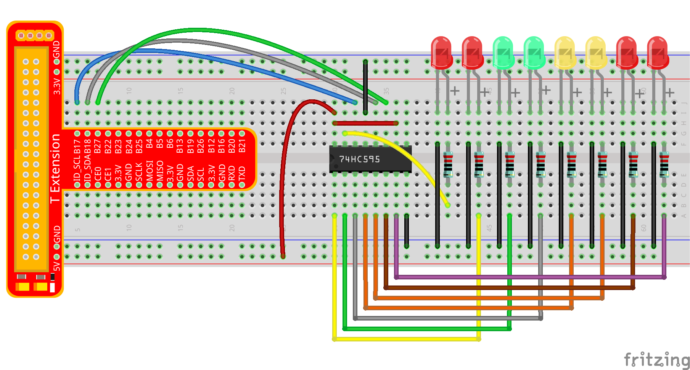
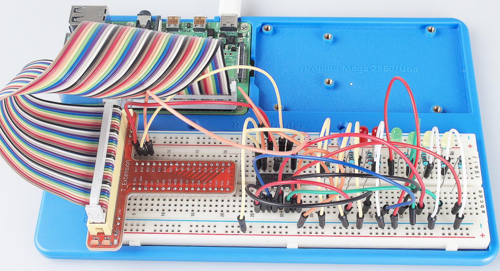

Lesson 13 Driving LEDs by 74HC595
=====================================

Introduction
-----------------------

In this lesson, we will learn how to use 74HC595 to make eight LEDs
blink regularly.

Components
-----------------------

\- 1 \* Raspberry Pi

\- 1 \* Breadboard

\- 1 \* 74HC595

\- 8 \* LED

\- 8 \* Resistor (220Ω)

\- Jumper wires

\- 1 \* T-Extension Board

\- 1 \* 40-Pin GPIO Cable

Principle
-----------------------

**74HC595**

The 74HC595 consists of an 8−bit shift register and a storage register
with three−state parallel outputs. It converts serial input into
parallel output so that you can save IO ports of an MCU. The 74HC595 is
widely used to indicate multipath LEDs and drive multi-bit segment
displays. "Three-state" mentioned above refers to the fact that you can
set the output pins as either high, low or high impedance. With data
latching, the instant output will not be affected during the shifting;
with data output, you can cascade 74HC595s more easily. Compatible with
low voltage TTL circuit, 74HC595 can transform serial input of 8-bit
data into parallel output of 8-bit data. So it is often used to extend
GPIO for embedded system and drive low power devices.

**Pins of 74HC595 and their functions**:

**Q0-Q7:** 8-bit parallel data output pins, able to control 8 LEDs or 8
pins of 7-segment display directly.

**Q7’:** Series output pin, connected to DS of another 74HC595 to
connect multiple 74HC595s in series

**MR:** Reset pin, active at low level; here it is directly connected to
5V to keep the chip from resetting.

**SH_CP:** Time sequence input of shift register. On the rising edge,
the data in shift register moves successively one bit, i.e. data in Q1
moves to Q2, and so forth. While on the falling edge, the data in shift
register remain unchanged.

**ST_CP:** Time sequence input of storage register. On the rising edge,
data in the shift register moves into memory register.

**OE:** Output enable pin, active at low level; here connected to GND to
keep 74HC595 in output enable state.

**DS:** Serial data input pin

**VCC:** Positive supply voltage

**GND:** Ground

The schematic diagram is shown as below:

**Principle**: In this experiment, connect 74HC595’s ST_CP to Raspberry
Pi’s B18, SH_CP to B27, and DS to B17; connect a current-limit resistor
and then a LED to Q0-Q7 respectively; connect MR and VCC to 5V, CE and
GND to GND. Input data in DS pin to the shift register when SH_CP (the
clock input of the shift register) is at the rising edge, and to the
memory register when ST_CP (the clock input of the memory) is at the
rising edge, and output to Q0-Q7. Then you can control the states of
SH_CP and ST_CP via Raspberry Pi GPIO to transform serial input data
into parallel output data so as to save Raspberry Pi GPIOs.

**Experimental Procedures**

**Step 1:** Build the circuit. If you want to take out the chip from the
breadboard, DO NOT pull it in one direction forcefully, for fear that
the pins on it may be bent and you may get hurt. Try to use a sharp tool
to cross the notch of the breadboard to remove the chip.

For C Language Users:
^^^^^^^^^^^^^^^^^^^^^^^

**Step 2:** Get into the folder of the code.

.. code-block::

    cd/home/pi/SunFounder_Super_Kit_V3.0_for_Raspberry_Pi/C

**Step 3**: Compile.

.. code-block::

    make 13_74HC595_LED

**Step 4**: Run the executable file above.

.. code-block::

    sudo ./13_74HC595_LED

**Code Explanation**

.. code-block:: c
    
    unsigned char LED[8] = {0x01,0x02,0x04,0x08,0x10,0x20,0x40,0x80}; 
    /* This array is to store the output values of Q0-Q7. For example, 0x01 in
    binary format is 0000 0001, thus Q7 Q6 Q5 Q4 Q3 Q2 Q1 Q0 are 0 0 0 0 0 0
    0 1 respectively, that is Q0=1, and the LED connected to Q0 will light
    up. Thus we can light up the eight LEDs separately in this way. */

    void pulse(int pin){ // generate a rising edge

        digitalWrite(pin, 0);

        digitalWrite(pin, 1);

    }

    void SIPO(unsigned char byte){ 
        // Assign the char byte to the SDI bit by bit

        int i;

        for(i=0;i<8;i++){

            digitalWrite(SDI, ((byte & (0x80 >> i)) > 0)); /* Use the for loop to
            count 8 times in cycle, and write a 1-bit data to the SDI each time. The
            data is a result of the AND operation. (0x80 >> i) is to implement the
            operation from left to right by bit, so each time one of the eight bits
            in byte (0000 0001). */

            pulse(SRCLK); /* the shift register generates a rising edge pulse, and
            data in DS will shift to the shift register. */

        } /* This part is to assign the data in byte to SDI(DS) by bits, thus
        when the shift register generates a rising edge pulse, data in SDI(DS)
        will transfer to it by bits. */

    }

    void init(void){ // Set DS, ST_CP, SH_CP as output, and low level as the initial state

        for(i=0;i<8;i++){

            SIPO(LED[i]); /* Assign the value in the LED[i] array to SDI(DS). When
            i=1, LED[0]=0x01 shifts to the shift register. */

            pulse(RCLK); /* RCLK (ST_CP) generates a rising edge pulse, and the data
            of the shift register is stored in the RCLK (ST_CP) storage register,
            and output at Q0-Q7. */

            delay(150);

        } /* After 8 cycles, Q0-Q7 will output 0x01 to 0x10 in sequence, that is to
        light up the LEDs connected to Q0-Q7 in turn. */
    }

Sketch in later part not explained here is to light up 8 LEDs together,
and dim them; then light up LEDs connected to Q7-Q0 one by one, and all
8 LEDs light up, dim in the end. Thus, a cycle completes. You can
observe the LEDs’ state.

For Python Users:
^^^^^^^^^^^^^^^^^^^

**Step 2:** Get into the folder of the code.

.. code-block::

    cd/home/pi/SunFounder_Super_Kit_V3.0_for_Raspberry_Pi/Python

**Step 3**: Run.

.. code-block::

    sudo python3 13_74HC595_LED.py

**Code Explanation**

.. code-block:: python

    LED0 = [0x01,0x02,0x04,0x08,0x10,0x20,0x40,0x80] ''' Define some LED
    blinking modes. Convert hexadecimal value to binary value will be more
    intuitionistic. For instance, 0x01 is binary 00000001, meaning the last
    LED lighting up; 0x80 is binary 10000000, representing the first LED
    lighting up. '''

    LED1 = [0x01,0x03,0x07,0x0f,0x1f,0x3f,0x7f,0xff] # blink mode 1

    LED2 = [0x01,0x05,0x15,0x55,0xb5,0xf5,0xfb,0xff] # blink mode 2

    LED3 = [0x02,0x03,0x0b,0x0f,0x2f,0x3f,0xbf,0xff] # blink mode 3

    # Shift the data to 74HC595

    def hc595_shift(dat): # Shift the data to 74HC595

        for bit in range(0, 8):

            GPIO.output(SDI, 0x80 & (dat << bit)) # Assig·n dat data to SDI pins of HC595 by bits

            GPIO.output(SRCLK, GPIO.HIGH) # Every SRCLK adds one, the shift register moves one bit.

            time.sleep(0.001)

            GPIO.output(SRCLK, GPIO.LOW)

        GPIO.output(RCLK, GPIO.HIGH) # Everytime RCLK adds one, the HC595 updates output.

        time.sleep(0.001)

        GPIO.output(RCLK, GPIO.LOW)

    leds = ['-', '-', '-', '-', '-', '-', '-', '-'] 
    # the array storing the LED state, used for command line printing.

    while True:

        # Change LED status from mode

        print (" mode")

        for onoff in mode: # Assign value to variable onoff by mode[] list

            hc595_shift(onoff)

            leds[mode.index(onoff)] = 1 # Show which led is on

            print (leds)

            time.sleep(sleeptime)

            leds[mode.index(onoff)] = '-' # Show the led is off

            # for loops in later part work similarly, lighting up LED by list.

Input a 2-bit hexadecimal parameter dat via hc595_in(dat) to control 8
LEDs state, and hc595_out() will output state to 8 LEDs. In While True,
the for loop will shift the LED blinking list to the hc595_in(dat)
function, thus we can see the LED light flowingHere you should see eight
LEDs light up one by one, and then all light up and dim after a while;
then eight LEDs will light up from reverse direction one by one, and
then all light up and then dim after a while. This cycle will keep
running.

