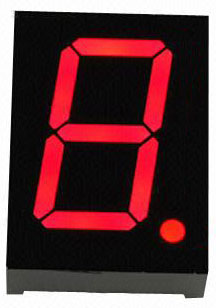
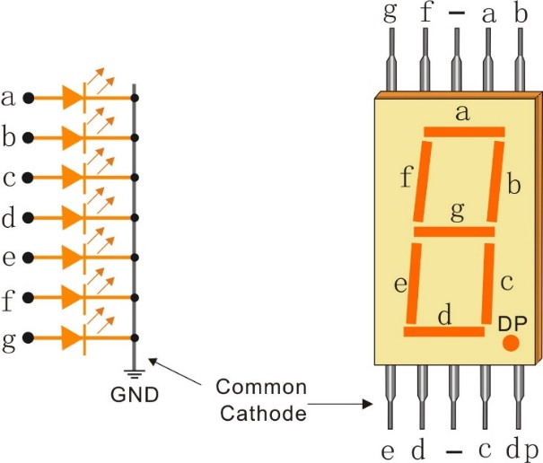
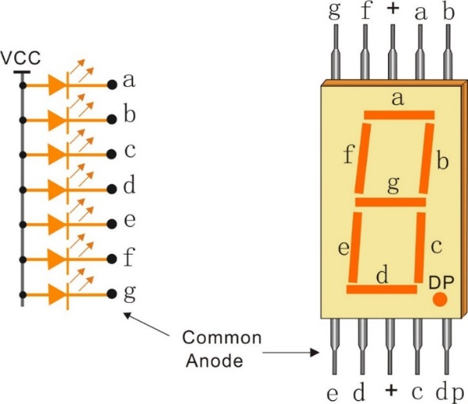
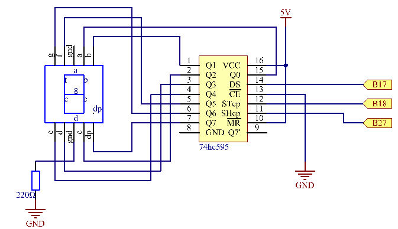
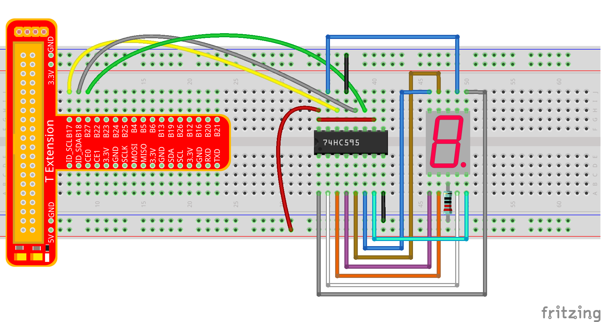
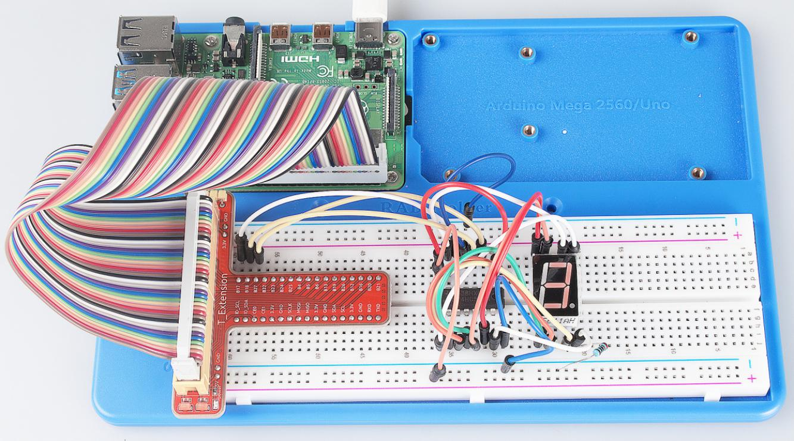
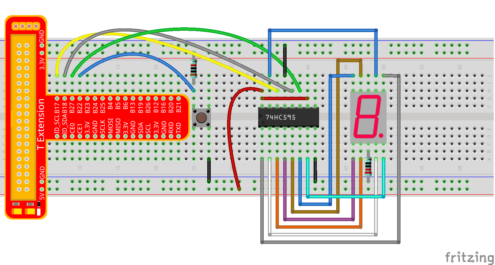
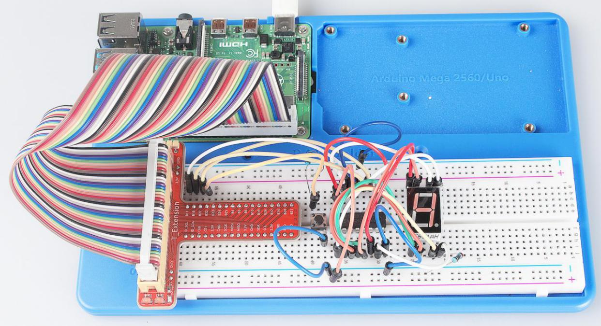

Lesson 14 Driving 7-Segment Display by 74HC595
===============================================

Introduction
-----------------

Since we've got some knowledge of the 74HC595 in the previous lesson,
now let's try to use it and drive a 7-segment display to show a figure
from 0 to 9 and A to F.

Components
-----------------

\- 1 \* Raspberry Pi

\- 1 \* Breadboard

\- 1 \* 74HC595

\- 1 \* 7-segment display

\- 2 \* Resistor (220Ω, 10k)

\- 1 \* Button

\- Jumper wires

\- 1 \* T-Extension Board

\- 1 \* 40-Pin GPIO Cable

Principle
-----------------

**7-Segment Display**

A 7-segment display is an 8-shaped component which packages 7 LEDs. Each
LED is called a segment – when energized, one segment forms part of a
numeral (both decimal and hexadecimal) to be displayed. An additional
8th LED is sometimes used within the same package thus allowing the
indication of a decimal point (DP) when two or more 7-segment displays
are connected together to display numbers greater than ten.

Each of the LEDs in the display is given a positional segment with one
of its connection pins led out from the rectangular plastic package.
These LED pins are labeled from "a" through to "g" representing each
individual LED. The other LED pins are connected together forming a
common pin. So by forward biasing the appropriate pins of the LED
segments in a particular order, some segments will brighten and others
stay dim, thus showing the corresponding character on the display.

The common pin of the display generally tells its type. There are two
types of pin connection: a pin of connected cathodes and one of
connected anodes, indicating Common Cathode (CC) and Common Anode (CA).
As the name suggests, a CC display has all the cathodes of the 7 LEDs
connected when a CA display has all the anodes of the 7 segments
connected.

In a common cathode display, the cathodes of all the LED segments are
connected to the logic "0" or ground. Then an individual segment (a-g)
is energized by a "HIGH", or logic "1" signal via a current limiting
resistor to forward bias the anode of the segment.

In a common anode display, the anodes of all the LED segments are
connected to the logic "1". Then an individual segment (a-g) is
energized by a ground, logic "0" or "LOW" signal via a current limiting
resistor to the cathode of the segment.

In this experiment, a common cathode 7-segment display is use. It should
be connected to ground. When the anode of an LED in a certain segment is
at high level, the corresponding segment will light up; when it is at
low, the segment will stay dim.

The schematic diagram is shown as below:

**Principle**: Connect pin ST_CP of 74HC595 to Raspberry Pi B18, SH_CP
to B27, DS to B17, parallel output ports to 8 segments of the LED
segment display. Input data in DS pin to shift register when SH_CP (the
clock input of the shift register) is at the rising edge, and to the
memory register when ST_CP (the clock input of the memory) is at the
rising edge. Then you can control the states of SH_CP and ST_CP via the
Raspberry Pi GPIOs to transform serial data input into parallel data
output so as to save Raspberry Pi GPIOs and drive the display.

Experimental Procedures
----------------------------

**Step 1:** Build the circuit.

For C Language Users:
^^^^^^^^^^^^^^^^^^^^^^^^^^^

**Step 2:** Get into the folder of the code.

.. raw:: html

    <run></run>

.. code-block::

    cd /home/pi/SunFounder_Super_Kit_V3.0_for_Raspberry_Pi/C

**Step 3**: Compile.

.. raw:: html

    <run></run>
    
.. code-block::

    make 14_segment

**Step 4**: Run the executable file above.

.. raw:: html

    <run></run>
    
.. code-block::

    sudo ./14_segment

.. note::
   
   If it does not work after running, please refer to :ref:`C code is not working?`

**Code**

.. code-block:: c

    #include <wiringPi.h>
    #include <stdio.h>

    #define   SDI   0   //serial data input
    #define   RCLK  1   //memory clock input(STCP)
    #define   SRCLK 2   //shift register clock input(SHCP)

    unsigned char SegCode[17] = {0x3f,0x06,0x5b,0x4f,0x66,0x6d,0x7d,0x07,0x7f,0x6f,0x77,0x7c,0x39,0x5e,0x79,0x71,0x80};

    void init(void){
        pinMode(SDI, OUTPUT); //make P0 output
        pinMode(RCLK, OUTPUT); //make P0 output
        pinMode(SRCLK, OUTPUT); //make P0 output

        digitalWrite(SDI, 0);
        digitalWrite(RCLK, 0);
        digitalWrite(SRCLK, 0);
    }

    void hc595_shift(unsigned char dat){
        int i;

        for(i=0;i<8;i++){
            digitalWrite(SDI, 0x80 & (dat << i));
            digitalWrite(SRCLK, 1);
            delay(1);
            digitalWrite(SRCLK, 0);
        }

            digitalWrite(RCLK, 1);
            delay(1);
            digitalWrite(RCLK, 0);
    }

    int main(void){
        int i;

        if(wiringPiSetup() == -1){ //when initialize wiring failed, print messageto screen
            printf("setup wiringPi failed !");
            return 1; 
        }

        init();

        printf("\n");
        printf("\n");
        printf("========================================\n");
        printf("|         Segment with 74HC595         |\n");
        printf("|    ------------------------------    |\n");
        printf("|         SDI connect to GPIO0         |\n");
        printf("|         RCLK connect to GPIO1        |\n");
        printf("|        SRCLK connect to GPIO 2       |\n");
        printf("|                                      |\n");
        printf("|     Control segment with 74HC595     |\n");
        printf("|                                      |\n");
        printf("|                            SunFounder|\n");
        printf("========================================\n");
        printf("\n");
        printf("\n");

        while(1){
            for(i=0;i<17;i++){
                printf("Print %1X on Segment\n", i);
                hc595_shift(SegCode[i]);
                delay(500);
            }
        }

        return 0;
    }

**Code Explanation**

.. code-block:: c

    
    unsigned char SegCode[17] =
    {0x3f,0x06,0x5b,0x4f,0x66,0x6d,0x7d,0x07,0x7f,0x6f,0x77,0x7c,0x39,0x5e,0x79,0x71,0x80};
    // display array from 0 to F.

    void init(void){} 
    // Initialize the function, set ds, st_cp, sh_cp three pins to low level, and the initial state as 0.

    void hc595_shift(unsigned char dat){

        int i;

        for(i=0;i<8;i++){

            digitalWrite(SDI, 0x80 & (dat << i)); /* Assign the dat data to SDI(DS)
            by bits. Here we assume dat=0x3f(0011 1111, when i=0, 0x3f will shift
            right(<<) 0 bits, 0x3f & 0x80 = 1000 0000 */

            digitalWrite(SRCLK, 1); /* SH_CP will convert from low to high, and
            generate a rising edge pulse, then shift the DS date to shift register. */

            delay(1);

            digitalWrite(SRCLK, 0);

        } // to assign 8 bit value to 74HC595’s shift register

        digitalWrite(RCLK, 1); /* ST_CP converts from low to high and generate a
        rising edge, then shift data from shift register to storage register. */

        delay(1);

        digitalWrite(RCLK, 0);

    }// Transfer data in shift register to data register to update the displayed data.

**For Python Users:**

**Step 2:** Get into the folder of the code.

.. raw:: html

    <run></run>
    
.. code-block::

    cd /home/pi/SunFounder_Super_Kit_V3.0_for_Raspberry_Pi/Python

**Step 3**: Run.

.. raw:: html

    <run></run>
    
.. code-block::

    sudo python3 14_segment.py

**Code**

.. raw:: html

    <run></run>
    
.. code-block:: python

    import RPi.GPIO as GPIO
    import time
    from sys import version_info
    
    if version_info.major == 3:
        raw_input = input
    
    # Set up pins
    SDI   = 17
    RCLK  = 18
    SRCLK = 27
    
    # Define a segment code from 0 to F in Hexadecimal
    # Commen cathode
    segCode = [0x3f,0x06,0x5b,0x4f,0x66,0x6d,0x7d,0x07,0x7f,0x6f,0x77,0x7c,0x39,0x5e,0x79,0x71]
    # Commen anode
    # segCode = [0xc0,0xf9,0xa4,0xb0,0x99,0x92,0x82,0xf8,0x80,0x90,0x88,0x83,0xc6,0xa1,0x86,0x8e]
    
    def print_msg():
        print ("========================================")
        print ("|         Segment with 74HC595         |")
        print ("|    ------------------------------    |")
        print ("|         SDI connect to GPIO17        |")
        print ("|         RCLK connect to GPIO18       |")
        print ("|        SRCLK connect to GPIO27       |")
        print ("|                                      |")
        print ("|     Control segment with 74HC595     |")
        print ("|                                      |")
        print ("|                            SunFounder|")
        print ("========================================")
        print ("Program is running...")
        print ("Please press Ctrl+C to end the program..")
        raw_input ("Press Enter to begin\n")
    
    def setup():
        GPIO.setmode(GPIO.BCM)
        GPIO.setup(SDI, GPIO.OUT, initial=GPIO.LOW)
        GPIO.setup(RCLK, GPIO.OUT, initial=GPIO.LOW)
        GPIO.setup(SRCLK, GPIO.OUT, initial=GPIO.LOW)
    
    # Shift the data to 74HC595
    def hc595_shift(dat):
        for bit in range(0, 8):	
            GPIO.output(SDI, 0x80 & (dat << bit))
            GPIO.output(SRCLK, GPIO.HIGH)
            time.sleep(0.001)
            GPIO.output(SRCLK, GPIO.LOW)
        GPIO.output(RCLK, GPIO.HIGH)
        time.sleep(0.001)
        GPIO.output(RCLK, GPIO.LOW)
    
    def main():
        print_msg()
        while True:
            # Shift the code one by one from segCode list
            for code in segCode:
                hc595_shift(code)
                print ("segCode[%s]: 0x%02X"%(segCode.index(code), code)) # double digit to print 
                time.sleep(0.5)
    
    def destroy():
        GPIO.cleanup()
    
    if __name__ == '__main__':
        setup()
        try:
            main()
        except KeyboardInterrupt:
            destroy()

**Code Explanation**

.. code-block:: python

    
    # Define a segment code from 0 to F in Hexadecimal

    # Commen cathode

    segCode = [0x3f,0x06,0x5b,0x4f,0x66,0x6d,0x7d,0x07,0x7f,0x6f,0x77,
               0x7c,0x39,0x5e,0x79,0x71]

    # Commen anode

    # segCode = [0xc0,0xf9,0xa4,0xb0,0x99,0x92,0x82,0xf8,0x80,0x90,0x88,
                 0x83,0xc6,0xa1,0x86,0x8e]

    # Shift the data to 74HC595

    def hc595_shift(dat):

        for bit in range(0, 8):

            GPIO.output(SDI, 0x80 & (dat << bit))

            GPIO.output(SRCLK, GPIO.HIGH)

            time.sleep(0.001)

            GPIO.output(SRCLK, GPIO.LOW)

            GPIO.output(RCLK, GPIO.HIGH)

            time.sleep(0.001)

            GPIO.output(RCLK, GPIO.LOW)

    for code in segCode: # Input item in segCode list to hc595_shift()function, to display the character.

        hc595_shift(code)

If you want to display a number, use the hc595_shift() function, segCode
list and decimal value x in the sketch:

.. code-block:: python

    hc595_shift(segCode[x]) ''' x is a number needs to be displayed ranging from 0~15, 
    and it will be coverted and displayed by 0~F in hexadecimal. '''

**Note:** The hexadecimal format of number 0~15 are (0, 1, 2, 3, 4, 5, 6, 7, 8, 9, A, B, C, D, E, F)

You should see the 7-segment display from 0 to 9 and A to F.

**Further Exploration**

You can slightly modify the hardware and software based on this
experiment to make a dice. For hardware, add a button to the original
board.

**Build the circuit:**

Get into the folder of the code.

.. code-block:: 

    cd/home/pi/SunFounder_Super_Kit_V3.0_for_Raspberry_Pi/C

Next, Compile the Code*.*

.. code-block:: 

    make 14_dice

Run.

.. code-block:: 

    sudo ./14_dice

**Code**

.. code-block:: C

    #include <wiringPi.h>
    #include <stdio.h>
    #include <stdlib.h>
    #include <string.h>
    #include <errno.h>
    #include <time.h>
    
    #define   SDI   0   //serial data input
    #define   RCLK  1   //memory clock input(STCP)
    #define   SRCLK 2   //shift register clock input(SHCP)
    
    #define   TouchPin  3
    
    unsigned char SegCode[6] = {0x06,0x5b,0x4f,0x66,0x6d,0x7d};
    
    unsigned char flag = 0;
    
    void init(void)
    {
        pinMode(SDI, OUTPUT); //make P0 output
        pinMode(RCLK, OUTPUT); //make P1 output
        pinMode(SRCLK, OUTPUT); //make P2 output
        pinMode(TouchPin, INPUT);
        pullUpDnControl(TouchPin, PUD_UP);
    
        digitalWrite(SDI, 0);
        digitalWrite(RCLK, 0);
        digitalWrite(SRCLK, 0);
    }
    
    void hc595_shift(unsigned char dat)
    {
        int i;
    
        for(i=0;i<8;i++){
            digitalWrite(SDI, 0x80 & (dat << i));
            digitalWrite(SRCLK, 1);
            delay(1);
            digitalWrite(SRCLK, 0);
        }
    
            digitalWrite(RCLK, 1);
            delay(1);
            digitalWrite(RCLK, 0);
    }
    
    void randomISR(void)
    {
        flag = 1;
    }
    
    int main(void)
    {
        int num;
    
        if(wiringPiSetup() == -1){ //when initialize wiring failed,print messageto screen
            printf("setup wiringPi failed !");
            return 1; 
        }
    
        init();
    
        printf("\n");
        printf("\n");
        printf("========================================\n");
        printf("|               Dice                   |\n");
        printf("|    ------------------------------    |\n");
        printf("|        SDI connect to GPIO0          |\n");
        printf("|        RCLK connect to GPIO1         |\n");
        printf("|       SRCLK connect to GPIO 2        |\n");
        printf("|     Button Pin connect to GPIO 3     |\n");
        printf("|                                      |\n");
        printf("|     Control segment with 74HC595     |\n");
        printf("|           random number 0~6          |\n");
        printf("|    Press to supend segment 2 second  |\n");
        printf("|                                      |\n");
        printf("|                            SunFounder|\n");
        printf("========================================\n");
        printf("\n");
        printf("\n");
    
        if(wiringPiISR(TouchPin, INT_EDGE_FALLING, &randomISR)){
            printf("Unable to setup ISR : %s\n", strerror(errno));	
            return 1;
        }
    
        srand(time(NULL));
        
        while(1){
            num = rand() % 6;
            hc595_shift(SegCode[num]);
            if(flag == 1){
                printf("flag = %d, ",flag);
                printf("Pressed when %d on Segment\n", (num+1));
                delay(2000);
                flag = 0;
            }
            else{	
                delay(60);
            }
            
        }
    
        return 0;
    }
    

    
**Code Explanation**

.. code-block:: C

    void randomISR(void){ // An interrupt function, run when the interrupt happens

        flag = 1; // flag represents the state of the button

    }

    if(wiringPiISR(TouchPin, INT_EDGE_FALLING, &randomISR)){ /* Set an
    interrupt here as the falling edge for TouchPin. When the interrupt
    happens, execute the function randomISR(). */

        printf("Unable to setup ISR : %s\n", strerror(errno));

        return 1;

    }

    srand(time(NULL));

    num = rand() % 6;

    /* Two functions here: One is the srand function, which is used before
    calling function rand() and used as seed for the random number
    generator; while the other is rand(), which is a function to generate
    the random number. Usually, these two functions are used together to
    generate the random number. Thus a random number of 0-6 will be
    displayed on the 7-segment display. */

For Python Users:
^^^^^^^^^^^^^^^^^^^^^

**Step 2:** Get into the folder of the code.

.. code-block::

    cd/home/pi/SunFounder_Super_Kit_V3.0_for_Raspberry_Pi/Python

**Step 3:** Run.

.. code-block::

    sudo python3 14_dice.py

**Code**

.. code-block:: python

    import RPi.GPIO as GPIO
    import time
    import random
    from sys import version_info

    if version_info.major == 3:
        raw_input = input

    # Set up pins
    SDI   = 17
    RCLK  = 18
    SRCLK = 27

    TouchPin = 22

    # Define a segment code from 1 to 6 in Hexadecimal
    SegCode = [0x06, 0x5b, 0x4f, 0x66, 0x6d, 0x7d]

    # Used to record button press
    flag = 0

    def print_msg():
        print ("========================================")
        print ("|               Dice                   |")
        print ("|    ------------------------------    |")
        print ("|        SDI connect to GPIO17         |")
        print ("|        RCLK connect to GPIO18        |")
        print ("|       SRCLK connect to GPIO27        |")
        print ("|     Button Pin connect to GPIO22     |")
        print ("|                                      |")
        print ("|     Control segment with 74HC595     |")
        print ("|           random number 1~6          |")
        print ("|    Press to supend segment 2 second  |")
        print ("|                                      |")
        print ("|                            SunFounder|")
        print ("========================================")
        print ("Program is running...")
        print ("Please press Ctrl+C to end the program...")
        raw_input ("Press Enter to begin\n")

    def setup():
        GPIO.setmode(GPIO.BCM)
        GPIO.setwarnings(False)
        GPIO.setup(SDI, GPIO.OUT, initial=GPIO.LOW)
        GPIO.setup(RCLK, GPIO.OUT, initial=GPIO.LOW)
        GPIO.setup(SRCLK, GPIO.OUT, initial=GPIO.LOW)
        GPIO.setup(TouchPin, GPIO.IN, pull_up_down = GPIO.PUD_UP)
        GPIO.add_event_detect(TouchPin, GPIO.RISING, callback = randomISR, bouncetime = 20)

    # Shift the data to 74HC595
    def hc595_shift(dat):
        for bit in range(0, 8):	
            GPIO.output(SDI, 0x80 & (dat << bit))
            GPIO.output(SRCLK, GPIO.HIGH)
            time.sleep(0.001)
            GPIO.output(SRCLK, GPIO.LOW)
        GPIO.output(RCLK, GPIO.HIGH)
        time.sleep(0.001)
        GPIO.output(RCLK, GPIO.LOW)

    def randomISR(channel):
        global flag
        flag = 1

    def destroy():
        GPIO.cleanup()

    def main():
        global flag
        print_msg()
        while True:
            num = random.randint(1,6)
            hc595_shift(SegCode[num-1])
            print (num, hex(SegCode[num-1]))
            if flag == 1:
                print ("Num: ", num)
                time.sleep(2)
                flag = 0
            else:
                time.sleep(0.01)

    if __name__ == '__main__':
        setup()
        try:
            main()
        except KeyboardInterrupt:
            destroy()

**Code Explanation**

.. code-block:: python
    
    import random # use this function to generate the random number

    SegCode = [0x06, 0x5b, 0x4f, 0x66, 0x6d, 0x7d] 
    # Define a segment code from 1 to 6 in Hexadecimal

    GPIO.add_event_detect(TouchPin, GPIO.RISING, callback = randomISR, bouncetime = 20) 
    ''' Set an interrupt, and the rising edge for TouchPin.
    When the interrupt happens, execute the function randomISR(). 
    Set bouncetime for button to 20ms. '''

    def randomISR(channel): # Interrupt calling the function

        global flag

        flag = 1

        num = random.randint(1,6)

        # Generate a random number from 1~6.

        hc595_shift(SegCode[num-1])　# Output the hexadecimal values in list by 74HC595.

Now you should see a number flashing between 0 and 6 quickly on the
segment display. Press the button on the breadboard, and the display
will statically display a random number between 0 and 6 for 2 seconds
and then circularly flash randomly between 0 and 6 again.

