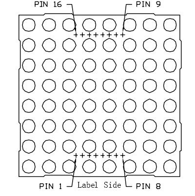
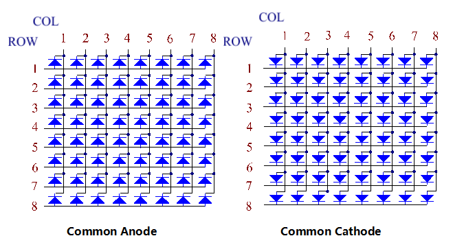
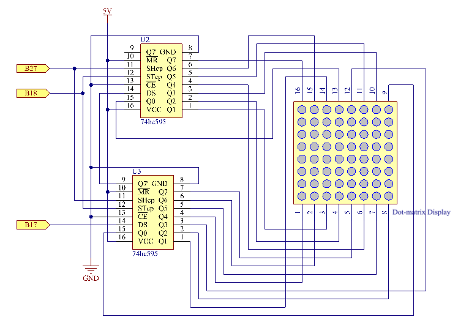
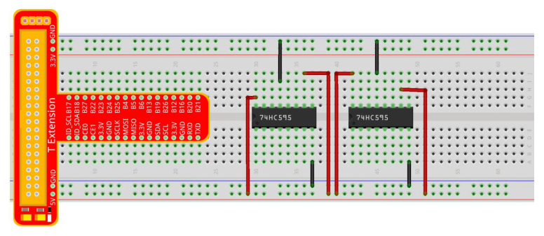
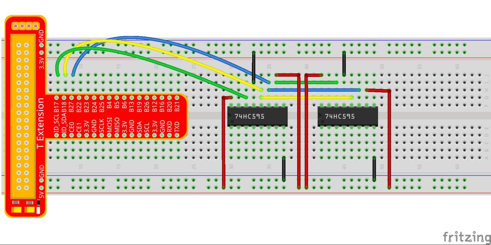
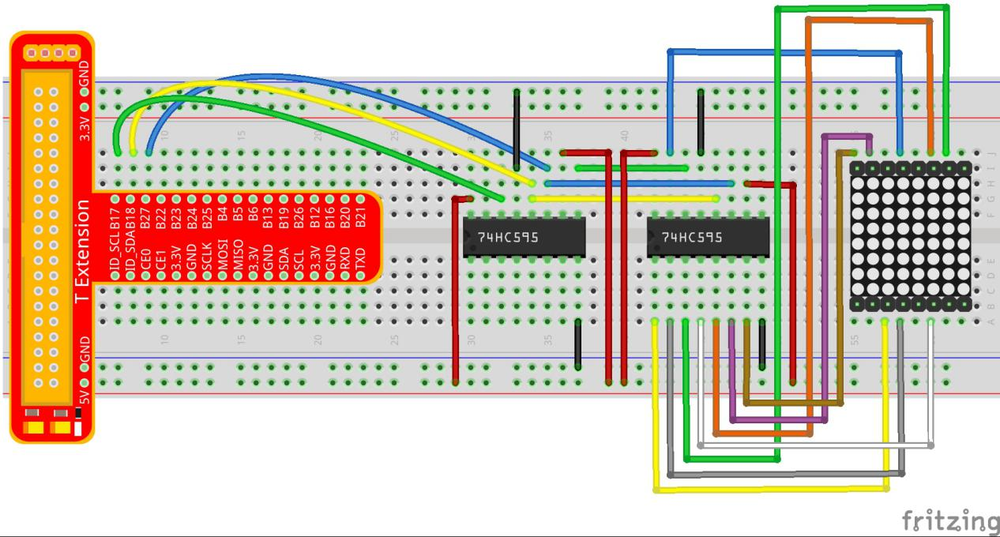
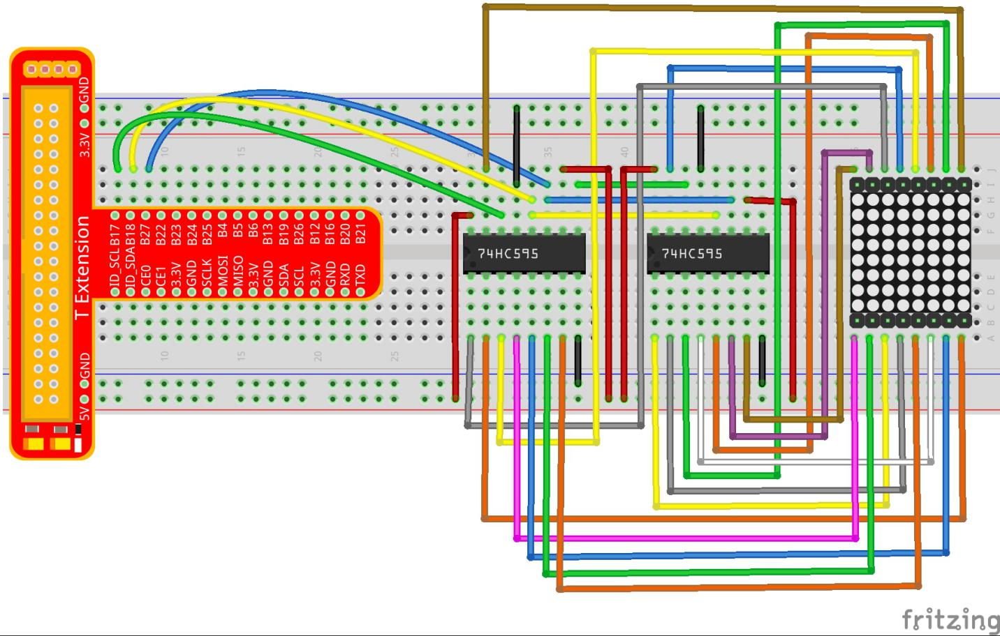
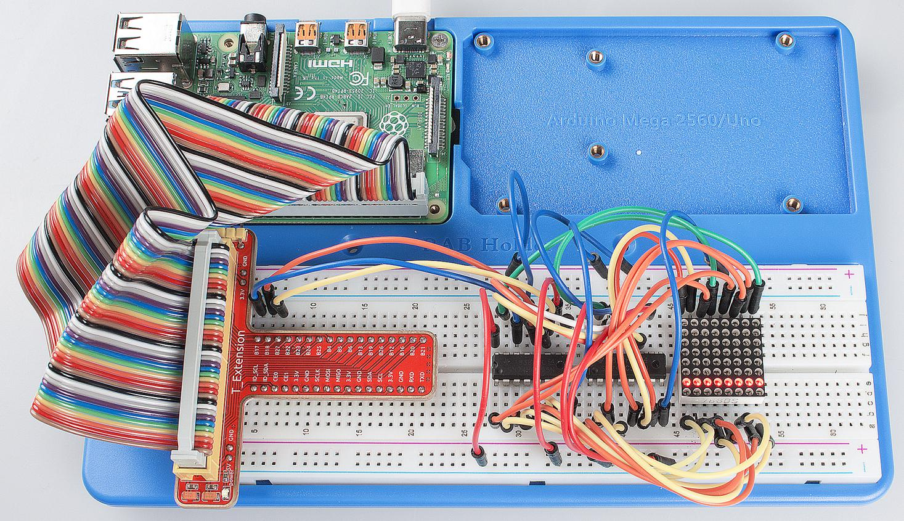

Lesson 15 Driving Dot-Matrix by 74HC595
==========================================

Introduction
-----------------

As the name suggests, an LED dot matrix is a matrix composed of LEDs.
The lighting up and dimming of the LEDs formulate different characters
and patterns.

Components
-----------------

\- 1 \* Raspberry Pi

\- 1 \* Breadboard

\- 2 \* 74HC595

\- 1 \* Dot-Matrix

\- Jumper wires

\- 1 \* T-Extension Board

\- 1 \* 40-Pin GPIO Cable

Principle
-----------------

**Dot Matrix**

Generally, dot matrix can be categorized into two types: common cathode
(CC) and common anode (CA). They look much alike, but internally the
difference lies. You can tell by test. A CA one is used in this kit. You
can see **788BS** labeled at the side.

See the figure below. The pins are arranged at the two ends at the back.
Take the label side for reference: pins on this end are pin 1-8, and oh
the other are pin 9-16.

The external view:

Below the figures show their internal structure. You can see in a CA
matrix, ROW represents the anode of the LED, and COL is cathode; it's
contrary for a CC one. One thing in common: for both types, pin 13, 3,
4, 10, 6, 11, 15, and 16 are all COL, when pin 9, 14, 8, 12, 1, 7, 2,
and 5 are all ROW. If you want to turn on the first LED at the top left
corner, for a CA matrix, just set pin 9 as High and pin 13 as Low, and
for a CC one, set pin 13 as High and pin 9 as Low. If you want to light
up the whole first column, for CA, set pin 13 as Low and ROW 9, 14, 8,
12, 1, 7, 2, and 5 as High, when for CC, set pin 13 as High and ROW 9,
14, 8, 12, 1, 7, 2, and 5 as Low. Consider the following figures for
better understanding.

The internal view:

Pin numbering corresponding to the above rows and columns:

+-------------+--------+--------+-------+--------+-------+--------+--------+--------+
| **COL**     | **1**  | **2**  | **3** | **4**  | **5** | **6**  | **7**  | **8**  |
+-------------+--------+--------+-------+--------+-------+--------+--------+--------+
| **Pin No.** | **13** | **3**  | **4** | **10** | **6** | **11** | **15** | **16** |
+-------------+--------+--------+-------+--------+-------+--------+--------+--------+
| **ROW**     | **1**  | **2**  | **3** | **4**  | **5** | **6**  | **7**  | **8**  |
+-------------+--------+--------+-------+--------+-------+--------+--------+--------+
| **Pin No.** | **9**  | **14** | **8** | **12** | **1** | **7**  | **2**  | **5**  |
+-------------+--------+--------+-------+--------+-------+--------+--------+--------+

In this experiment, a CA dot matrix is used. You can see the label ends
with "BS". The wiring and code are done for the CA matrix. Therefore, if
you happen to have a CC matrix, you need to change the wiring and code.
In addition, two 74HC595 chips are used here. One is to control the rows
of the dot matrix while the other, the columns.

The Schematic Diagram
---------------------------

**Experimental Procedures**

**Step 1:** Build the circuit. Since the wiring is complicated, let's
make it step by step. First, inset the T-Cobbler and two 74HC595 chips
into breadboard. Connect the 5V and GND of the T-Cobbler to holes on the
two sides of the board, then hook up pin16 and 10 of the two 74HC595
chips to VCC and pin 13 respectively, and pin 8 to GND.

**Step 2**: Connect pin 11 of the two 74HC595 together, and then to
GPIO27; then pin 12 of the two chips, and to GPIO18; next, pin 14 of the
74HC595 on the left side to GPIO17 and pin 9 to pin 14 of the other
74HC595.

**Step 3:** Insert the dot matrix onto the breadboard. The 74HC595 on
the right side is to control columns of the matrix. See the table below
for the mapping. Therefore, Q0-Q7 pins of the 74HC595 are mapped with
pin 13, 3, 4, 10, 6, 11, 15, and 16 respectively.

+-------------+--------+-------+-------+--------+-------+--------+--------+--------+
| **COL**     | **1**  | **2** | **3** | **4**  | **5** | **6**  | **7**  | **8**  |
+-------------+--------+-------+-------+--------+-------+--------+--------+--------+
| **Pin No.** | **13** | **3** | **4** | **10** | **6** | **11** | **15** | **16** |
+-------------+--------+-------+-------+--------+-------+--------+--------+--------+

**Step 4:** Now connect the ROWs of the dot matrix. The 74HC595 on the
left controls ROW of the matrix. See the table below for the mapping. We
can see, Q0-Q7 of the 74HC595 on the left are mapped with pin 9, 14, 8,
12, 1, 7, 2, and 5 respectively.

+-------------+-------+--------+-------+--------+-------+-------+-------+-------+
| **ROW**     | **1** | **2**  | **3** | **4**  | **5** | **6** | **7** | **8** |
+-------------+-------+--------+-------+--------+-------+-------+-------+-------+
| **Pin No.** | **9** | **14** | **8** | **12** | **1** | **7** | **2** | **5** |
+-------------+-------+--------+-------+--------+-------+-------+-------+-------+

.. note::

    PLEASE connect devices correctly. DO NOT wire up insufficiently.
    DO NOT connect to the wrong side of the dot matrix. 
    In the Fritzing image above, the side with label is at the bottom.

For C Language Users:
^^^^^^^^^^^^^^^^^^^^^^^^^^

**Step 2:** Get into the folder of code.

.. code-block::

    cd/home/pi/SunFounder_Super_Kit_V3.0_for_Raspberry_Pi/C

**Step 3**: Compile.

.. code-block::

    make 15_dotMatrix

**Step 4**: Run.

.. code-block::

    sud./15_dotMatrix

**Code Explanation**

.. code-block:: C
    
    void hc595_in(unsigned char dat)
    { 
        // Write an 8-bit data to the shift register of the 74HC595

        int i;

        for(i=0;i<8;i++)
        {

            digitalWrite(SDI, 0x80 & (dat << i)); 
            // Write the value of dat to pin SDI of the HC595 bit by bit

            digitalWrite(SRCLK, 1); // Everytime SRCLK adds one, the shift register moves 1 bit

            delay(1);

            digitalWrite(SRCLK, 0);

        }

    }

    void hc595_out()
    { // Update the output data of the 74HC596

        digitalWrite(RCLK, 1); // Everytime RCLK adds 1, the HC595 updates the output.

        delay(1);

        digitalWrite(RCLK, 0);

    }

    while(1)
    {

        for(i=0;i<sizeof(code_H);i++){ 
            // The data of ROW and COL table for the matrix adds 1 each time.

            hc595_in(code_L[i]); // Write to the first data of the Row table

            hc595_in(code_H[i]); 
            // Write to the first data of the COL table, and the ROW data previously goes to the other HC595.

            hc595_out(); /* Update the output of the 74HC595; output the data
            controlled by both two HC595, and the dot matrix will show the pattern. */

            delay(100);

        }

        for(i=sizeof(code_H);i>=0;i--)
        { // The data of ROW and COL table for the matrix decreases by 1 each time.

            hc595_in(code_L[i]); // Write to the first data of the Row table

            hc595_in(code_H[i]); /* Write to the first data of the COL table, and
            the ROW data previously goes to the other HC595. */

            hc595_out(); /* Update the output of the 74HC595; output the data
            controlled by both two HC595, and the dot matrix will show the pattern. */

            delay(100);

        }

    }

For Python Users:
^^^^^^^^^^^^^^^^^^^^^

**Step 2:** Get into the folder of code.

.. code-block:: 
    
    cd/home/pi/SunFounder_Super_Kit_V3.0_for_Raspberry_Pi/Python

**Step 3**: Run.

.. code-block:: 
    
    sudo python3 15_DotMatrix.py

**Code Explanation**

.. code-block:: python
    
    # We use a Common Anode matrix, so ROW pins are the common anode, and COL, the common cathode.

    ''' row and column lists. When characters are displayed, an element in row
    and one in column are acquired and assigned to the two HC595 chips
    respectively. Thus a pattern is shown on the matrix. '''

    # ROW ++++

    code_H = [0x01,0xff,0x80,0xff,0x01,0x02,0x04,0x08,0x10,0x20,0x40,0x80,
              0xff,0xff,0xff,0xff,0xff,0xff,0xff,0xff]

    # COL ----

    code_L = [0x00,0x7f,0x00,0xfe,0x00,0x00,0x00,0x00,0x00,0x00,0x00,0x00,0xfe,
              0xfd,0xfb,0xf7,0xef,0xdf,0xbf,0x7f]

    def get_matrix(row_buffer, col_buffer, max_row=8, max_col=8): 
    # The functions is to print the pattern on the matrix by the 2D array on the command line interface (CLI).

        matrix_msg = [[0 for i in range(max_row)] for i in range(max_col)] # Initialize a 2D array

        print ("row_buffer = 0x%02x , col_buffer = 0x%02x"%(row_buffer, col_buffer))

        for row_num in range(0,8):

            for col_num in range(0,8):

                if (((row_buffer >> row_num) & 0x01) - ((col_buffer >> col_num) & 0x01)): 
                # for Common Anode type matrix, when row is High and column is low, the LED will light up.

                    matrix_msg[row_num][col_num] = 1 ''' To turn on an LED at a certain row
                    and column, assign 1 to the corresponding elements in the 2D array'''

        print_matrix(matrix_msg) # Print the 2D array on the CLI

        matrix_msg = [[0 for i in range(max_row)] for i in range(max_col)] 
        # Reset the array after one print

    def hc595_shift(dat): # Shift the data to 74HC595

        for bit in range(0, 8):

            GPIO.output(SDI, 0x80 & (dat << bit)) # Write the value of dat bit by bit to pin SDI of the HC595

            GPIO.output(SRCLK, GPIO.HIGH) # Everytime SRCLK is High, the shift register shifts one bit

            time.sleep(0.001)

            GPIO.output(SRCLK, GPIO.LOW)

        GPIO.output(RCLK, GPIO.HIGH) # Everytime RCLK is high, HC595 updates its output.

        time.sleep(0.001)

        GPIO.output(RCLK, GPIO.LOW)

    def main():

        print_msg()

        while True:

            for i in range(0, len(code_H)): #　Assign elements of the column table in sequence

                hc595_shift(code_L[i])　# Write to the first data of the Row table

                hc595_shift(code_H[i])　
                # Write to the first data of the COL table, and the ROW data previously goes to the other HC595.

                get_matrix(code_L[i], code_H[i]) # Print the 2D array on the CLI

                time.sleep(0.1)

            for i in range(len(code_H)-1, -1, -1): #　Assign elements of the column table in inverse order

                hc595_shift(code_L[i])

                hc595_shift(code_H[i])

                get_matrix(code_L[i], code_H[i])

                time.sleep(0.1)

You should see LEDs light up as you control.

**Summary**

Through this lesson, you have got the basic principle of LED dot matrix
and how to program the Raspberry Pi to drive an LED dot matrix based on
74HC595 cascade. With the knowledge learnt, try more fascinating
creations!

**Further Exploration**

If you want to display characters on the matrix, please refer to a
python code: https://github.com/sunfounder/SunFounder_Dot_Matrix.

