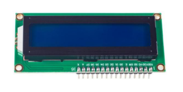
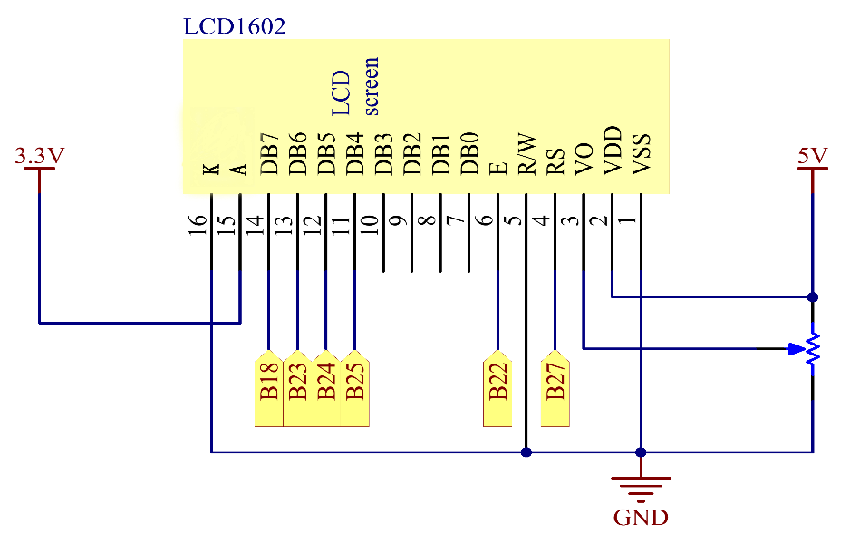
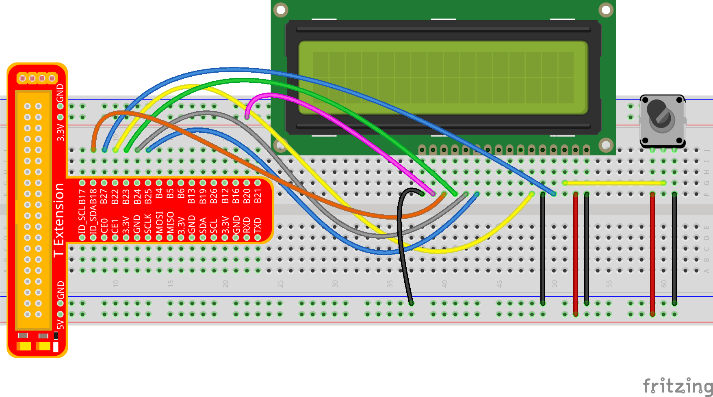
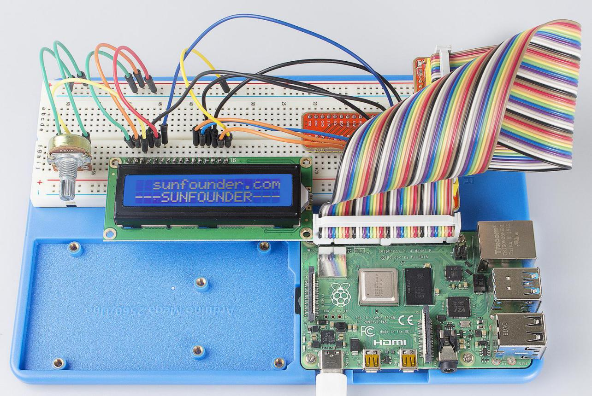

Lesson 16 LCD1602
====================

Introduction
-----------------

In this lesson, we will learn how to use LCD1602 to display characters
and strings.

Components
-----------------

\- 1 \* Raspberry Pi

\- 1 \* Breadboard

\- 1 \* LCD1602

\- 1 \* Potentiometer

\- 1 \* T-Extension Board

\- 1 \* 40-Pin GPIO Cable

\- Jumper wires

Principle
-----------------

**LCD1602**

Generally, LCD1602 has parallel ports, that is, it would control several
pins at the same time. LCD1602 can be categorized into eight-port and
four-port connections. If the eight-port connection is used, then all
the digital ports of the SunFounder Uno board are almost completely
occupied. If you want to connect more sensors, there will be no ports
available. Therefore, the four-port connection is used here for better
application.

LCD1602 uses the standard 16-pin port, among which:

**Pin 1 (GND):** connected to Ground

**Pin 2 (Vcc):** connected to 5V power supply

**Pin 3 (Vo):** used to adjust the contrast of LCD1602; the level is
lowest when it’s connected to a positive power supply, and highest when
connected to ground (you can connect a 10K potentiometer to adjust its
contrast when using LCD1602)

**Pin 4 (RS):** register select pin, controlling where in the LCD’s
memory you are writing data to. You can select either the data register,
which holds what goes on the screen, or an instruction register, where
the LCD’s controller looks for instructions on what to do next.

**Pin 5 (R/W):** to read/write signals; it reads signals when supplied
with high level (1), and writes when low level (0) (in this experiment,
you only need to write data to LCD1602, so just connect this pin to
ground)

**Pin 6 (E):** An enable pin that, when low-level energy is supplied,
causes the LCD module to execute relevant instructions

**Pin 7 (D0-D7):** pins that read and write data

**A and K:** controlling LCD backlight; K connects to GND, and A to
3.3V. Turn the backlight on and you can see the characters displayed
clear in a dim environment

LCD1602 has two operation modes: 4-bit and 8-bit. When the IOs of the
MCU are insufficient, you can choose the 4-bit mode, under which only
pins D4~D7 are used. After connecting the circuit, you can operate
LCD1602 by the Raspberry Pi.

Experimental Procedures
---------------------------

**Step 1:** Build the circuit (please be sure the pins are connected
correctly. Otherwise, characters will not be displayed properly):

+-------------+--------------------------------------------+
| **LCD1602** | **T-Extension Board**                      |
+-------------+--------------------------------------------+
| VDD         | 5V                                         |
+-------------+--------------------------------------------+
| VSS         | GND                                        |
+-------------+--------------------------------------------+
| OV          | Connect to the middle pin of potentiometer |
+-------------+--------------------------------------------+
| RS          | B27                                        |
+-------------+--------------------------------------------+
| R/W         | GND                                        |
+-------------+--------------------------------------------+
| E           | B22                                        |
+-------------+--------------------------------------------+
| D0-D3       | Not connected                              |
+-------------+--------------------------------------------+
| D4          | B25                                        |
+-------------+--------------------------------------------+
| D5          | B24                                        |
+-------------+--------------------------------------------+
| D6          | B23                                        |
+-------------+--------------------------------------------+
| D7          | B18                                        |
+-------------+--------------------------------------------+
| A           | 3.3V                                       |
+-------------+--------------------------------------------+
| K           | GND                                        |
+-------------+--------------------------------------------+

.. note::

    After you run the code, characters may not appear on the LCD1602. 
    You need to adjust the contrast of the screen (the gradual change from 
    black to white) by spinning the potentiometer clockwise or anticlockwise, 
    until the screen displays characters clearly.

For C Language Users:
^^^^^^^^^^^^^^^^^^^^^^^

**Step 2:** Get into the folder of code.

.. raw:: html

    <run></run>
    
.. code-block::

    cd /home/pi/SunFounder_Super_Kit_V3.0_for_Raspberry_Pi/C

**Step 3:** Compile.

.. raw:: html

    <run></run>
    
.. code-block::

    make 16_lcd1602

**Step 4:** Run.

.. raw:: html

    <run></run>
    
.. code-block::

    sudo ./16_lcd1602

.. note::
   
   If it does not work after running, please refer to :ref:`C code is not working?`

**Code**

.. code-block:: c

    #include <stdio.h>
    #include <stdlib.h>
    #include <wiringPi.h>
    #include <lcd.h>
    
    const unsigned char Buf[] = "---SUNFOUNDER---";
    const unsigned char myBuf[] = "  sunfounder.com";
    
    int main(void)
    {
        int fd;
        int i;
        
        if(wiringPiSetup() == -1){
            exit(1);
        }
        
        fd = lcdInit(2,16,4, 2,3, 6,5,4,1,0,0,0,0); //see /usr/local/include/lcd.h
        printf("%d", fd);
        if (fd == -1){
            printf("lcdInit 1 failed\n") ;
            return 1;
        }
        sleep(1);
        lcdClear(fd);
        lcdPosition(fd, 0, 0); 
        lcdPuts(fd, "Welcome To--->");
    
        lcdPosition(fd, 0, 1); 
        lcdPuts(fd, "  sunfounder.com");
    
        sleep(1);
        lcdClear(fd);
        
        printf("\n");
        printf("\n");
        printf("========================================\n");
        printf("|                LCD1602               |\n");
        printf("|    ------------------------------    |\n");
        printf("|         D4 connect to GPIO6          |\n");
        printf("|         D5 connect to GPIO5          |\n");
        printf("|         D6 connect to GPIO4          |\n");
        printf("|         D7 connect to GPIO1          |\n");
        printf("|         RS connect to GPIO2          |\n");
        printf("|         RW connect to GND            |\n");
        printf("|         CE connect to GPIO3          |\n");
        printf("|                                      |\n");
        printf("|           Control LCD1602            |\n");
        printf("|                                      |\n");
        printf("|                            SunFounder|\n");
        printf("========================================\n");
        printf("\n");
        printf("\n");
    
        while(1){
            lcdClear(fd);
            for(i=0; i<16; i++){
                lcdPosition(fd, i, 0);
                lcdPutchar(fd, *(myBuf+i));
                delay(100);
            }
            for(i=0;i<sizeof(Buf)-1;i++){
                lcdPosition(fd, i, 1);
                lcdPutchar(fd, *(Buf+i));
                delay(200);
            }
            sleep(0.5);
        }
        return 0;
    }

**Code Explanation**

.. code-block:: c

    #include <lcd.h> 
    // includes the lcd library, containing some functions for the LCD1602 display for convenient use

    const unsigned char Buf[] = "---SUNFOUNDER---"; 
    // An array to store the characters to be displayed on the LCD1602

    const unsigned char myBuf[] = " sunfounder.com";
    // Another array to store the characters

    fd = lcdInit(2,16,4, 2,3, 6,5,4,1,0,0,0,0); 
    // Initialize the LCD display, see /usr/local/include/lcd.h

    /* lcdInit(rows, cols, bits, rs, strb, d0, d1, d2, d3, d4, d5, d6, d7) -
    LCD1602 shows 2 rows and 16 columns. If the initialization succeeds, it
    will return True. */

    lcdClear(fd); // Clear the screen

    lcdPosition(fd, 0, 0); 
    // Locate the position of the cursor at Row 0 and Col 0 (in fact it's the first line and first column)

    lcdPuts(fd, "Welcom To--->"); 
    // Display the character "Welcom To--->"on the LCD1602

    lcdPosition(fd, 0, 1); // Place the cursor at Col 0, Row 0.

    lcdPuts(fd, " sunfounder.com");

    while(1)
    {
        lcdClear(fd);

        for(i=0; i<16; i++)
        {   // i adds one in the loop. i means the number of columns, so i adds to 16 at most.

            lcdPosition(fd, i, 0); 
            // Place the cursor at the first row, and moves left to right from the first character

            lcdPutchar(fd, *(myBuf+i)); 
            // *(myBuf+i) is a pointer that points to contents in the myBuf[] array, and output the pointed data to lcd

            delay(100);

        }

        for(i=0;i<sizeof(Buf)-1;i++)
        {

            lcdPosition(fd, i, 1); // Place the cursor at the second row, moves from the first character

            lcdPutchar(fd, *(Buf+i)); // A pointer that points to data in the Buf[] array; output it to lcd

            delay(200);

        }

        sleep(0.5);

    }

For Python Users:
^^^^^^^^^^^^^^^^^^^^^

**Step 2:** Get into the folder of code.

.. raw:: html

    <run></run>
    
.. code-block::

    cd /home/pi/SunFounder_Super_Kit_V3.0_for_Raspberry_Pi/Python

**Step 3:** Run.

.. raw:: html

    <run></run>
    
.. code-block::

    sudo python3 16_lcd1602.py

**Code**

.. raw:: html

    <run></run>
    
.. code-block:: python

    import RPi.GPIO as GPIO
    from sys import version_info
    from time import sleep
    
    if version_info.major == 3:
        raw_input = input
    
    class LCD:
        # commands
        LCD_CLEARDISPLAY 		= 0x01
        LCD_RETURNHOME 		    = 0x02
        LCD_ENTRYMODESET 		= 0x04
        LCD_DISPLAYCONTROL 		= 0x08
        LCD_CURSORSHIFT 		= 0x10
        LCD_FUNCTIONSET 		= 0x20
        LCD_SETCGRAMADDR 		= 0x40
        LCD_SETDDRAMADDR 		= 0x80
    
        # flags for display entry mode
        LCD_ENTRYRIGHT 		= 0x00
        LCD_ENTRYLEFT 		= 0x02
        LCD_ENTRYSHIFTINCREMENT 	= 0x01
        LCD_ENTRYSHIFTDECREMENT 	= 0x00
    
        # flags for display on/off control
        LCD_DISPLAYON 		= 0x04
        LCD_DISPLAYOFF 		= 0x00
        LCD_CURSORON 		= 0x02
        LCD_CURSOROFF 		= 0x00
        LCD_BLINKON 		= 0x01
        LCD_BLINKOFF 		= 0x00
    
        # flags for display/cursor shift
        LCD_DISPLAYMOVE 	= 0x08
        LCD_CURSORMOVE 		= 0x00
    
        # flags for display/cursor shift
        LCD_DISPLAYMOVE 	= 0x08
        LCD_CURSORMOVE 		= 0x00
        LCD_MOVERIGHT 		= 0x04
        LCD_MOVELEFT 		= 0x00
    
        # flags for function set
        LCD_8BITMODE 		= 0x10
        LCD_4BITMODE 		= 0x00
        LCD_2LINE 			= 0x08
        LCD_1LINE 			= 0x00
        LCD_5x10DOTS 		= 0x04
        LCD_5x8DOTS 		= 0x00
    
        def __init__(self, pin_rs=27, pin_e=22, pins_db=[25, 24, 23, 18], GPIO = None):
            # Emulate the old behavior of using RPi.GPIO if we haven't been given
            # an explicit GPIO interface to use
            if not GPIO:
                import RPi.GPIO as GPIO
                self.GPIO = GPIO
                self.pin_rs = pin_rs
                self.pin_e = pin_e
                self.pins_db = pins_db
    
                self.used_gpio = self.pins_db[:]
                self.used_gpio.append(pin_e)
                self.used_gpio.append(pin_rs)
    
                self.GPIO.setwarnings(False)
                self.GPIO.setmode(GPIO.BCM)
                self.GPIO.setup(self.pin_e, GPIO.OUT)
                self.GPIO.setup(self.pin_rs, GPIO.OUT)
    
                for pin in self.pins_db:
                    self.GPIO.setup(pin, GPIO.OUT)
    
            self.write4bits(0x33) # initialization
            self.write4bits(0x32) # initialization
            self.write4bits(0x28) # 2 line 5x7 matrix
            self.write4bits(0x0C) # turn cursor off 0x0E to enable cursor
            self.write4bits(0x06) # shift cursor right
    
            self.displaycontrol = self.LCD_DISPLAYON | self.LCD_CURSOROFF | self.LCD_BLINKOFF
    
            self.displayfunction = self.LCD_4BITMODE | self.LCD_1LINE | self.LCD_5x8DOTS
            self.displayfunction |= self.LCD_2LINE
    
            """ Initialize to default text direction (for romance languages) """
            self.displaymode =  self.LCD_ENTRYLEFT | self.LCD_ENTRYSHIFTDECREMENT
            self.write4bits(self.LCD_ENTRYMODESET | self.displaymode) #  set the entry mode
    
            self.clear()
    
        def begin(self, cols, lines):
            if (lines > 1):
                self.numlines = lines
                self.displayfunction |= self.LCD_2LINE
                self.currline = 0
    
        def home(self):
            self.write4bits(self.LCD_RETURNHOME) # set cursor position to zero
            self.delayMicroseconds(3000) # this command takes a long time!
        
        def clear(self):
            self.write4bits(self.LCD_CLEARDISPLAY) # command to clear display
            self.delayMicroseconds(3000)	# 3000 microsecond sleep, clearing the display takes a long time
    
        def setCursor(self, col, row):
            self.row_offsets = [ 0x00, 0x40, 0x14, 0x54 ]
    
            if ( row > self.numlines ): 
                row = self.numlines - 1 # we count rows starting w/0
    
            self.write4bits(self.LCD_SETDDRAMADDR | (col + self.row_offsets[row]))
    
        def noDisplay(self): 
            # Turn the display off (quickly)
            self.displaycontrol &= ~self.LCD_DISPLAYON
            self.write4bits(self.LCD_DISPLAYCONTROL | self.displaycontrol)
    
        def display(self):
            # Turn the display on (quickly)
            self.displaycontrol |= self.LCD_DISPLAYON
            self.write4bits(self.LCD_DISPLAYCONTROL | self.displaycontrol)
    
        def noCursor(self):
            # Turns the underline cursor on/off
            self.displaycontrol &= ~self.LCD_CURSORON
            self.write4bits(self.LCD_DISPLAYCONTROL | self.displaycontrol)
    
        def cursor(self):
            # Cursor On
            self.displaycontrol |= self.LCD_CURSORON
            self.write4bits(self.LCD_DISPLAYCONTROL | self.displaycontrol)
    
        def noBlink(self):
            # Turn on and off the blinking cursor
            self.displaycontrol &= ~self.LCD_BLINKON
            self.write4bits(self.LCD_DISPLAYCONTROL | self.displaycontrol)
    
        def noBlink(self):
            # Turn on and off the blinking cursor
            self.displaycontrol &= ~self.LCD_BLINKON
            self.write4bits(self.LCD_DISPLAYCONTROL | self.displaycontrol)
    
        def DisplayLeft(self):
            # These commands scroll the display without changing the RAM
            self.write4bits(self.LCD_CURSORSHIFT | self.LCD_DISPLAYMOVE | self.LCD_MOVELEFT)
    
        def scrollDisplayRight(self):
            # These commands scroll the display without changing the RAM
            self.write4bits(self.LCD_CURSORSHIFT | self.LCD_DISPLAYMOVE | self.LCD_MOVERIGHT);
    
        def leftToRight(self):
            # This is for text that flows Left to Right
            self.displaymode |= self.LCD_ENTRYLEFT
            self.write4bits(self.LCD_ENTRYMODESET | self.displaymode);
    
        def rightToLeft(self):
            # This is for text that flows Right to Left
            self.displaymode &= ~self.LCD_ENTRYLEFT
            self.write4bits(self.LCD_ENTRYMODESET | self.displaymode)
    
        def autoscroll(self):
            # This will 'right justify' text from the cursor
            self.displaymode |= self.LCD_ENTRYSHIFTINCREMENT
            self.write4bits(self.LCD_ENTRYMODESET | self.displaymode)
    
        def noAutoscroll(self): 
            # This will 'left justify' text from the cursor
            self.displaymode &= ~self.LCD_ENTRYSHIFTINCREMENT
            self.write4bits(self.LCD_ENTRYMODESET | self.displaymode)
    
        def write4bits(self, bits, char_mode=False):
            # Send command to LCD
            self.delayMicroseconds(1000) # 1000 microsecond sleep
            bits=bin(bits)[2:].zfill(8)
            self.GPIO.output(self.pin_rs, char_mode)
            for pin in self.pins_db:
                self.GPIO.output(pin, False)
            for i in range(4):
                if bits[i] == "1":
                    self.GPIO.output(self.pins_db[::-1][i], True)
            self.pulseEnable()
            for pin in self.pins_db:
                self.GPIO.output(pin, False)
            for i in range(4,8):
                if bits[i] == "1":
                    self.GPIO.output(self.pins_db[::-1][i-4], True)
            self.pulseEnable()
    
        def delayMicroseconds(self, microseconds):
            seconds = microseconds / float(1000000)	# divide microseconds by 1 million for seconds
            sleep(seconds)
    
        def pulseEnable(self):
            self.GPIO.output(self.pin_e, False)
            self.delayMicroseconds(1)		# 1 microsecond pause - enable pulse must be > 450ns 
            self.GPIO.output(self.pin_e, True)
            self.delayMicroseconds(1)		# 1 microsecond pause - enable pulse must be > 450ns 
            self.GPIO.output(self.pin_e, False)
            self.delayMicroseconds(1)		# commands need > 37us to settle
    
        def message(self, text):
            # Send string to LCD. Newline wraps to second line
            print ("message: %s"%text)
            for char in text:
                if char == '\n':
                    self.write4bits(0xC0) # next line
                else:
                    self.write4bits(ord(char),True)
        
        def destroy(self):
            print ("clean up used_gpio")
            self.GPIO.cleanup(self.used_gpio)
    
    def print_msg():
        print ("========================================")
        print ("|                LCD1602               |")
        print ("|    ------------------------------    |")
        print ("|         D4 connect to GPIO25         |")
        print ("|         D5 connect to GPIO24         |")
        print ("|         D6 connect to GPIO23         |")
        print ("|         D7 connect to GPIO18         |")
        print ("|         RS connect to GPIO27         |")
        print ("|         CE connect to GPIO22         |")
        print ("|          RW connect to GND           |")
        print ("|                                      |")
        print ("|           Control LCD1602            |")
        print ("|                                      |")
        print ("|                            SunFounder|")
        print ("========================================\n")
        print ("Program is running...")
        print ("Please press Ctrl+C to end the program...")
        raw_input ("Press Enter to begin\n")
    
    def main():
        global lcd
        print_msg()
        lcd = LCD()
        line0 = "  sunfounder.com"
        line1 = "---SUNFOUNDER---"
    
        lcd.clear()
        lcd.message("Welcome to --->\n  sunfounder.com")
        sleep(3)
    
        msg = "%s\n%s" % (line0, line1)
        while True:
            lcd.begin(0, 2)
            lcd.clear()
            for i in range(0, len(line0)):
                lcd.setCursor(i, 0)
                lcd.message(line0[i])
                sleep(0.1)
            for i in range(0, len(line1)):
                lcd.setCursor(i, 1)
                lcd.message(line1[i])
                sleep(0.1)
            sleep(1)
    
    if __name__ == '__main__':
        try:
            main()
        except KeyboardInterrupt:
            lcd.clear()
            lcd.destroy()

**Code Explanation**

.. code-block:: python

    class LCD: # Write an LCD class

    def __init__(self, pin_rs=27, pin_e=22, pins_db=[25, 24, 23, 18], GPIO = None):
    ''' Initialization function for the class, run when an object is created of the class. 
    A parameter needs to be transferred to the object when it's created; otherwise, 
    the default value in __init__ will be assigned. '''

        self.used_gpio = self.pins_db[:] ''' Note down the used gpio to easily
        clear IO setting after the stop. pins_db[:] writes all in the pins_db
        list to the used_gpio list; if here use used_gpio = self.pins_db, it
        means used_gpio call pins_db, in other words, any change of pins_db will
        affect used_gpio. '''

        self.used_gpio.append(pin_e)

        self.used_gpio.append(pin_rs)

        self.write4bits(0x33) # initialization

        self.write4bits(0x32) # initialization

        self.write4bits(0x28) # 2 line 5x7 matrix

        self.write4bits(0x0C) # turn cursor off 0x0E to enable cursor

        self.write4bits(0x06) # shift cursor right

        """ Initialize to default text direction (for romance languages) """

        self.displaymode = self.LCD_ENTRYLEFT # self.LCD_ENTRYSHIFTDECREMENT

        self.write4bits(self.LCD_ENTRYMODESET # self.displaymode) # Set the entry mode

    def begin(self, cols, lines): # Start the LCD

    def setCursor(self, col, row): # Set the cursor location

    def message(self, text): # Send strings to the LCD. The new line wraps to the second line

    def destroy(self): # Clean up the used gpio

    lcd = LCD(0, 2) # Create an lcd object

    lcd.clear() # Clear the LCD display

    for i in range(0, len(line0)): # i adds 1 each time within the length of the character line0

        lcd.setCursor(i, 0) # Locate the cursor at character No. i, Row 0

        lcd.message(line0[i]) # Display the character on the screen

        sleep(0.1)

    for i in range(0, len(line1)): # i adds 1 each time within the length of the character line0

        lcd.setCursor(i, 1) # Locate the cursor at character No. i, Row 1

        lcd.message(line1[i]) # Display the character on the LCD

        
You should see two lines of characters displayed on the LCD1602: "
**Welcome to --->** " ," **sunfounder.com** " and "**---SUNFOUNDER---**
".

**Further Exploration**

In this experiment, the LCD1602 is driven in the 4-bit mode. You can try
programming by yourself to drive it in the 8-bit mode.

| 