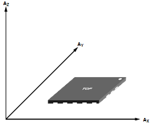
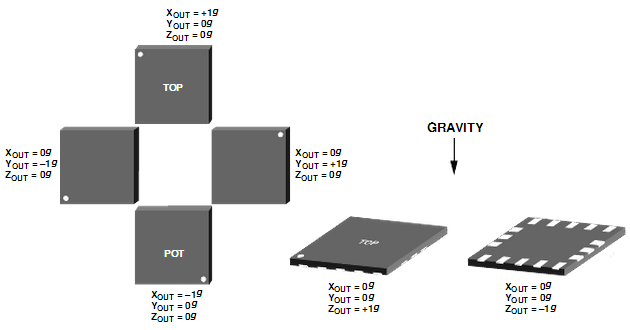
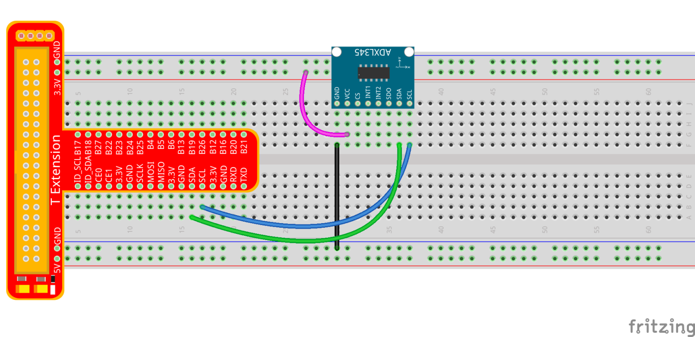
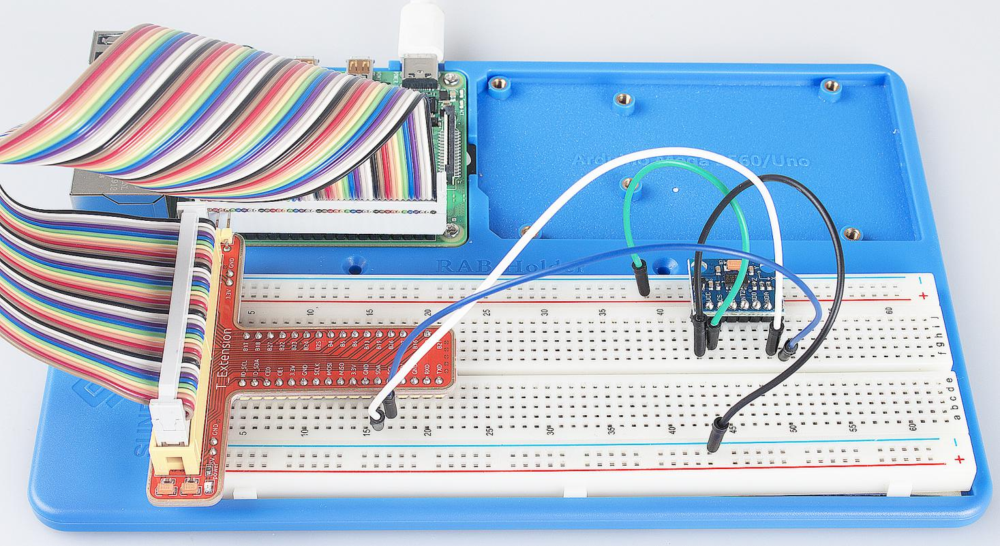

Lesson 17 ADXL345
====================

Introduction
--------------------

In this lesson, we will learn how to use the acceleration sensor
ADXL345.

Components
--------------------

\- 1 \* Raspberry Pi

\- 1 \* Breadboard

\- 1 \* ADXL345 module

\- 1 \* T-Extension Board

\- 1 \* 40-Pin GPIO Cable

\- Jumper wires

Principle
--------------------

**ADXL345**

The ADXL345 is a small, thin, low power, 3-axis accelerometer with high
resolution (13-bit) measurement at up to ±16 g. Digital output data is
formatted as 16-bit two’s complement and is accessible through either an
SPI (3- or 4-wire) or I2C digital interface.

The ADXL345 is well suited to measure the static acceleration of gravity
in tilt-sensing applications, as well as dynamic acceleration resulting
from motion or shock. Its high resolution (4 mg/LSB) enables the
inclination change measurement by less than 1.0°. And the excellent
sensitivity (3.9mg/LSB @2g) provides a high-precision output of up to
±16g.

In this experiment, I2C digital interface is used.

ADXL345 works like this:

Axes of detection by ADXL345

When you place the module face up, **Z_OUT** is at the maximum which is
+1g; face down, **Z_OUT** is at the minimum. No matter of face, as long
as it's placed on a level surface, **X_OUT** increases along the **Ax**
axis direction, so does **Y_OUT** along the Ay axis. See the picture
below. Thus, when you rotate the module, you can see the changes of
**X_OUT**, **Y_OUT**, and **Z_OUT**.

Relationship between output and gravity direction

Pin Function of ADXL345 Module:

+-----------------------------------+-----------------------------------+
| **Name**                          | **Description**                   |
+-----------------------------------+-----------------------------------+
| VS                                | Supply Voltage                    |
+-----------------------------------+-----------------------------------+
| CS                                | Chip Select; I2C mode is enabled  |
|                                   | if it's tie-high to VDD I/O       |
|                                   | **(**\ VDD I/O = 1.8V).           |
+-----------------------------------+-----------------------------------+
| SDO                               | Serial Data Out, alternate I2C    |
|                                   | address select                    |
+-----------------------------------+-----------------------------------+
| INT1                              | Interrupt 1 Output                |
+-----------------------------------+-----------------------------------+
| INT2                              | Interrupt 2 Output                |
+-----------------------------------+-----------------------------------+
| 3.3V                              | 3.3V                              |
+-----------------------------------+-----------------------------------+
| SDA                               | Serial Data (I2C), Serial Data In |
|                                   | (SPI 4-Wire), Serial Data In/Out  |
|                                   | (SPI 3-Wire)                      |
+-----------------------------------+-----------------------------------+
| SCL                               | Serial Communications Clock       |
+-----------------------------------+-----------------------------------+
| GND                               | GND                               |
+-----------------------------------+-----------------------------------+

Experimental Procedures
---------------------------

**Step 1:** Build the circuit.

The I2C interface is used in the following program. Before running the
program, please make sure the I2C driver module of Raspberry Pi has
loaded normally.

For C Language Users:
^^^^^^^^^^^^^^^^^^^^^^

**Step 2:** Get into the folder of code.

.. raw:: html

    <run></run>
    
.. code-block::

    cd /home/pi/SunFounder_Super_Kit_V3.0_for_Raspberry_Pi/C

**Step 3:** Compile the Code.

.. raw:: html

    <run></run>
    
.. code-block::

    make 17_adxl345

**Step 4:** Run.

.. raw:: html

    <run></run>
    
.. code-block::

    sudo ./17_adxl345

.. note::
   
   If it does not work after running, or there is an error prompt: \"wiringPi.h: No such file or directory\", please refer to :ref:`C code is not working?`.

**Code**

.. code-block:: c

    #include <wiringPiI2C.h>
    #include <stdio.h>
    #include <stdlib.h>
    #include <errno.h>
    #include <unistd.h>
    
    #define  DevAddr  0x53  //device address
    #define  SENSITIVITY 256.00  //the sensitivity at each axis is 256LSB/g in +-2g,10bit or full resolution 
    
    struct acc_dat{
        int x;
        int y;
        int z;
    };
    
    void adxl345_init(int fd)
    {
        wiringPiI2CWriteReg8(fd, 0x31, 0x0b); //set the range as +-16g & full resolution
        wiringPiI2CWriteReg8(fd, 0x2d, 0x08);
    //	wiringPiI2CWriteReg8(fd, 0x2e, 0x00);
        wiringPiI2CWriteReg8(fd, 0x1e, 0x00);
        wiringPiI2CWriteReg8(fd, 0x1f, 0x00);
        wiringPiI2CWriteReg8(fd, 0x20, 0x00);
        
        wiringPiI2CWriteReg8(fd, 0x21, 0x00);
        wiringPiI2CWriteReg8(fd, 0x22, 0x00);
        wiringPiI2CWriteReg8(fd, 0x23, 0x00);
    
        wiringPiI2CWriteReg8(fd, 0x24, 0x01);
        wiringPiI2CWriteReg8(fd, 0x25, 0x0f);
        wiringPiI2CWriteReg8(fd, 0x26, 0x2b);
        wiringPiI2CWriteReg8(fd, 0x27, 0x00);
        
        wiringPiI2CWriteReg8(fd, 0x28, 0x09);
        wiringPiI2CWriteReg8(fd, 0x29, 0xff);
        wiringPiI2CWriteReg8(fd, 0x2a, 0x80);
        wiringPiI2CWriteReg8(fd, 0x2c, 0x0a);
        wiringPiI2CWriteReg8(fd, 0x2f, 0x00);
        wiringPiI2CWriteReg8(fd, 0x38, 0x9f);
    }
    
    struct acc_dat adxl345_read_xyz(int fd)
    {
        char x0, y0, z0, x1, y1, z1;
        struct acc_dat acc_xyz;
    
        x0 = 0xff - wiringPiI2CReadReg8(fd, 0x32);
        x1 = 0xff - wiringPiI2CReadReg8(fd, 0x33);
        y0 = 0xff - wiringPiI2CReadReg8(fd, 0x34);
        y1 = 0xff - wiringPiI2CReadReg8(fd, 0x35);
        z0 = 0xff - wiringPiI2CReadReg8(fd, 0x36);
        z1 = 0xff - wiringPiI2CReadReg8(fd, 0x37);
    
        // printf("  x0 = %d   ",x0);printf("x1 = %d  \n",x1);
        // printf("  y0 = %d   ",y0);printf("y1 = %d  \n",y1);
        // printf("  z0 = %d   ",z0);printf("z1 = %d  \n",z1);
    
        acc_xyz.x = (int)(x1 << 8) + (int)x0;
        acc_xyz.y = (int)(y1 << 8) + (int)y0;
        acc_xyz.z = (int)(z1 << 8) + (int)z0;
    
        if(acc_xyz.x > 32767){
            acc_xyz.x -= 65536;	    
        }
        if(acc_xyz.y > 32767){
            acc_xyz.y -= 65536;	    
        }
        if(acc_xyz.z >32767){
            acc_xyz.z -= 65536;	
        }
    
        return acc_xyz;
    }
    
    int main(void)
    {
        int fd;
        struct acc_dat acc_xyz;
    
        fd = wiringPiI2CSetup(DevAddr);
        
        if(-1 == fd){
            perror("I2C device setup error");	
        }
    
        adxl345_init(fd);
    
        while(1){
            acc_xyz = adxl345_read_xyz(fd);
            float x = acc_xyz.x/SENSITIVITY; 
            float y = acc_xyz.y/SENSITIVITY;
            float z = acc_xyz.z/SENSITIVITY;
            printf("x: %.2f  y: %.2f  z: %.2f\n", x,y,z);
            
            sleep(1);
        }
        
        return 0;
    }

**Code Explanation**

.. code-block:: c

    #include <wiringPiI2C.h> // Include functions and method for the IIC protocol

    #define DevAddr 0x53 // device address

    struct acc_dat
    { // a struct variable to store the value of x，y，and z

        int x;

        int y;

        int z;

    };

    fd = wiringPiI2CSetup(DevAddr); // This initialises the I2C system with your given device identifier

    void adxl345_init(int fd)
    { // Initialize the device by i2c

        wiringPiI2CWriteReg8(fd, 0x31, 0x0b); 
        // These write an 8-bit data value into the device register indicated.

        wiringPiI2CWriteReg8(fd, 0x2d, 0x08); 
        // Write 0x08 to the address(0x21) of the i2c device

    }

    struct acc_dat adxl345_read_xyz(int fd)
    { 
        // a struct function, returning a struct value

        char x0, y0, z0, x1, y1, z1;

        struct acc_dat acc_xyz;

        x0 = 0xff - wiringPiI2CReadReg8(fd, 0x32); 
        // These read an 8- or 16-bit value from the device register indicated.

        x1 = 0xff - wiringPiI2CReadReg8(fd, 0x33); 
        // Read an 8-bit data from the 0x33 register of the I2C device fd, assign to x1

        y0 = 0xff - wiringPiI2CReadReg8(fd, 0x34);

        y1 = 0xff - wiringPiI2CReadReg8(fd, 0x35);

        z0 = 0xff - wiringPiI2CReadReg8(fd, 0x36);

        z1 = 0xff - wiringPiI2CReadReg8(fd, 0x37);

        printf(" x0 = %d ",x0);printf("x1 = %d \n",x1);

        printf(" y0 = %d ",y0);printf("y1 = %d \n",y1);

        printf(" z0 = %d ",z0);printf("z1 = %d \n",z1);

        acc_xyz.x = (int)(x1 << 8) + (int)x0; 
        // Assign values to members of the struct; the value of x consists of x1 (high 8 bits) and x0 (low 8 bits).

        acc_xyz.y = (int)(y1 << 8) + (int)y0;

        acc_xyz.z = (int)(z1 << 8) + (int)z0;

        if(acc_xyz.x > 32767)
        { // Set the value of x as no more than 0x7FFF

            acc_xyz.x -= 65536;

        }

        if(acc_xyz.y > 32767)
        { // Set the value of y as no more than 0x7FFF

            acc_xyz.y -= 65536;

        }

        if(acc_xyz.z > 32767)
        {

            acc_xyz.z -= 65536;

        }

        return acc_xyz; // The function ends, return to the acc_xyz struct

    }

    acc_xyz = adxl345_read_xyz(fd);
    // Call the function to read the data collected by the accelerometer module

    printf("x: %05d y: %05d z: %05d\n", acc_xyz.x, acc_xyz.y, acc_xyz.z); 
    // Print the data collected by the accelerometer; %05d means the printed
    // data is a 5-bit one, and the empty bit will be replaced by 0.
    

For Python Users:
^^^^^^^^^^^^^^^^^^^^^^

**Step 2:** Get into the folder of the code.

.. raw:: html

    <run></run>
    
.. code-block::

    cd /home/pi/SunFounder_Super_Kit_V3.0_for_Raspberry_Pi/Python

**Step 3:** Run.

.. raw:: html

    <run></run>
    
.. code-block::

    sudo python3 17_adxl345.py

**Code**

.. raw:: html

    <run></run>
    
.. code-block:: python

    from I2C import I2C
    from time import sleep
    
    class ADXL345(I2C):
    
        ADXL345_ADDRESS          = 0x53
        ADXL345_REG_DATA_FORMAT  = 0x31
        ADXL345_REG_DEVID        = 0x00 # Device ID
        ADXL345_REG_DATAX0       = 0x32 # X-axis data 0 (6 bytes for X/Y/Z)
        ADXL345_REG_POWER_CTL    = 0x2D # Power-saving features control
    
        ADXL345_DATARATE_0_10_HZ = 0x00
        ADXL345_DATARATE_0_20_HZ = 0x01
        ADXL345_DATARATE_0_39_HZ = 0x02
        ADXL345_DATARATE_0_78_HZ = 0x03
        ADXL345_DATARATE_1_56_HZ = 0x04
        ADXL345_DATARATE_3_13_HZ = 0x05
        ADXL345_DATARATE_6_25HZ  = 0x06
        ADXL345_DATARATE_12_5_HZ = 0x07
        ADXL345_DATARATE_25_HZ   = 0x08
        ADXL345_DATARATE_50_HZ   = 0x09
        ADXL345_DATARATE_100_HZ  = 0x0A # (default)
        ADXL345_DATARATE_200_HZ  = 0x0B
        ADXL345_DATARATE_400_HZ  = 0x0C
        ADXL345_DATARATE_800_HZ  = 0x0D
        ADXL345_DATARATE_1600_HZ = 0x0E
        ADXL345_DATARATE_3200_HZ = 0x0F
    
        ADXL345_RANGE_2_G        = 0x00 # +/-  2g (default)
        ADXL345_RANGE_4_G        = 0x01 # +/-  4g
        ADXL345_RANGE_8_G        = 0x02 # +/-  8g
        ADXL345_RANGE_16_G       = 0x03 # +/- 16g
        ADXL345_SENSITIVITY      = 256.00 # 256LSB/g in full resolution
    
        def __init__(self, busnum=1, debug=False):
            self.accel = I2C(self.ADXL345_ADDRESS, busnum, debug)
            if self.accel.readU8(self.ADXL345_REG_DEVID) == 0xE5:
                # Enable the accelerometer
                self.accel.write8(self.ADXL345_REG_POWER_CTL, 0x08)
    
        def setRange(self, range):
            # Read the data format register to preserve bits.  Update the data
            # rate, make sure that the FULL-RES bit is enabled for range scaling
            format = ((self.accel.readU8(self.ADXL345_REG_DATA_FORMAT) & ~0x0F) |
              range | 0x08)
            # Write the register back to the IC
            self.accel.write8(self.ADXL345_REG_DATA_FORMAT, format)
    
        def getRange(self):
            return self.accel.readU8(self.ADXL345_REG_DATA_FORMAT) & 0x03
    
        def setDataRate(self, dataRate):
            # Note: The LOW_POWER bits are currently ignored,
            # we always keep the device in 'normal' mode
            self.accel.write8(self.ADXL345_REG_BW_RATE, dataRate & 0x0F)
    
        def getDataRate(self):
            return self.accel.readU8(self.ADXL345_REG_BW_RATE) & 0x0F
    
        # Read the accelerometer
        def read(self):
            raw = self.accel.readList(self.ADXL345_REG_DATAX0, 6)
            #print (raw)
            res = []
            for i in range(0, 6, 2):
                g = raw[i] | (raw[i+1] << 8)
                if g > 32767: 
                    g -= 65535
                res.append(g/self.ADXL345_SENSITIVITY)
            return res
    
    # Simple example prints accelerometer data once per second:
    def main():
        accel = ADXL345()
        accel.setRange(accel.ADXL345_RANGE_16_G)
        while True:
            x, y, z = accel.read()
            print('X: %.2f, Y: %.2f, Z: %.2f'%(x, y, z))
            sleep(1) # Output is fun to watch if this is commented out
    
    def destroy():
        exit()
    
    if __name__ == '__main__':
        try:
            main()
        except KeyboardInterrupt:
            destroy()

**Code Explanation**

.. code-block:: python
    
    class ADXL345(I2C): # Define a class ADXL345，and the class inheritance is I2C

    def __init__(self, busnum=1, debug=False): 
    # The initialize function of the class, which is run when an instance is created of the class

    def setRange(self, range): 
    # Read the data format register to preserve bits. Update the data rate, 
    # make sure that the FULL-RES bit is enabled for range scaling:

    def getRange(self): # Read an 8-bit data from the device register

    def setDataRate(self, dataRate): 
    # Note: The LOW_POWER bits are currently ignored; we always keep the device in 'normal' mode

    def getDataRate(self): # get the rate from the register

    def read(self): # Read data from the accelerometer

        raw = self.accel.readList(self.ADXL345_REG_DATAX0, 6) 
        # Read 6 values from the register, respectively equal to the high and low bits of the x, y, and z value

        print ( raw)

        res = []

        for i in range(0, 6, 2):

            g = raw[i] | (raw[i+1] << 8) 
            # Combine the high 8 bits and low 8 bits and obtain a measurement value g = 65535-g

            if g > 32767:

                g -= 65535

            res.append(g)

        return res

    accel = ADXL345() # Create an instance accel of class ADXL345

    x, y, z = accel.read() # accel calls itself to measure x, y, and z and store them in a list. 
                                   # Then assign the values measured to x, y, and z.

Now, rotate the acceleration sensor, and you should see the values
printed on the screen change.

