Lesson 1 Blinking LED
=======================

Introduction
------------------

In this lesson, we will learn how to program Raspberry Pi to make an LED
blink. You can play numerous tricks with an LED as you want. Now get to
start and you will enjoy the fun of DIY at once!

Components
-----------

\- 1 \* Raspberry Pi

\- 1 \* Breadboard

\- 1 \* T-Extension Board

\- 1 \* 40-Pin Cable

\- 1 \* LED

\- 1 \* Resistor (220Ω)

\- Jumper wires

Principle
-------------

In this experiment, connect a 220Ω resistor to the anode (the long pin
of the LED), then the resistor to 3.3 V, and connect the cathode (the
short pin) of the LED to B17 of Raspberry Pi. We can see from the
schematic diagram that the anode of LED connects to a current-limiting
resistor and then to 3.3V. **Therefore**, to turn on an LED, we need to
make B17 low (0V) level. It can be realized by programming.

.. image:: media/image99.png
    :align: center

Experimental Procedures
---------------------------

**Step 1:** Build the circuit.

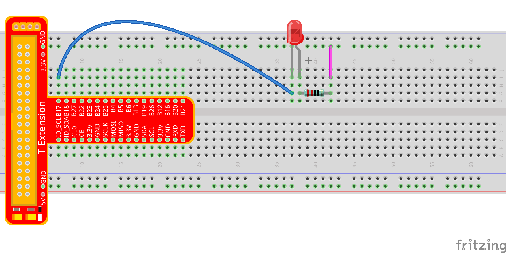

For C Language Users:
^^^^^^^^^^^^^^^^^^^^^^^^

**Step 2:** Go to the folder of the code.

**If you use a monitor, you're recommended to take the following
steps.**

Go to /home/pi/ and find the folder
SunFounder_Super_Kit_V3.0_for_Raspberry_Pi .

Find **C** in the folder, right-click on it and select **Open in
Terminal.**

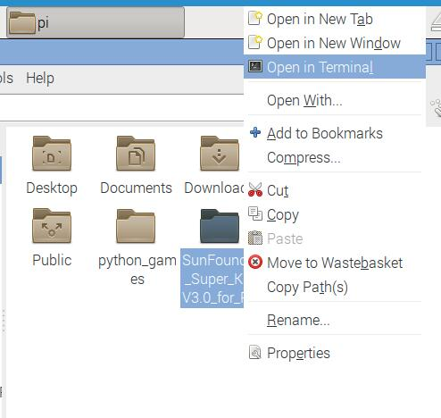

Then a window will pop up as shown below. So now you've entered the path
of the code **01_blinkLed.c**

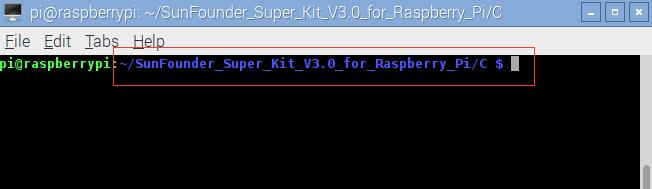

In the lessons later, we will show how to get into the folder of the
code in command way, not with the display. You only need to find out the
code file and right click **Open in Terminal.** You can back to lesson 1
to check if you forgot. Certainly, the terminal can be opened if you’re
using display, and then use cd command directly to go to the code path.

**If you log into the Raspberry Pi remotely, use “cd” to change
directory:**

.. raw:: html

    <run></run>
 
.. code-block::
    
    cd /home/pi/SunFounder_Super_Kit_V3.0_for_Raspberry_Pi/C

.. note::
    
    Change directory to the path of the code in this experiment via cd.

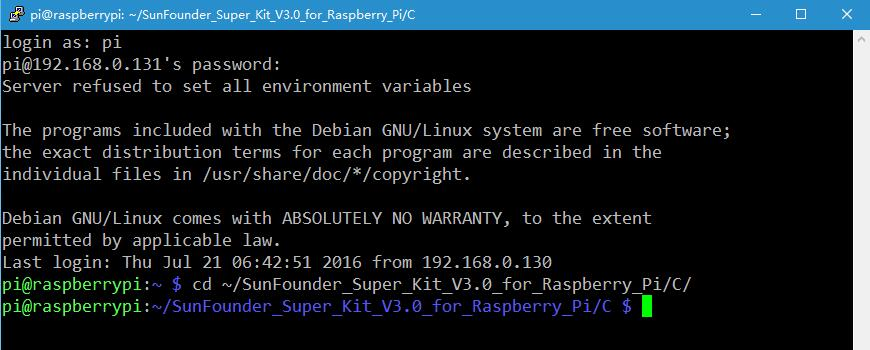

In either way, you now are in the folder *C*. The subsequent procedures
under the two methods are the same. Let's move on.

**Step 3:** Compile the Code.

.. raw:: html

    <run></run>

.. code-block::

    gcc 01_blinkLed.c -o 01_blinkLed -lwiringPi

.. note::
    
    gcc is GNU Compiler Collection. Here, 
    it functions like compiling the C language file *01_blinkLed.c* 
    and outputting an executable file 01_blinkLed. 
    In the command, -o means outputting and -lwiringPi is to load the 
    library wiringPi (l is short for library).If you want to write your 
    own C code and compile to run it, you need to master gcc.

Since the gcc command is too long, you can use make to test the
experimental effect of the kit to make the process quicker and more
convenient.

.. raw:: html

    <run></run>
 
.. code-block::

    make 01_blinkLed

.. note::
    
    The make command will compile according to the rules in the Makefile. 
    Two files will be generated after compiling: \"\*.o\" and an executable file.
    
    We use makefile, in essence, is to write the compilation method of gcc 
    into the automated script. If you have written your own program in C 
    language, you need to write and modify the makefile so as to use make 
    command to compile your C code.

**Step 4:** Run the executable file output in the previous step:

.. raw:: html

    <run></run>
 
.. code-block::

    sudo ./01_blinkLed

.. note::
    
    To control the GPIO, you need to access to led with the 
    permission of superuser (sudo is not needed to control the GPIO for the 
    raspbian system after 2016-5-27), namely, by the command sudo. In the 
    command “./” indicates the current directory. The whole command is to 
    run the *01_blinkLed* in the current directory.

    If it does not work after running, please refer to :ref:`C code is not working?`

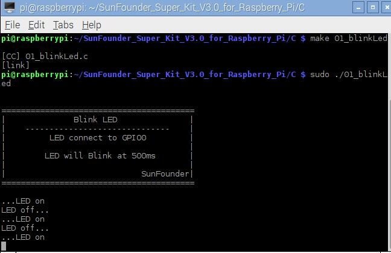

If you want to view the code *01_blinkLed.c*, press **Ctrl + C** to stop
running the code. Then type the following command to open it:

.. raw:: html

    <run></run>
 
.. code-block::

    nano 01_blinkLed.c

.. note::
    nano is a text editor tool. The command is to open the code file *01_edblinkLed.c* by this tool.

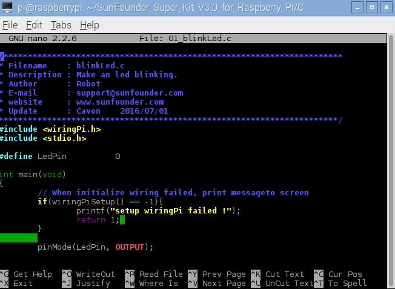

**Code**

.. code-block:: C

    #include <wiringPi.h>
    #include <stdio.h>

    #define LedPin		0

    int main(void)
    {
        // When initialize wiring failed, print messageto screen
        if(wiringPiSetup() == -1){
            printf("setup wiringPi failed !");
            return 1; 
        }
        
        pinMode(LedPin, OUTPUT);

        printf("\n");
        printf("\n");
        printf("========================================\n");
        printf("|              Blink LED               |\n");
        printf("|    ------------------------------    |\n");
        printf("|         LED connect to GPIO0         |\n");
        printf("|                                      |\n");
        printf("|        LED will Blink at 500ms       |\n");
        printf("|                                      |\n");
        printf("|                            SunFounder|\n");
        printf("========================================");
        printf("\n");
        printf("\n");
        
        while(1){
            // LED on
            digitalWrite(LedPin, LOW);
            printf("...LED on\n");
            delay(500);
            // LED off
            digitalWrite(LedPin, HIGH);
            printf("LED off...\n");
            delay(500);
        }

        return 0;
    }

**Code Explanation**

.. code-block:: C

    #include <wiringPi.h> 
    // The hardware drive library designed for the C language of Raspberry Pi. 
    // Adding this library is convenient for hardware initialization, I/O ports, PWM outputs, etc.

    #include <stdio.h>
    /* Standard I/O library. The pintf function used for
    printing the data displayed on the screen is realized by this library.
    There are many other performance functions for you to explore.*/

    #define LedPin 0 
    /* Pin B17 of the T_Extension Board is corresponding to
    the pin0 in wiringPi, namely, GPIO 0 of the raspberry Pi. Assign GPIO 0
    to LedPin, LedPin represents GPIO 0 in the code later.*/

    pinMode(LedPin, OUTPUT) // Set LedPin as output to write value to it.

    digitalWrite(LedPin, LOW) 
    /* Set GPIO0 as 0V (low level). Since the
    cathode of LED is connected to GPIO0, thus the LED will light up if
    GPIO0 is set low. On the contrary, set GPIO0 as high level, digitalWrite
    (LedPin, HIGH): LED will go out.*/

Press **Ctrl+X** to exit. If you have modified the code, there will be a
prompt asking whether to save the changes or not. Type in **Y** (save)
or **N** (don’t save). Then press **Enter** to exit. Repeat **Step 3**
and **Step 4** to see the effect after modifying.

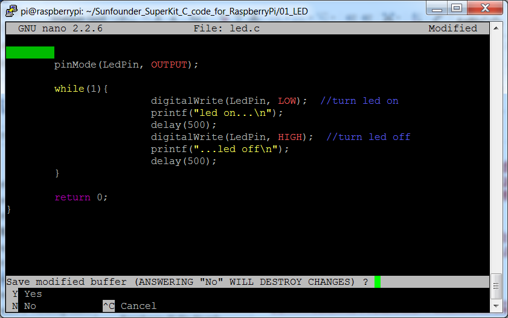

For Python Users:
^^^^^^^^^^^^^^^^^^^

**Step 2:** Go to the folder of the code and run it.

Open the downloaded folder *SunFounder_Super_Kit_V3.0_for_Raspberry_Pi/Python* and you can see
them.

**If you use a monitor, you're recommended to take the following
steps.**

Find *01_blinkLed.py* and double click it to open. Now you're in the
file.

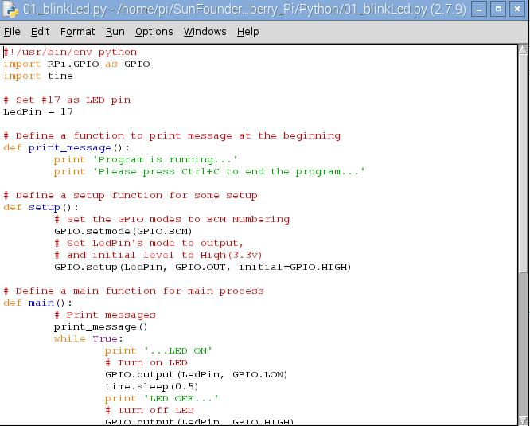

Click **Run** -> **Run Module** in the window and the following contents
will appear.

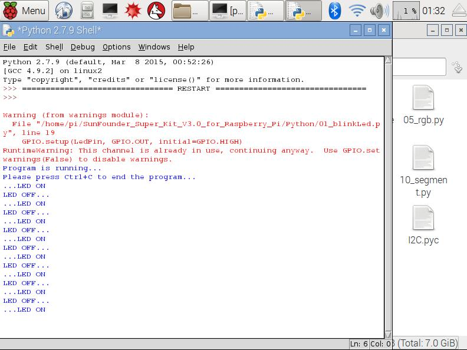

To stop it from running, just click the X button on the top right to
close it and then you'll back to the code details. If you modify the
code, before clicking **Run Module (F5)** you need to save it first.
Then you can see the results.

**If you want to log into the Raspberry Pi remotely, type in the
command:**

.. raw:: html

    <run></run>

.. code-block::

    cd /home/pi/SunFounder_Super_Kit_V3.0_for_Raspberry_Pi/Python

Run the code:

.. raw:: html

    <run></run>

.. code-block::

    sudo python3 01_blinkLed.py

.. note::

    Here sudo – superuser do, and python means to run the file by Python.

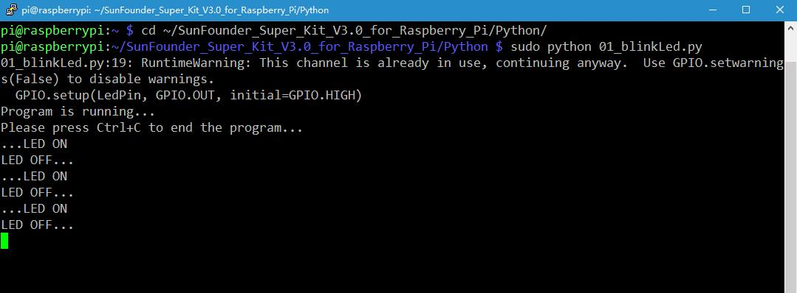

If you want to view the code *01_blinkLed.py*, press **Ctrl + C** to
stop running the code. Then type the following command to open it:

.. raw:: html

    <run></run>

.. code-block::

    nano 01_blinkLed.py

.. note::
   
    nano is a text editor tool. The command is to open the code file 01_blinkLed.c by this tool.

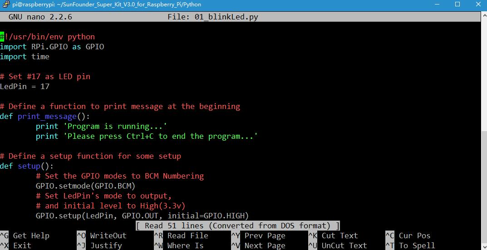

    
**Code**

.. raw:: html

    <run></run>

.. code-block:: python

    import RPi.GPIO as GPIO
    import time
    from sys import version_info
    
    if version_info.major == 3:
        raw_input = input
    
    # Set #17 as LED pin
    LedPin = 17
    
    # Define a function to print message at the beginning
    def print_message():
        print ("========================================")
        print ("|              Blink LED               |")
        print ("|    ------------------------------    |")
        print ("|         LED connect to B17           |")
        print ("|                                      |")
        print ("|        LED will Blink at 500ms       |")
        print ("|                                      |")
        print ("|                            SunFounder|")
        print ("========================================\n")
        print ("Program is running...")
        print ("Please press Ctrl+C to end the program...")
        #raw_input ("Press Enter to begin\n")
    
    # Define a setup function for some setup
    def setup():
        # Set the GPIO modes to BCM Numbering
        GPIO.setmode(GPIO.BCM)
        # Set LedPin's mode to output, 
        # and initial level to High(3.3v)
        GPIO.setup(LedPin, GPIO.OUT, initial=GPIO.HIGH)
    
    # Define a main function for main process
    def main():
        # Print messages
        print_message()
        while True:
            print ("...LED ON")
            # Turn on LED
            GPIO.output(LedPin, GPIO.LOW)
            time.sleep(0.5)
            print ("LED OFF...")
            # Turn off LED
            GPIO.output(LedPin, GPIO.HIGH) 
            time.sleep(0.5)
    
    # Define a destroy function for clean up everything after
    # the script finished 
    def destroy():
        # Turn off LED
        GPIO.output(LedPin, GPIO.HIGH)
        # Release resource
        GPIO.cleanup()                     
    
    # If run this script directly, do:
    if __name__ == '__main__':
        setup()
        try:
            main()
        # When 'Ctrl+C' is pressed, the child program 
        # destroy() will be  executed.
        except KeyboardInterrupt:
            destroy()

**Code Explanation**

.. code-block:: python

    #!/usr/bin/env python3:

    """When the system detects this, it will search the installation path of
    python in the env setting, then call the corresponding interpreter to
    complete the operation. It’s to prevent the user not installing the
    python onto the /usr/bin default path."""

    import RPi.GPIO as GPIO 
    # import RPI.GPIO package, thus python code control GPIO easily with it.

    import time 
    # import time package, for time delay function in the following program.

    LedPin = 17 
    # LED connects to the B17 of the T-shape extension board, namely, the GPIO 0 of the Raspberry Pi.

    # Define a setup function for some setup
    def setup():

        GPIO.setmode(GPIO.BCM) # Set the GPIO modes to BCM Numbering

        # Set LedPin's mode to output, and initial level to High (3.3v)

        GPIO.setup(LedPin, GPIO.OUT, initial=GPIO.HIGH)

    # Define a main function for main process

    def main():

        # Print messages

        print_message()

        while True:

            print ("...LED ON")

            # Turn on LED

            GPIO.output(LEDPin, GPIO.LOW)

            # delay 0.5 second, which is equals to the delay in C language, using
            second as the unit,

            time.sleep(0.5)

            print ("LED OFF...")

            # Turn off LED

            GPIO.output(LedPin, GPIO.HIGH)

            time.sleep(0.5)

    # Define a destroy function for clean up everything after the script finished

    def destroy():

        # Turn off LED

        GPIO.output(LedPin, GPIO.HIGH)

        # Release resource

        GPIO.cleanup()

    # If run this script directly, do:

    if __name__ == '__main__':

        setup()

        try:

            main()

        # When 'Ctrl+C' is pressed, the child program destroy () will be executed.

        except KeyboardInterrupt:

            destroy()

Press **Ctrl+X** to exit. If you have modified the code, there will be a
prompt asking whether to save the changes or not. Type in **Y** (save)
or **N** (don’t save).

Then press **Enter** to exit. Type in nano 01_blinkLed.py again to see
the effect after the change.

Run the code to make it work. It will be like below:

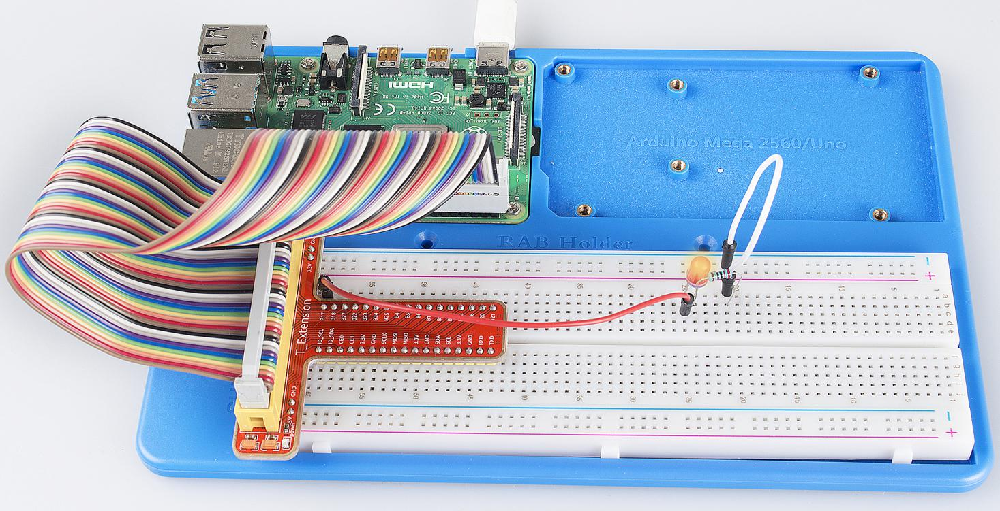

Further Exploration
--------------------

If you want the LED to speed up the blinking, just change the delay
time. For example, change the time to *delay (200)* (for C) or
*time.sleep(0.2)* (for python) in the program, recompile and run, and
then you will see the LED blink faster.

Summary
-------------

Raspberry Pi packages many low-level detail designs, which ease your way
to explore your own apps. Maybe that is the charm of Raspberry Pi. Now
you have already learnt how to use the Raspberry Pi GPIO to blink an
LED. Keep moving to the next contents.

FAQ
-----

If you haven't modified the code, you do not need to run make
*01_blinkLed* again.

.. code-block::

    make 01_blinkLed

Or a message will appear: make: ’01_blinkLed’ is up to date.

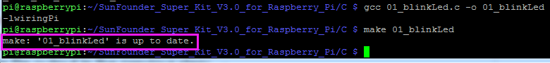

It will not appear only when you run the make command after having
changed the code and saved it.

**tips:** For any **TECHNICAL** questions, add a topic under **FORUM** section on our website `www.sunfounder.com <http://www.sunfounder.com>`_
and we'll reply as soon as possible.
