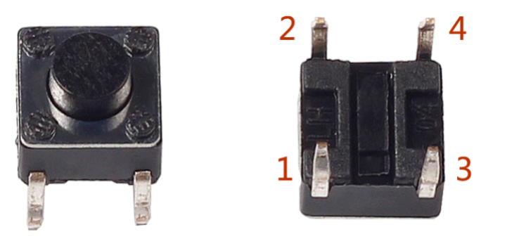
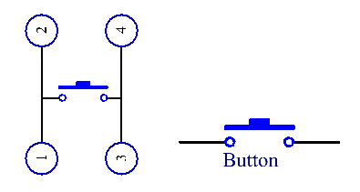
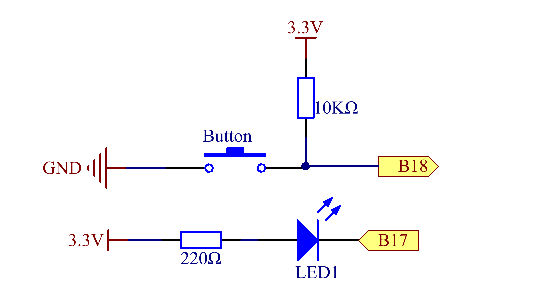
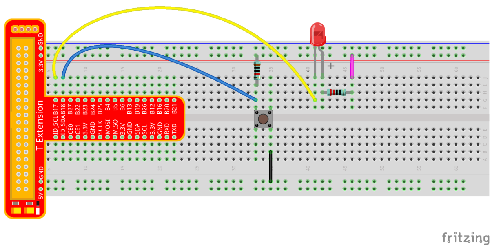
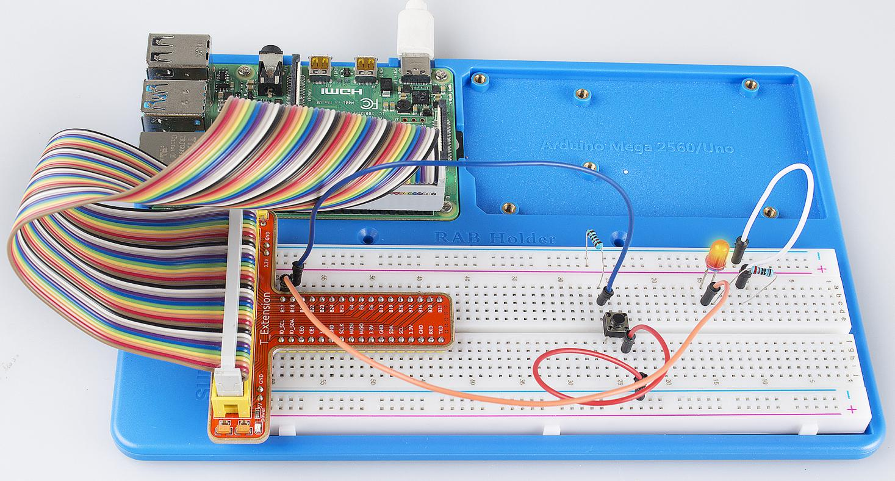

Lesson 2 Controlling an LED by a Button
=========================================

Introduction
---------------

In this lesson, we will learn how to turn an LED on or off by a button.

Components
------------

\- 1 \* Raspberry Pi

\- 1 \* Breadboard

\- 1 \* LED

\- 1 \* Button

\- 2 \* Resistor (220Ω, 10K)

\- Jumper wires

\- 1 \* T-Extension Board

\- 1 \* 40-Pin Cable

Principle
--------------

**Button**

Buttons are a common component used to control electronic devices. They
are usually used as switches to connect or disconnect circuits. Although
buttons come in a variety of sizes and shapes, the one used here is a
6mm mini-button as shown in the following pictures. Pin 1 is connected
to pin 2 and pin 3 to pin 4. So you just need to connect either of pin 1
and pin 2 to pin 3 or pin 4.

The following is the internal structure of a button. Since the pin 1 is
connected to pin 2, and pin 3 to pin 4. The symbol on the right below is
usually used to represent a button in circuits.

When the button is pressed, the 4 pins are connected, thus closing the
circuit.

Use a normally open button as the input of Raspberry Pi, the detailed
connection is as shown in the schematic diagram below. When the button
is pressed, the B18 will turn into low level (0V). We can detect the
state of the B18 through programming. That is, if the B18 turns into low
level, it means the button is pressed. You can run the corresponding
code when the button is pressed, and then the LED will light up.

.. note::

    The longer pin of the LED is the anode and the shorter one is the cathode.

    
Experimental Procedures
------------------------

**Step 1**: Build the circuit.

For C Language Users:
^^^^^^^^^^^^^^^^^^^^^^^^

**Step 2:** Open the code file:

.. raw:: html

    <run></run>

.. code-block::

    cd /home/pi/SunFounder_Super_Kit_V3.0_for_Raspberry_Pi/C

.. note::
    
    Change directory to the path of the code in this experiment via cd.

**Step 3:** Compile the Code.

.. raw:: html

    <run></run>

.. code-block::

    gcc 02_buttonControlLed.c -o 02_buttonControlLed -lwiringPi

**or**

.. raw:: html

    <run></run>

.. code-block::

    make 02_buttonControlLed

**Step 4:** Run the executable file above.

.. raw:: html

    <run></run>

.. code-block::

    sudo ./02_buttonControlLed

.. note::

    If it does not work after running, please refer to :ref:`C code is not working?`

**Step 5:** Check the code.

.. raw:: html

    <run></run>
    
.. code-block::

    nano 02_buttonControlLed.c

**Code**

.. code-block:: C

    #include <wiringPi.h>
    #include <stdio.h>
    
    #define LedPin		0
    #define ButtonPin 	1
    
    int main(void){
        // When initialize wiring failed, print messageto screen
        if(wiringPiSetup() == -1){
            printf("setup wiringPi failed !");
            return 1; 
        }
        
        pinMode(LedPin, OUTPUT); 
        pinMode(ButtonPin, INPUT);
        // Pull up to 3.3V,make GPIO1 a stable level
        pullUpDnControl(ButtonPin, PUD_UP);
    
        printf("\n");
        printf("\n");
        printf("========================================\n");
        printf("|          Button control LED          |\n");
        printf("|    ------------------------------    |\n");
        printf("|         LED connect to GPIO0         |\n");
        printf("|        Button connect to GPIO1       |\n");
        printf("|                                      |\n");
        printf("|     Press button to turn on LED.     |\n");
        printf("|                                      |\n");
        printf("|                            SunFounder|\n");
        printf("========================================\n");
        printf("\n");
        printf("\n");
    
        digitalWrite(LedPin, HIGH);
        printf("LED off...\n");
    
        while(1){
            // Indicate that button has pressed down
            if(digitalRead(ButtonPin) == 0){
                // Led on
                digitalWrite(LedPin, LOW);
                printf("...LED on\n");
                delay(100);
            }
            else{
                // Led off
                digitalWrite(LedPin, HIGH);
                printf("LED off...\n");
                delay(100);
            }
        }
        return 0;
    }

**Code Explanation**

.. code-block:: C

    #define LedPin 0 
    /* Pin B17 in the T_Extension Board connects to the GPIO0.
    GPIO0 corresponds to pin0 in the wiringPi pin figure. So in C program,
    LedPin is defined as 0. */

    #define ButtonPin 1 
    /* Pin B18 in the T_Extension Board connects to the
    GPIO8. GPIO8 corresponds to pin1 in the wiringPi pin figure. So in C
    program, LedPin is defined as 1.*/

    pinMode(LedPin, OUTPUT) // Set LedPin as output to assign value to it.

    pinMode(ButtonPin, INPUT) // Set ButtonPin as input to read the value of ButtonPin.

    pullUpDnControl(ButtonPin, PUD_UP) 
    /* Set the ButtonPin as pull-up input.
    When the button is not pressed, the I/O port is 3.3V. When the button is
    pressed, the I/O port connects to GND (OV). You can judge the button
    status by reading the level value of the I/O port.*/

    while(1){

        // indicate that button has pressed down

        if(digitalRead(ButtonPin) == 0)
        
        {

            // LED on

            digitalWrite(LedPin, LOW);

            printf("...LED on\n");
            delay(100);
        }

        else
        
        {

            // LED off

            digitalWrite(LedPin, HIGH);

            printf("LED off...\n");
            delay(100);
        }

    /* digitalWrite (LedPin, HIGH) in while: close the LED. if (digitalRead(ButtonPin) == 0: 
    check whether the button has been pressed. Execute digitalWrite(LedPin, LOW) 
    when pressed to light up LED.*/
    }

Press **Ctrl+X** to exit, if you have modified the code, there will be a
prompt asking whether to save the changes or not. Type in **Y** (save)
or **N** (don’t save). Then press **Enter** to exit. Repeat **Step 3**
and **Step 4** to see the effect after modifying.

For Python Users:
^^^^^^^^^^^^^^^^^^^^^^

**Step 2:** Open the code file.

.. raw:: html

    <run></run>
    
.. code-block::
    
    cd /home/pi/SunFounder_Super_Kit_V3.0_for_Raspberry_Pi/Python

**Step 3:** Run the code.

.. raw:: html

    <run></run>
    
.. code-block::
    
    sudo python3 02_buttonControlLed.py

**Step 4:** Check the code.

.. raw:: html

    <run></run>
    
.. code-block::
    
    nano 02_buttonControlLed.py

**Code**

.. raw:: html

    <run></run>
    
.. code-block:: python

    import RPi.GPIO as GPIO
    import time
    from sys import version_info
    
    if version_info.major == 3:
        raw_input = input
    
    # Set #17 as LED pin
    LedPin = 17
    # Set #18 as button pin
    BtnPin = 18
    
    # Set Led status to True(OFF)
    Led_status = True
    
    # Define a function to print message at the beginning
    def print_message():
        print ("========================================")
        print ("|          Button control LED          |")
        print ("|    ------------------------------    |")
        print ("|         LED connect to GPIO17        |")
        print ("|        Button connect to GPIO18      |")
        print ("|                                      |")
        print ("|   Press button to turn on/off LED.   |")
        print ("|                                      |")
        print ("|                            SunFounder|")
        print ("========================================\n")
        print ("Program is running...")
        print ("Please press Ctrl+C to end the program...")
        raw_input ("Press Enter to begin\n")
    
    # Define a setup function for some setup
    def setup():
        # Set the GPIO modes to BCM Numbering
        GPIO.setmode(GPIO.BCM)
        # Set LedPin's mode to output, 
        # and initial level to high (3.3v)
        GPIO.setup(LedPin, GPIO.OUT, initial=GPIO.HIGH)
        # Set BtnPin's mode to input, 
        # and pull up to high (3.3V)
        GPIO.setup(BtnPin, GPIO.IN, pull_up_down=GPIO.PUD_UP)
        # Set up a falling detect on BtnPin, 
        # and callback function to swLed
        GPIO.add_event_detect(BtnPin, GPIO.FALLING, callback=swLed)
    
    # Define a callback function for button callback
    def swLed(ev=None):
        global Led_status
        # Switch led status(on-->off; off-->on)
        Led_status = not Led_status
        GPIO.output(LedPin, Led_status)
        if Led_status:
            print ("LED OFF...")
        else:
            print ("...LED ON")	
            
    # Define a main function for main process
    def main():
        # Print messages
        print_message()
        while True:
            # Don't do anything.
            time.sleep(1)
    
    # Define a destroy function for clean up everything after
    # the script finished 
    def destroy():
        # Turn off LED
        # GPIO.output(LedPin, GPIO.HIGH)
        # Release resource
        GPIO.cleanup()
    
    # If run this script directly, do:
    if __name__ == '__main__':
        destroy()
        setup()
        try:
            main()
        # When 'Ctrl+C' is pressed, the child program 
        # destroy() will be  executed.
        except KeyboardInterrupt:
            destroy()
        finally:
            print("destroy")
            destroy()

**Code Explanation**

.. code-block:: python
    
    LedPin = 17 # Set #17 as LED pin

    BtnPin = 18 # Set #18 as button pin

    # Set up a falling detect on BtnPin, and callback function to swled

    GPIO.add_event_detect(BtnPin, GPIO.FALLING, callback=swLED)

    # Define a callback function for button callback, execute the function after the callback of the interrupt.

    def swLed(ev=None):

        global Led_status

        # Switch Led status (on-->off; off-->on)

        Led_status = not Led_status

        GPIO.output(LedPin, Led_status)

        if Led_status:

            print ("LED OFF...")

        else:

            print ("...LED ON")

Now, press the button, and the LED will light up; press the button
again, and the LED will go out. At the same time, the state of the LED
will be printed on the screen.

