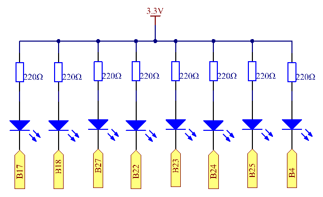
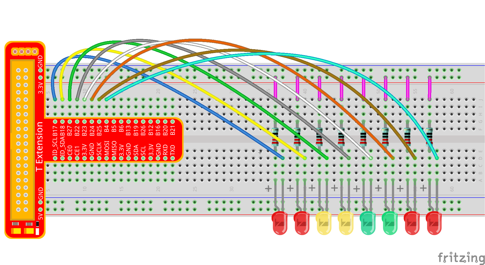
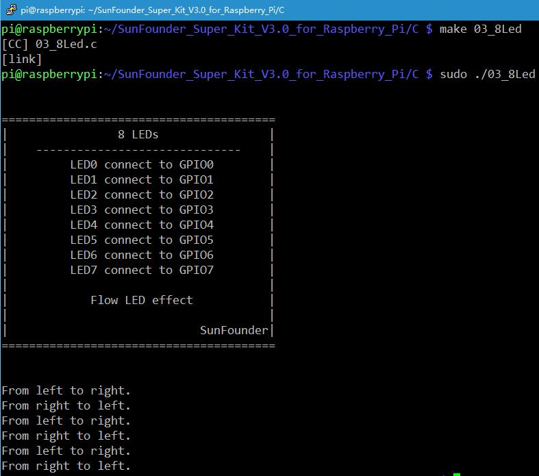
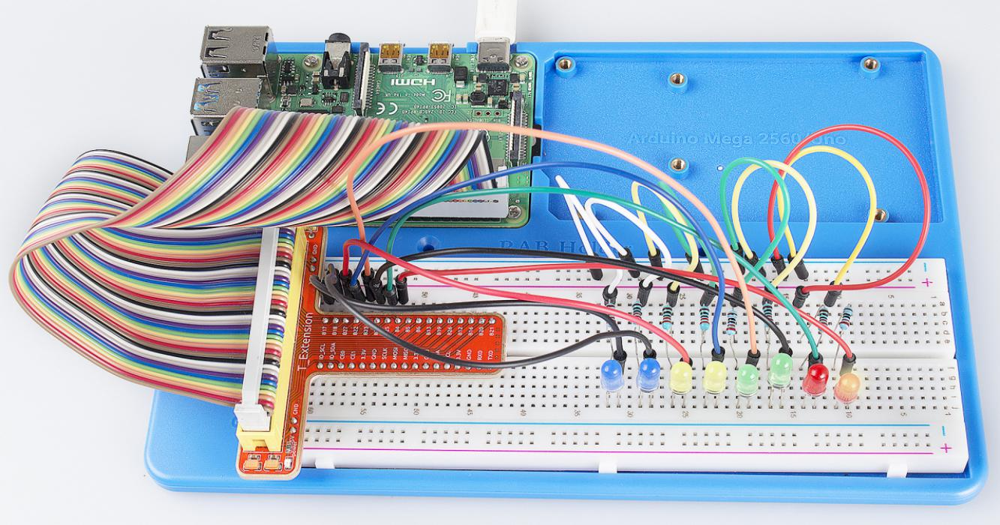

Lesson 3 Flowing LED Lights
=============================

Introduction
---------------

In this lesson, we will learn how to make eight LEDs blink in various
effects as you want based on Raspberry Pi.

Components
-------------

\- 1 \* Raspberry Pi

\- 1 \* Breadboard

\- 8 \* LED

\- 8 \* Resistor (220Ω)

\- Jumper wires

\- 1 \* T-Extension Board

\- 1 \* 40-Pin Cable

Principle
-----------

**Principle**: Judging from the schematic diagram, we can know that a
LED and a current-limiting resistor have been connected to B17, B18,
B27, B22, B23, B24, B25, and B4 respectively. The current-limiting
resistor has been connected to the 3.3V power supply on other side.
Therefore, if we want to light up one LED, we only need to set the GPIO
of the LED as low level. So in this experiment, set B17, B18, B27, B22,
B23, B24, B25, and B4 to low level in turn by programming, and then
LED0-LED7 will light up in turn. You can make eight LEDs blink in
different effects by controlling their delay time and the order of
lighting up.

Experimental Procedures
-------------------------

**Step 1**: Build the circuit.

**Step 2:** GPIO4 is the default pin for onewire driver (w1-gpio). In
this lesson, we need to disable the onewire function and use it as an
output pin.

.. code-block::

    sudo nano/boot/config.txt

Commit the following line.

.. code-block::

    #dtoverlay=w1-gpio

For C Language Users:
^^^^^^^^^^^^^^^^^^^^^^^^^

**Step 3:** Open the code file.

.. code-block::

    cd/home/pi/SunFounder_Super_Kit_V3.0_for_Raspberry_Pi/C

.. note::
    
    Use the cd command to switch to the code path of this experiment.

**Step 4:** Compile the Code.

.. code-block::

    gcc 03_8Led.c -o 03_8Led -lwiringPi

**or**

.. code-block::

    make 03_8Led

.. note::
    
    *gcc* is a linux command which can realize compiling and generating the C language program file **03_8Led.c** to the executable file **03_8Led**.
    
    *make* is a linux command which can compiling and generating the executable file according to the rule inside the makefile.

**Step 5:** Run the executable file above.

.. code-block::

    sudo ./03_8Led

.. note::
    
    Here the Raspberry Pi will run the executable file *03_8Led* compiled previously.

**Code**

.. code-block:: C

    #include <wiringPi.h>
    #include <stdio.h>
    
    // Turn LED(channel) on
    void led_on(int channel){
        digitalWrite(channel, LOW);
    }
    
    // Turn LED(channel) off
    void led_off(int channel){
        digitalWrite(channel, HIGH);
    }
    
    int main(void){
        int i;
    
        // When initialize wiring failed, print messageto screen
        if(wiringPiSetup() == -1){
            printf("setup wiringPi failed !");
            return 1; 
        }
        // Set 8 pins' modes to output
        for(i=0;i<8;i++){       
            pinMode(i, OUTPUT);
        }
    
        printf("\n");
        printf("\n");
        printf("========================================\n");
        printf("|                8 LEDs                |\n");
        printf("|    ------------------------------    |\n");
        printf("|         LED0 connect to GPIO0        |\n");
        printf("|         LED1 connect to GPIO1        |\n");
        printf("|         LED2 connect to GPIO2        |\n");
        printf("|         LED3 connect to GPIO3        |\n");
        printf("|         LED4 connect to GPIO4        |\n");
        printf("|         LED5 connect to GPIO5        |\n");
        printf("|         LED6 connect to GPIO6        |\n");
        printf("|         LED7 connect to GPIO7        |\n");
        printf("|                                      |\n");
        printf("|            Flow LED effect           |\n");
        printf("|                                      |\n");
        printf("|                            SunFounder|\n");
        printf("========================================\n");
        printf("\n");
        printf("\n");
    
        while(1){
            // Turn LED on from left to right
            printf("From left to right.\n");
            for(i=0;i<8;i++){
                led_on(i);
                delay(100);
                led_off(i);
            }
            // Turn LED off from right to left
            printf("From right to left.\n");
            for(i=8;i>=0;i--){
                led_on(i);
                delay(100);
                led_off(i);
            }
        }
    
        return 0;
    }
    

**Code Explanation**

.. code-block:: C
    
    void Led_on(int channel)
    { /* This is a subfunction with a formal parameter
    int channel for importing the numbers of the controlled pins. Its
    function body is digitalWrite(channel, LOW); Set the I/O port of channel
    as low level(0V), the LED on this port lights up. void led_off(int
    channel) is to turn off the LED. Setting function simplifies the input
    for the repeated content.*/

        for(i=0;i<8;i++)
        { //make 8 pins' mode is output

            pinMode(i, OUTPUT);

        }
        /*The cathodes of the 8 LEDs connect to B17, B18, B27, B22, B23, B24,
        B25, and B4 of the T-shape extension board respectively, corresponding
        to 0,1,2,3,4,5,6,7. It is to set the 8 LEDs as output separately. Use
        for loop to make it more concise and efficient.*/

        for(i=0;i<8;i++)
        { //make LED on from left to right

            Led_on(i); // turn the LED i on

            delay(100); // keep the LED i lighting for 100ms.

            Led_off(i); // Turn the LED i off

        } 
        /* Light up and turn off the LEDs in GPIO0~7 successively. i increases
        progressively from 0 to 7, LED0 to LED7 changes accordingly, making it
        like a flowing LED light from left to right.*/

        for(i=;i>=0;i--)
        { //make LED off from right to left

            led_on(i); // turn the LED i on

            delay(100); // keep the LED i lighting for 100ms

            led_off(i); //turn the LED i off
        }
    }
    /* In this for loop, light up and turn off the LED in GPIO7 to GPIO0 successively, 
    making a flowing LED light from left to right.*/

For Python Users:
^^^^^^^^^^^^^^^^^^^^

**Step 3:** Open the code file.

.. code-block::

    cd/home/pi/SunFounder_Super_Kit_V3.0_for_Raspberry_Pi/Python

**Step 4:** Run.

.. code-block::

    sudo python3 03_8Led.py

**Code**

.. code-block:: python

    import RPi.GPIO as GPIO
    import time
    from sys import version_info
    
    if version_info.major == 3:
        raw_input = input
    
    
    # Set 8 Pins for 8 LEDs.
    LedPins = [17, 18, 27, 22, 23, 24, 25, 4]
    
    # Define a function to print message at the beginning
    def print_message():
        print ("========================================")
        print ("|                8 LEDs                |")
        print ("|    ------------------------------    |")
        print ("|         LED0 connect to GPIO17        |")
        print ("|         LED1 connect to GPIO18        |")
        print ("|         LED2 connect to GPIO27       |")
        print ("|         LED3 connect to GPIO22        |")
        print ("|         LED4 connect to GPIO23        |")
        print ("|         LED5 connect to GPIO24        |")
        print ("|         LED6 connect to GPIO25        |")
        print ("|         LED7 connect to GPIO4        |")
        print ("|                                      |")
        print ("|            Flow LED effect           |")
        print ("|                                      |")
        print ("|                            SunFounder|")
        print ("========================================\n")
        print ("Program is running...")
        print ("Please press Ctrl+C to end the program...")
        raw_input ("Press Enter to begin\n")
    
    # Define a setup function for some setup
    def setup():
        # Set the GPIO modes to BCM Numbering
        GPIO.setmode(GPIO.BCM)
        # Set all LedPin's mode to output, 
        # and initial level to High(3.3v)
        GPIO.setup(LedPins, GPIO.OUT, initial=GPIO.HIGH)
    
    # Define a main function for main process
    def main():
        # Print messages
        print_message()
        leds = ['-', '-', '-', '-', '-', '-', '-', '-']
    
        while True:
            # Turn LED on from left to right
            print ("From left to right.")
            for pin in LedPins:
                #print pin
                GPIO.output(pin, GPIO.LOW)
                leds[LedPins.index(pin)] = 0	# Show which led is on
                print (leds)
                time.sleep(0.1)
                GPIO.output(pin, GPIO.HIGH)
                leds[LedPins.index(pin)] = '-'	# Show the led is off
    
            # Turn LED off from right to left
            print ("From right to left.")
            for pin in reversed(LedPins):
                #print pin
                GPIO.output(pin, GPIO.LOW)
                leds[LedPins.index(pin)] = 0	# Show which led is on
                print (leds)
                time.sleep(0.1)
                GPIO.output(pin, GPIO.HIGH)
                leds[LedPins.index(pin)] = '-'	# Show the led is off
    
    # Define a destroy function for clean up everything after
    # the script finished 
    def destroy():
        # Turn off all LEDs
        GPIO.output(LedPins, GPIO.HIGH)
        # Release resource
        GPIO.cleanup()
    
    # If run this script directly, do:
    if __name__ == '__main__':
        setup()
        try:
            main()
        # When 'Ctrl+C' is pressed, the child program 
        # destroy() will be  executed.
        except KeyboardInterrupt:
            destroy()

**Code Explanation**

.. code-block:: python

    LedPins = [17, 18, 27, 22, 23, 24, 25, 4] '''The cathodes of the 8 LEDs
    connect to B17, B18, B27, 22, 23, 24, 25, 4 of the T-shape extension
    board. In BCM, these pins are corresponding to 17, 18, 27, 22, 23, 24,
    25, and 4.'''

    leds = ['-', '-', '-', '-', '-', '-', '-', '-'] 
    # the array to print out the status of the 8 LEDs

    for pin in LedPins: 
    # Assign the element in pins list to pin variable one by one. 
    # In GPIO.setup (pin, GPIO.OUT), set the pins in list as output one by one.

        GPIO.output(pin, GPIO.LOW) 
        # Set each element in the pins list as low level to light up the LEDs

        leds[LedPins.index(pin)] = 0 # Show which LED is on

        time.sleep(0.1) # wait for 0.1s

        GPIO.output(pin, GPIO.HIGH)) 
        # After delaying, set it as high level to light up or turn off the LED.

        leds[LedPins.index(pin)] = '-' # Show the led is off

You will see the eight LEDs lighten up one by one, and then dim in turn.

