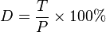
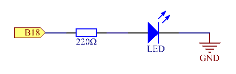
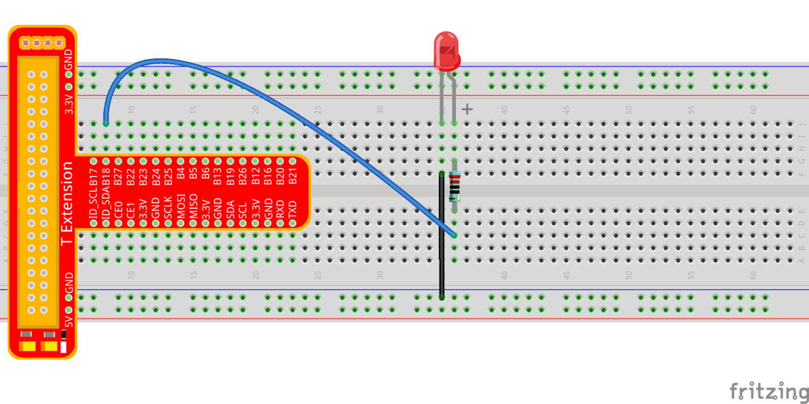
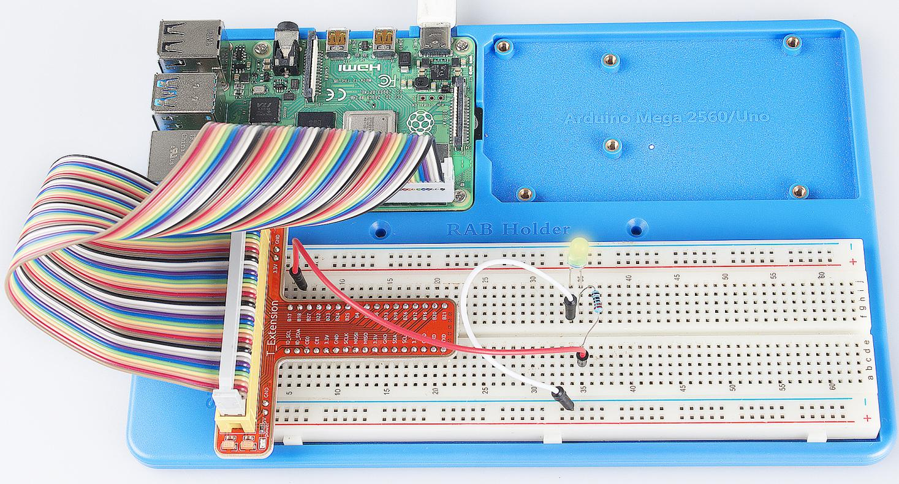

Lesson 4 Breathing LED
=============================

Introduction
-------------------

In this lesson, we will try something interesting – gradually increase
and decrease the luminance of an LED with PWM, just like breathing. So
we give it a magical name - Breathing LED.

Components
-------------------

\- 1 \* Raspberry Pi

\- 1 \* Breadboard

\- 1 \* LED

\- 1 \* Resistor (220Ω)

\- Jumper wires

\- 1 \* T-Extension Board

\- 1 \* 40-Pin Cable

Principle
-------------------

**PWM**

Pulse Width Modulation, or PWM, is a technique for getting analog
results with digital means. Digital control is used to create a square
wave, a signal switched between on and off. This on-off pattern can
simulate voltages in between full on (3.3 Volts) and off (0 Volts) by
changing the portion of the time the signal spends on versus the time
that the signal spends off. The duration of "on time" is called pulse
width. To get varying analog values, you change, or modulate, that
width. If you repeat this on-off pattern fast enough with some device,
an LED for example, the result would be like this: the signal is a
steady voltage between 0 and 3.3v controlling the brightness of the LED.

**Duty Cycle**

A duty cycle is the percentage of one period in which a signal is
active. A period is the time it takes for a signal to complete an
on-and-off cycle. As a formula, a duty cycle may be expressed as:

Where **D** is the duty cycle, **T** is the time the signal is active, and
**P** is the total period of the signal. Thus, a 60% duty cycle means the
signal is on 60% of the time but off 40% of the time. The "on time" for
a 60% duty cycle could be a fraction of a second, a day, or even a week,
depending on the length of the period.

.. image:: media/image128.png
    :align: center

In this experiment, we use this technology to make the LED brighten and
dim slowly so it looks like our breath.

Experimental Procedures
--------------------------------------

**Step 1:** Build the circuit.

For C Language Users:
^^^^^^^^^^^^^^^^^^^^^^^^^^

**Step 2:** Open the code file.

.. code-block::
    
    cd/home/pi/SunFounder_Super_Kit_V3.0_for_Raspberry_Pi/C

**Step 3**: Compile the Code.

.. code-block::
    
    make 04_breathLed

**Step 4**: Run the executable file above.

.. code-block::
    
    sudo ./04_breathLed

**Code Explanation**

.. code-block:: C
    
    pinMode(LedPin, PWM_OUTPUT); // Set the I/O as pwn output

    for(i=0;i<1024;i++)
    { 
        // i,as the value of pwm, increases progressively during 0-1024.

        pwmWrite(LedPin, i); // Write i into the LEDPin

        delay(2); 
        // wait for 2ms, interval time between the changes indicates the speed of breathing.

    } 
    // the value of pwm add 1 every 2ms, when the value of pwm increases, the luminance of the LED increases.

    for(i=1023;i>=0;i--)
    {

        pwmWrite(LedPin, i);

        delay(2);

    } 
    // the value of pwm minus 1 every 2ms, when the value of pwm decreases, the luminance of the LED decreases.

For Python Users:
^^^^^^^^^^^^^^^^^^^^^

**Step 2:** Open the code file.

.. code-block:: 
    
    cd/home/pi/SunFounder_Super_Kit_V3.0_for_Raspberry_Pi/Python

**Step 3**: Run.

.. code-block:: 
    
    sudo python3 04_breathLed.py

**Code Explanation**

.. code-block:: python
    
    GPIO.setup(LedPin, GPIO.OUT, initial=GPIO.LOW) 
    # Set LedPin as OUTPUT, initialize the pin as low level.

    pLED = GPIO.PWM(LedPin, 1000) '''use PWM in the RPi.GPIO library. Set
    LedPin as analog PWM output, the frequency as 1000Hz, assign these
    configurations to pLed.'''

    pLed.start(0) # Start pLed with 0% pulse width

    time.sleep(0.05)

    while True:

        # Increase duty cycle from 0 to 100

        for dc in range(0, 101, step): 
        # set dc from 0 to 100 in for loop. Set step to cycle.

            # Change duty cycle to dc

            pLed.ChangeDutyCycle(dc) 
            # ChangeDutyCycle() function in pLED output pulse width 0~100% according to the variable dc.

            print (" ++ Duty cycle: %s" %dc) # print information

            time.sleep(delay) '''it will delay after changing the pulse width for
            each time, this parameter can be modified to change the LED’s lighting
            and dimming speed.'''

        time.sleep(1)

        # decrease duty cycle from 100 to 0

        for dc in range(100, -1, -step): 
        # the luminance of the LED decreases with each cycle.

            # Change duty cycle to dc

            pLED.ChangeDutyCycle(dc) # same as the last for loop

            print (" -- Duty cycle: %s" %dc)

            time.sleep(delay) 
            # Now you will see the gradual change of the LED luminance, between bright and dim.

**Summary**

Through this experiment, you should have mastered the principle of PWM
and how to program Raspberry Pi with PWM. You can try to apply this
technology to DC motor speed regulation later.