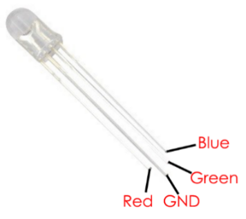
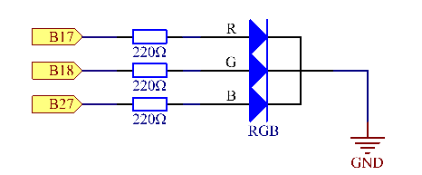
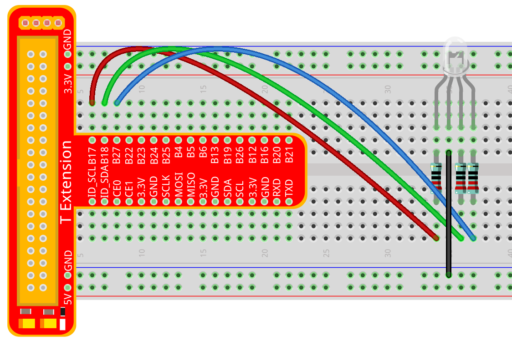
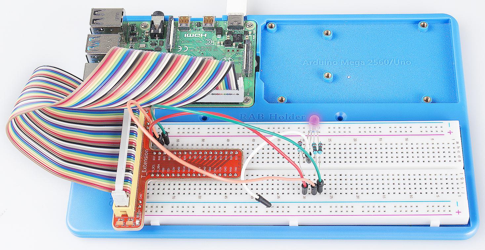

Lesson 5 RGB LED
====================

Introduction
---------------

Previously we've used the PWM technology to control an LED brighten and
dim. In this lesson, we will use it to control an RGB LED to flash
various kinds of colors.

Components
---------------

\- 1 \* Raspberry Pi

\- 1 \* Breadboard

\- 1 \* RGB LED

\- 3 \* Resistor (220Ω)

\- Several jumper wires

\- 1 \* T-Extension Board

\- 1 \* 40-Pin GPIO Cable

Principle
---------------

In this experiment, we will use a RGB. For details of RGB, please refer
to the introduction of RGB LED in **Components Introduction**.

The three primary colors of the RGB LED can be mixed into various colors
by brightness. The brightness of LED can be adjusted with PWM. Raspberry
Pi has only one channel for hardware PWM output, but it needs three
channels to control the RGB LED, which means it is difficult to control
the RGB LED with the hardware PWM of Raspberry Pi. Fortunately, the
**softPwm** library simulates PWM (softPwm) by programming. You only
need to include the header file **softPwm.h** (for C language users),
and then call the API it provides to easily control the RGB LED by
multi-channel PWM output, so as to display all kinds of color.

Experimental Procedures
------------------------

**Step 1:** Build the circuit.

For C Language Users:
^^^^^^^^^^^^^^^^^^^^^^^^

**Step 2:** Open the code file.

.. code-block::
    
    cd/home/pi/SunFounder_Super_Kit_V3.0_for_Raspberry_Pi/C

**Step 3:** Compile the Code.

.. code-block::
    
    make 05_rgb

**Step 4:** Run the executable file above.

.. code-block::
    
    sudo ./05_rgb

**Code Explanation**

.. code-block:: C
    
    #include <softPwm.h> 
    // library used for realizing the pwm function of the software.

    void ledInit(void)
    { // define function used for initializing I/O port to output for pwm.

        /* LedPinX refers to one pin. 0 is the minimum value and 100 is the
        maximum (as a percentage). The function is to use software to create a
        PWM pin, set its value between 0-100%.*/

        softPwmCreate(LedPinRed, 0, 100);

        softPwmCreate(LedPinGreen,0, 100);

        softPwmCreate(LedPinBlue, 0, 100);
    
        void ledColorSet(uchar r_val, uchar g_val, uchar b_val)
        { /* This function is to set the colors of the LED. Using RGB, the formal
        parameter r_val represents the luminance of the red one, g_val of the
        green one, b_val of the blue one. The three formal parameters’ different
        values corresponds to various colors. You can modify the 3 formal
        parameters randomly to verify.*/

            softPwmWrite(LedPinRed, r_val);

            softPwmWrite(LedPinGreen, g_val);

            softPwmWrite(LedPinBlue, b_val);

        }

        ledColorSet(0xff,0x00,0x00); /* red calls the function defined before.
        Write oxff into LedPinRed and ox00 into LedPinGreen and LedPinBlue. Only
        the Red LED lights up after running this code. If you want to light up
        LEDs in other colors, just modify the parameters.*/
    }

For Python Users:
^^^^^^^^^^^^^^^^^^^^^^

**Step 2:** Open the code file.

.. code-block:: 
    
    cd/home/pi/SunFounder_Super_Kit_V3.0_for_Raspberry_Pi/Python

**Step 3:** Run.

.. code-block:: 
    
    sudo python3 05_rgb.py

**Code Explanation**

.. code-block:: python
    
    # Set up a color table in Hexadecimal

    COLOR = [0xFF0000, 0x00FF00, 0x0000FF, 0xFFFF00, 0xFF00FF, 0x00FFFF]

    # Set pins' channels with dictionary

    pins = {'Red':17, 'Green':18, 'Blue':27}

    p_R = GPIO.PWM(pins['Red'], 2000) 
    # the same as the last lesson, here we configure the channels and frequencies of the 3 PWM.

    p_G = GPIO.PWM(pins['Green'], 2000)

    p_B = GPIO.PWM(pins['Blue’], 2000)

    p_R.start(0) 
    # the same as the last lesson, the PWM of the 3 LEDs begin with 0.

    p_G.start(0)

    p_B.start(0)

    # Define a MAP function for mapping values. Like from 0~255 to 0~100

    def MAP(x, in_min, in_max, out_min, out_max):

        return (x - in_min) * (out_max - out_min) / (in_max - in_min) + out_min

    def setColor(color): # configures the three LEDs’ luminance with the inputted color value .

        R_val = (color & 0xFF0000) >> 16 
        # these three lines are used for analyzing the col variables

        G_val = (color & 0x00FF00) >> 8 
        # assign the first two values of the hexadecimal to R, the middle two assigned to G

        B_val = (color & 0x0000FF) >> 0 
        # assign the last two values to B, please refer to the shift operation of the hexadecimal for details.

        R_val = MAP(R_val, 0, 255, 0, 100) 
        # use map function to map the R,G,B value among 0~255 into PWM value among 0-100.

        G_val = MAP(G_val, 0, 255, 0, 100)

        B_val = MAP(B_val, 0, 255, 0, 100)

        p_R.ChangeDutyCycle(R_val) 
        # Assign the mapped duty cycle value to the corresponding PWM channel to change the luminance.

        p_G.ChangeDutyCycle(G_val)

        p_B.ChangeDutyCycle(B_val)

    for color in COLOR: 
    # Assign every item in the COLOR list to the color respectively 
    # and change the color of the RGB LED via the setColor() function.

        setColor(color) # change the color of the RGB LED
        
        time.sleep(0.5) 
        # set delay for 0.5s after each color changing. Modify
        # this parameter will changed the LED’s color changing rate.

Here you should see the RGB LED flash different colors in turn.

You can modify the parameters of the function *ledColorSet( )* by
yourself, and then and run the code to see the color changes of the RGB
LED.