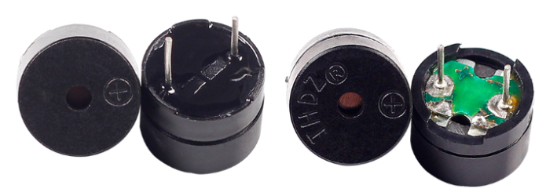
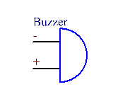
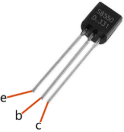
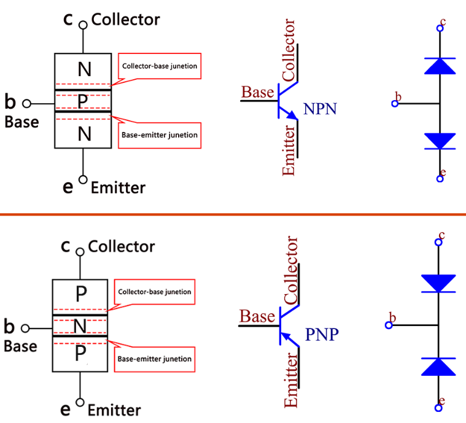
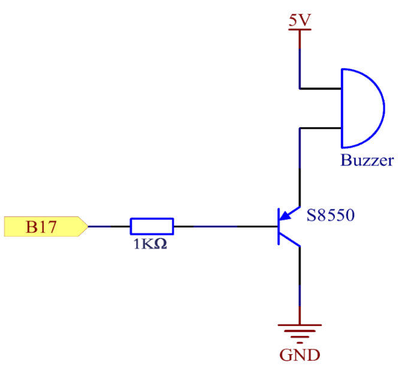
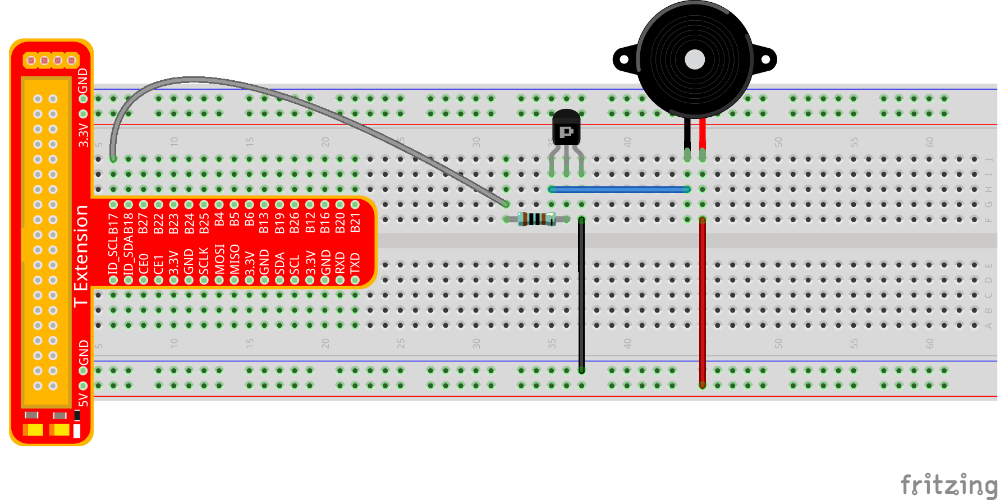
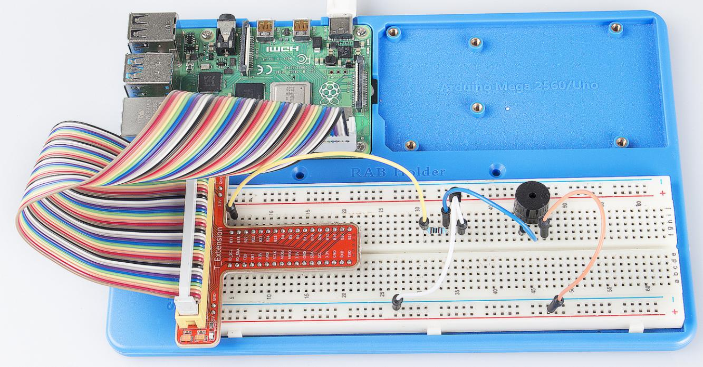

Lesson 6 Buzzer
===================

Introduction
-------------------

In this lesson, we will learn how to drive an active buzzer to beep with
a PNP transistor.

Components
-------------------

\- 1 \* Raspberry Pi

\- 1 \* Breadboard

\- 1 \* Buzzer (Active)

\- 1 \* PNP transistor (8550)

\- 1 \* Resistor (1KΩ)

\- Jumper wires

\- 1 \* T-Extension Board

\- 1 \* 40-Pin GPIO Cable

Principle
-------------------

**Buzzer**

As a type of electronic buzzer with integrated structure, buzzers, which
are supplied by DC power, are widely used in computers, printers,
photocopiers, alarms and other electronic products for voice devices.
Buzzers can be categorized as active and passive ones (see the following
picture). Turn the pins of two buzzers face up, and the one with a green
circuit board is a passive buzzer, while the other enclosed with a black
tape is an active one.

The difference between an active buzzer and a passive buzzer is: An
active buzzer has a built-in oscillating source, so it will make sounds
when electrified. But a passive buzzer does not have such source, so it
will not beep if DC signals are used; instead, you need to use square
waves whose frequency is between 2K and 5K to drive it. The active
buzzer is often more expensive than the passive one because of multiple
built-in oscillating circuits.

The following is the electrical symbol of a buzzer. It has two pins with
positive and negative poles. With a + in the surface represents the
anode and the other is the cathode.

You can check the pins of the buzzer, the longer one is the anode and
the shorter one is the cathode. Please don’t mix them up when
connecting, otherwise the buzzer will not make sound.

**Transistor**

The transistor is a semiconductor device that controls current by
current. It functions by amplifying weak signal to larger amplitude
signal and is also used as a non-contact switch. A transistor is a
three-layer structure composed of P-type or N-type semiconductors. They
form the three regions internally. The thinner in the middle is the base
region; the other two are all N-type or P-type ones – the smaller region
with intense majority carriers is the emitter region, when the other one
is the collector region. This composition enables the transistor to be
an amplifier.

From these three regions, three poles are generated respectively, which
are base (b), emitter (e), and collector (c). They form two P-N
junctions, namely, the emitter junction and collection junction. The
arrow in the circuit symbol indicates the direction of emitter junction.
Transistors can be divided into two kinds: the NPN and PNP one. The
former is made of two N-type semiconductors and one P-type and that the
latter is the opposite. See the figure below.

When a High level signal goes through an NPN transistor, it is
energized. But a PNP one needs a Low level signal to manage it. Both
types of transistor are frequently used for contactless switches, just
like in this experiment.

The Schematic Diagram
------------------------

**Principle:** In this experiment, an active buzzer, a PNP transistor
and a 1k resistor are used between the base of the transistor and GPIO
to protect the transistor. When the B17 of Raspberry Pi output is
supplied with low level (0V) by programming, the transistor will conduct
because of current saturation and the buzzer will make sounds. But when
high level is supplied to the IO of Raspberry Pi, the transistor will be
cut off and the buzzer will not make sounds

Experimental Procedures
---------------------------

**Step 1:** Build the circuit (Pay attention to poles of the buzzer: The
one with + label is the positive pole and the other is the negative.)

For C Language Users:
^^^^^^^^^^^^^^^^^^^^^^^^^

**Step 2:** Open the code file.

.. raw:: html

    <run></run>
 
.. code-block::

    cd /home/pi/SunFounder_Super_Kit_V3.0_for_Raspberry_Pi/C

**Step 3:** Compile the Code.

.. raw:: html

    <run></run>
 
.. code-block::

    make 06_beep

**Step 4:** Run the executable file above.

.. raw:: html

    <run></run>
 
.. code-block::

    sudo ./06_beep

.. note::

    If it does not work after running, please refer to :ref:`C code is not working?`

**Code**

.. code-block:: c 

    #include <wiringPi.h>
    #include <stdio.h>
    
    #define BeepPin 0
    
    int main(void){
        if(wiringPiSetup() == -1){ //when initialize wiring failed, print messageto screen
            printf("setup wiringPi failed !");
            return 1; 
        }
        
        pinMode(BeepPin, OUTPUT);   //set GPIO0 output
    
        printf("\n");
        printf("\n");
        printf("========================================\n");
        printf("|                 Beep                 |\n");
        printf("|    ------------------------------    |\n");
        printf("|        Buzzer connect to GPIO0       |\n");
        printf("|                                      |\n");
        printf("|            Make Buzzer beep          |\n");
        printf("|                                      |\n");
        printf("|                            SunFounder|\n");
        printf("========================================\n");
        printf("\n");
        printf("\n");
    
        while(1){
            //beep on
            printf("Buzzer on\n");
            digitalWrite(BeepPin, LOW);
            delay(100);
            printf("Buzzer off\n");
            //beep off
            digitalWrite(BeepPin, HIGH);
            delay(100);
        }
    
        return 0;
    }
    

**Code Explanation**

.. code-block:: c 

    digitalWrite(BeepPin, LOW); /* We use an active buzzer in this
    experiment, so it will make sound automatically when connecting to the
    direct current. This sketch is to set the I/O port as low level (0V),
    thus to manage the transistor and make the buzzer beep.*/

    digitalWrite(BeepPin, HIGH); /* To set the I/O port as high level(5V),
    thus the transistor is not energized and the buzzer doesn’t beep.*/

For Python Users:
^^^^^^^^^^^^^^^^^^^^^^

**Step 2:** Open the code file.

.. raw:: html

    <run></run>
 
.. code-block::

    cd /home/pi/SunFounder_Super_Kit_V3.0_for_Raspberry_Pi/Python

**Step 3:** Run.

.. raw:: html

    <run></run>
 
.. code-block::

    sudo python3 06_beep.py

**Code**

.. raw:: html

    <run></run>
 
.. code-block:: python

    import RPi.GPIO as GPIO
    import time
    from sys import version_info
    
    if version_info.major == 3:
        raw_input = input
    
    
    # Set #17 as buzzer pin
    BeepPin = 17
    
    def print_message():
        print ("========================================")
        print ("|                 Beep                 |")
        print ("|    ------------------------------    |")
        print ("|        Buzzer connect to GPIO17      |")
        print ("|                                      |")
        print ("|            Make Buzzer beep          |")
        print ("|                                      |")
        print ("|                            SunFounder|")
        print ("======================================\n")
        print ("Program is running...")
        print ("Please press Ctrl+C to end the program...")
        #raw_input ("Press Enter to begin\n")
    
    def setup():
        # Set the GPIO modes to BCM Numbering
        GPIO.setmode(GPIO.BCM)
        # Set LedPin's mode to output, 
        # and initial level to High(3.3v)
        GPIO.setup(BeepPin, GPIO.OUT, initial=GPIO.HIGH)
    
    def main():
        print_message()
        while True:
            # Buzzer on (Beep)
            print ("Buzzer On")
            GPIO.output(BeepPin, GPIO.LOW)
            time.sleep(0.1)
            # Buzzer off
            print ("Buzzer Off")
            GPIO.output(BeepPin, GPIO.HIGH)
            time.sleep(0.1)
    
    def destroy():
        # Turn off buzzer
        GPIO.output(BeepPin, GPIO.HIGH)
        # Release resource
        GPIO.cleanup()    
    
    # If run this script directly, do:
    if __name__ == '__main__':
        setup()
        try:
            main()
        # When 'Ctrl+C' is pressed, the child program 
        # destroy() will be  executed.
        except KeyboardInterrupt:
            destroy()

**Code Explanation**

.. code-block:: python

    GPIO.output(BeepPin, GPIO.LOW) # Set the buzzer pin as low level.

    time.sleep(0.1) # Wait for 0.1 second. Change the switching frequency by
    #changing this parameter. Note: Not the sound frequency. Active Buzzer
    #cannot change sound frequency.

    GPIO.output(BeepPin, GPIO.HIGH) # close the buzzer

    time.sleep(0.1)

Now, you should hear the buzzer make sounds.

**Further Exploration**

If you have a passive buzzer in hand, you can replace the active buzzer
with it. Now you can make a buzzer sound like “do re mi fa so la si do”
with just some basic knowledge of programming. Give a try!