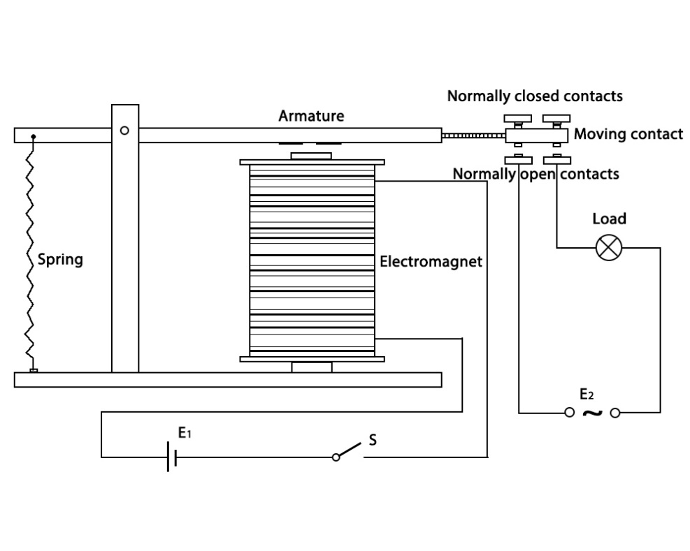
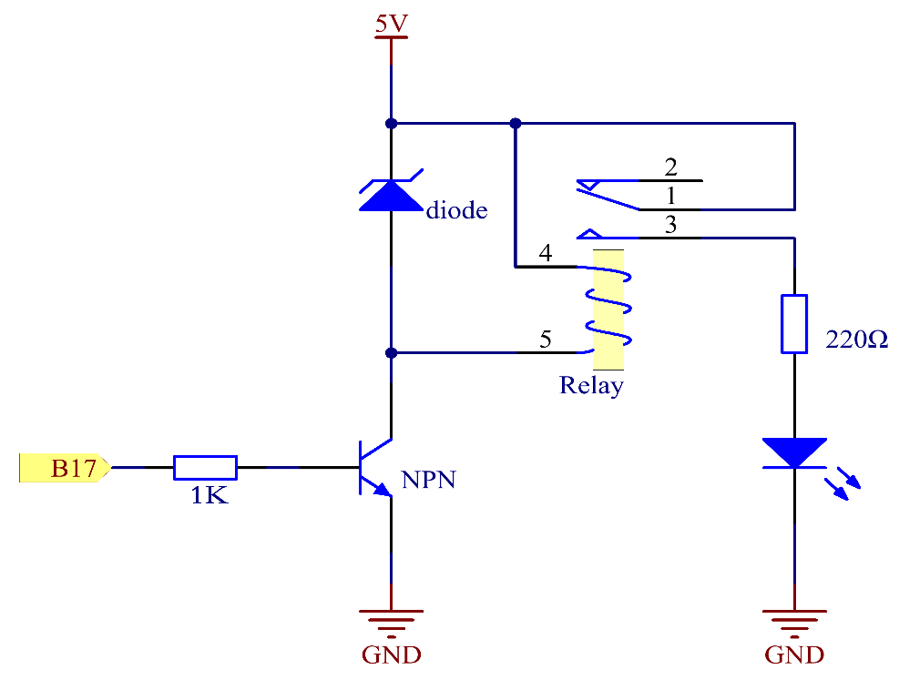
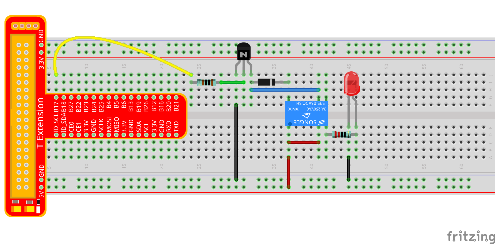
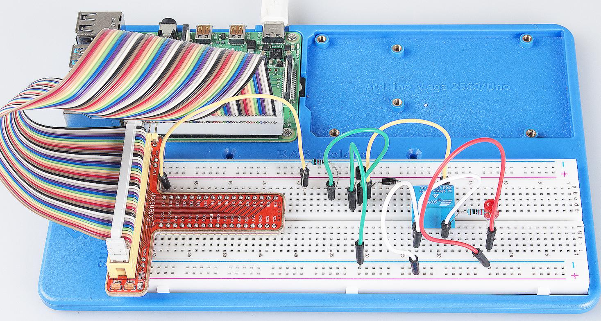

Lesson 7 Relay
=================

Introduction
--------------

As we know relay is a device which is used to provide connection between
two or more points or device in response to the input signal applied. In
another words relay provide isolation between the controller and the
device as we know devices may work on AC as well as on DC. However, they
receive signals from microcontroller which works on DC hence we require
a relay to bridge the gap. Relay is extremely useful when you need to
control a large amount of current or voltage with small electrical
signal.

Components
--------------

\- 1 \* Raspberry Pi

\- 1 \* Breadboard

\- 1 \* Relay

\- 1 \* LED

\- 1 \* Resistor (220Ω)

\- 1 \* Resistor (1KΩ)

\- 1 \* NPN Transistor

\- 1 \* Diode (Rectifier)

\- Several jumper wires

\- 1 \* T-Extension Board

\- 1 \* 40-Pin GPIO Cable

Principle
--------------

**Relay**

There are 5 parts in every relay:

1. **Electromagnet** – It consists of an iron core wounded by coil of
wires. When electricity is passed through, it becomes magnetic.
Therefore, it is calLED electromagnet.

2. **Armature** – The movable magnetic strip is known as armature. When
current flows through them, the coil is it energized thus producing a
magnetic field which is used to make or break the normally open (N/O) or
normally close (N/C) points. And the armature can be moved with direct
current (DC) as well as alternating current (AC).

3. **Spring** – When no currents flow through the coil on the
electromagnet, the spring pulls the armature away so the circuit cannot
be completed.

4. Set of electrical **contacts** – There are two contact points:

-  Normally open - connected when the relay is activated, and disconnected when it is inactive.

-  Normally close – not connected when the relay is activated, and connected when it is inactive.

5. Molded frame – Relays are covered with plastic for protection.

Working of Relay
-------------------

The working principle of relay is simple. When power is supplied to the
relay, currents start flowing through the control coil; as a result, the
electromagnet starts energizing. Then the armature is attracted to the
coil, pulling down the moving contact together thus connecting with the
normally open contacts. So the circuit with the load is energized. Then
breaking the circuit would a similar case, as the moving contact will be
pulled up to the normally closed contacts under the force of the spring.
In this way, the switching on and off of the relay can control the state
of a load circuit.

Schematic Diagram:
-----------------------

Experimental Procedures
-----------------------

**Step 1:** Build the circuit.

For C Language Users:
^^^^^^^^^^^^^^^^^^^^^^^^^^

**Step 2**: Open the code file.

.. raw:: html

    <run></run>

.. code-block:: 

    cd /home/pi/SunFounder_Super_Kit_V3.0_for_Raspberry_Pi/C

**Step 3:** Compile the Code.

.. raw:: html

    <run></run>

.. code-block:: 

    make 07_relay

**Step 4:** Run the executable file above.

.. raw:: html

    <run></run>

.. code-block:: 

    sudo ./07_relay

.. note::

    If it does not work after running, please refer to :ref:`C code is not working?`

**Code**

.. code-block:: C

    #include <wiringPi.h>
    #include <stdio.h>
    
    #define RelayPin 0
    
    int main(void){
        if(wiringPiSetup() == -1){ //when initialize wiring failed, print messageto screen
            printf("setup wiringPi failed !");
            return 1; 
        }
        
        pinMode(RelayPin, OUTPUT);   //set GPIO0 output
    
        printf("\n");
        printf("\n");
        printf("========================================\n");
        printf("|                 Relay                |\n");
        printf("|    ------------------------------    |\n");
        printf("| GPIO0 connect to relay's control pin |\n");
        printf("| led connect to relay's NormalOpen pin|\n");
        printf("|  5v connect to relay's com pin       |\n");
        printf("|                                      |\n");
        printf("|      Make relay to contral a led     |\n");
        printf("|                                      |\n");
        printf("|                            SunFounder|\n");
        printf("========================================\n");
        printf("\n");
        printf("\n");
    
        while(1){
            // Tick
            printf("......Relay Close\n");
            digitalWrite(RelayPin, LOW);
            delay(1000);
            // Tock
            printf("Relay Open......\n");
            digitalWrite(RelayPin, HIGH);
            delay(1000);
        }
    
        return 0;
    }

**Code Explanation**

.. code-block:: C

    digitalWrite(relayPin, LOW); /* Set the I/O port as LOW level (5V), thus
    the transistor is not energized and the coil is not powered. There is no
    electromagnetic force, so the relay opens.*/

    digitalWrite(relayPin, HIGH); /* set the I/O port as HIGH level (0V) to
    energize the transistor. The coil of the relay is powered and generate
    electromagnetic force, and the relay closes.*/

For Python Users:
^^^^^^^^^^^^^^^^^^^^^^

**Step 2:** Open the code file.

.. raw:: html

    <run></run>

.. code-block:: 

    cd /home/pi/SunFounder_Super_Kit_V3.0_for_Raspberry_Pi/Python

**Step 3:** Run.

.. raw:: html

    <run></run>

.. code-block:: 

    sudo python3 07_relay.py

**Code**

.. raw:: html

    <run></run>

.. code-block:: python

    import RPi.GPIO as GPIO
    import time
    from sys import version_info
    
    if version_info.major == 3:
        raw_input = input
    
    
    # GPIO0 connect to relay's control pin
    # led connect to relay's NormalOpen pin
    # 5v connect to relay's com pin
    # Set #17 as contral pin
    relayPin = 17
    
    # Define a function to print message at the beginning
    def print_message():
        print ("========================================")
        print ("|                 Relay                |")
        print ("|    ------------------------------    |")
        print ("| GPIO17 connect to relay's control pin |")
        print ("| led connect to relay's NormalOpen pin|")
        print ("|  5v connect to relay's com pin       |")
        print ("|                                      |")
        print ("|      Make relay to contral a led     |")
        print ("|                                      |")
        print ("|                            SunFounder|")
        print ("======================================\n")
        print ("Program is running...")
        print ("Please press Ctrl+C to end the program..")
        #raw_input ("Press Enter to begin\n")
    
    # Define a setup function for some setup
    def setup():
        # Set the GPIO modes to BCM Numbering
        GPIO.setmode(GPIO.BCM)
        # Set relayPin's mode to output, 
        # and initial level to High(3.3v)
        GPIO.setup(relayPin, GPIO.OUT, initial=GPIO.HIGH)
    
    # Define a main function for main process
    def main():
        # Print messages
        print_message()
        while True:
            print ("...Relay close")
            # Tick
            GPIO.output(relayPin, GPIO.LOW)
            time.sleep(1)
            print ("Relay open...")
            # Tock
            GPIO.output(relayPin, GPIO.HIGH) 
            time.sleep(1)
    
    # Define a destroy function for clean up everything after
    # the script finished 
    def destroy():
        # Turn off LED
        GPIO.output(relayPin, GPIO.HIGH)
        # Release resource
        GPIO.cleanup()                     
    
    # If run this script directly, do:
    if __name__ == '__main__':
        setup()
        try:
            main()
        # When 'Ctrl+C' is pressed, the child program 
        # destroy() will be  executed.
        except KeyboardInterrupt:
            destroy()

**Code Explanation**

.. code-block:: python

    GPIO.output(relayPin, GPIO.LOW) 
    # Set the pins of the transistor as low level to let the relay open.

    time.sleep(1) # wait for 1 second. Change the switching frequency of the
    #relay by changing this parameter. Note: Relay is a kind of metal dome
    #formed in mechanical structure. So its lifespan will be shortened under
    #high-frequency using.

    GPIO.output(relayPin, GPIO.HIGH) 
    # Set the pins of transistor as HIGH level to actuate the relay.

    time.sleep(1)

Now, connect a device of high voltage, and the relay will close and the
LED will light up; connect one of low voltage, and it will open and the
LED will go out. In addition, you can hear a ticktock caused by breaking
normally close contact and closing normally open contact.

