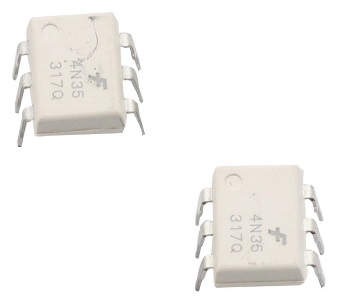
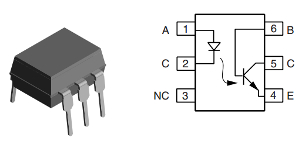
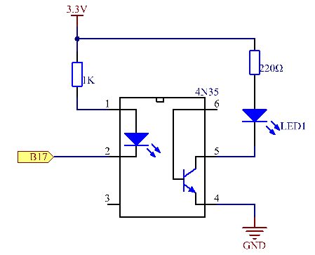
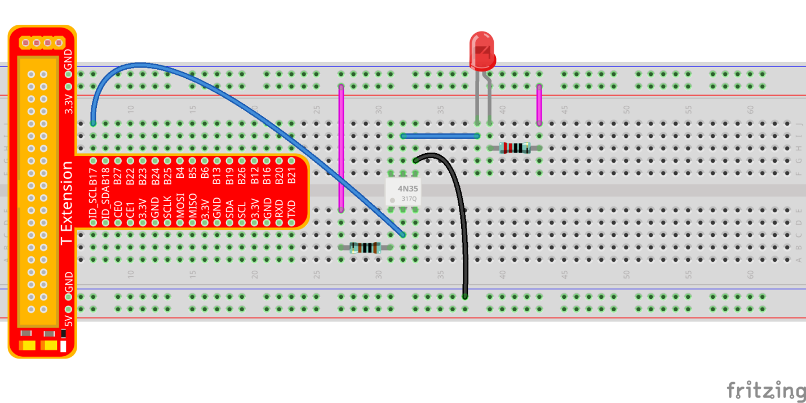
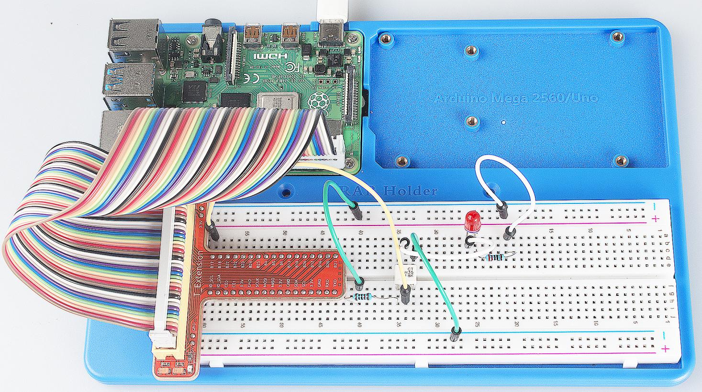

Lesson 8 4N35
===============

Introduction
----------------

The 4N35 is an optocoupler for general purpose application. It consists
of gallium arsenide infrared LED and a silicon NPN phototransistor. When
the input signal is applied to the LED in the input terminal, the LED
lights up. After receiving the light signal, the light receiver then
converts it into electrical signal and outputs the signal directly or
after amplifying it into a standard digital level. Thus, the transition
and transmission of electricity-light-electricity is completed. Since
light is the media of the transmission, meaning the input terminal and
the output one are isolated electrically, this process is also be known
as electrical isolation.

Components
----------------

\- 1 \* Raspberry Pi

\- 1 \* 4N35

\- 1 \* LED

\- 1 \* 220 Ohm Resistor

\- 1\* 1k Ohm Resistor

\- Some jump wires

\- 1 \* T-Extension Board

\- 1 \* 40-Pin GPIO Cable

Principle
----------------

**4N35**

The 4N35 is an optocoupler for general purpose application. It consists
of gallium arsenide infrared LED and a silicon NPN phototransistor.

What an optocoupler does is to break the connection between signal
source and signal receiver, so as to stop electrical interference. In
other words, it is used to prevent interference from external electrical
signals. 4N35 can be used in AV conversion audio circuits. Broadly it is
widely used in electrical insulation for a general optocoupler.

See the internal structure of 4N35 above. Pin 1 and 2 are connected to
an infrared LED. When the LED is electrified, it'll emit infrared rays.
To protect the LED from burning, usually a resistor (about 1K) is
connected to pin 1. Then the NPN phototransistor is power on when
receiving the rays. This can be done to control the load connected to
the phototransistor. Even when the load short circuit occurs, it won't
affect the control board, thus realizing good electrical isolation.

The Schematic Diagram:
-------------------------

**Principle:** In this experiment, use an LED as the load connected to
the NPN phototransistor. Connect pin 2 of 4N35 to pin B17, pin 1
connects a 1K current-limiting resistor and then a 3.3V. Connect pin 4
to GND, and pin 5 to the cathode of the LED. Then hook the anode of the
LED to 3.3V after connecting with a 220 Ohm resistor. When in program, a
LOW level is given to pin B17, the infrared LED will emit infrared rays.
Then the phototransistor receives infrared rays and gets electrified,
and the LED cathode is LOW, thus turning on the LED. Also you can
control the LED by circuits only – connect pin 2 to ground and it will
brighten.

**Step 1:** Build the circuit.

For C Language Users:
^^^^^^^^^^^^^^^^^^^^^^^

**Step 2**: Open the code file.

.. raw:: html

    <run></run>
    
.. code-block::

    cd /home/pi/SunFounder_Super_Kit_V3.0_for_Raspberry_Pi/C

**Step 3:** Compile the Code.

.. raw:: html

    <run></run>
    
.. code-block::

    make 08_4N35

**Step 4:** Run the executable file above.

.. raw:: html

    <run></run>
    
.. code-block::

    sudo ./08_4N35

.. note::

    If it does not work after running, or there is an error prompt: \"wiringPi.h: No such file or directory\", please refer to :ref:`C code is not working?`.

**Code**

.. code-block:: C

    #include <wiringPi.h>
    #include <stdio.h>
    
    #define _4N35Pin		0
    
    int main(void)
    {
        // When initialize wiring failed, print messageto screen
        if(wiringPiSetup() == -1){
            printf("setup wiringPi failed !");
            return 1; 
        }
        
        pinMode(_4N35Pin, OUTPUT);
    
        printf("\n");
        printf("\n");
        printf("========================================\n");
        printf("|                 4N35                 |\n");
        printf("|    ------------------------------    |\n");
        printf("|      LED connect to 4N35 pin5;       |\n");
        printf("|      gpio0 connect to 4N35 pin2；    |\n");
        printf("|                                      |\n");
        printf("|     4N35 to contral led blinking.    |\n");
        printf("|                                      |\n");
        printf("|                            SunFounder|\n");
        printf("========================================");
        printf("\n");
        printf("\n");
        
        while(1){
            // LED on
            digitalWrite(_4N35Pin, LOW);
            printf("...LED on\n");
            delay(500);
            // LED off
            digitalWrite(_4N35Pin, HIGH);
            printf("LED off...\n");
            delay(500);
        }
    
        return 0;
    }

**Code Explanation**

.. code-block:: C

    digitalWrite(_4N35Pin, LOW); /* set the I/O port as low level (0V), thus
    the optocoupler is energized, and the pin connected to LED conducts to
    the 0V. Then the LED lights up.*/

    delay(500); 
    // optocoupler is a kind of electronic device and there is no limitation on its on-off frequency.

    digitalWrite(_4N35Pin, HIGH); /* set I/O port as high level (3.3V), thus
    the optocoupler is not energized ,and the pin connected to LED cannot
    conduct to the 0V. Then the LED goes out.*/

For Python Users:
^^^^^^^^^^^^^^^^^^

**Step 2:** Open the code file.

.. raw:: html

    <run></run>
    
.. code-block:: 

    cd /home/pi/SunFounder_Super_Kit_V3.0_for_Raspberry_Pi/Python

**Step 3:** Run.

.. raw:: html

    <run></run>
    
.. code-block:: 

    sudo python3 08_4N35.py

**Code**

.. raw:: html

    <run></run>
    
.. code-block:: python

    import RPi.GPIO as GPIO
    import time
    from sys import version_info
    
    if version_info.major == 3:
        raw_input = input
    
    
    # Set #17 as 4N35 pin
    Pin_4N35 = 17
    
    # Define a function to print message at the beginning
    def print_message():
        print ("========================================")
        print ("|                 4N35                 |")
        print ("|    ------------------------------    |")
        print ("|      LED connect to 4N35 pin5;       |")
        print ("|      gpio17 connect to 4N35 pin2;    |")
        print ("|                                      |")
        print ("|     4N35 to contral led blinking.    |")
        print ("|                                      |")
        print ("|                            SunFounder|")
        print ("======================================\n")
        print ("Program is running...")
        print ("Please press Ctrl+C to end the program..")
        #raw_input ("Press Enter to begin\n")
    
    # Define a setup function for some setup
    def setup():
        # Set the GPIO modes to BCM Numbering
        GPIO.setmode(GPIO.BCM)
        # Set Pin_4N35's mode to output, 
        # and initial level to High(3.3v)
        GPIO.setup(Pin_4N35, GPIO.OUT, initial=GPIO.HIGH)
    
    # Define a main function for main process
    def main():
        # Print messages
        print_message()
        while True:
            print ("...LED ON")
            # Turn on LED
            GPIO.output(Pin_4N35, GPIO.LOW)
            time.sleep(0.5)
            print ("LED OFF...")
            # Turn off LED
            GPIO.output(Pin_4N35, GPIO.HIGH) 
            time.sleep(0.5)
    
    # Define a destroy function for clean up everything after
    # the script finished 
    def destroy():
        # Turn off LED
        GPIO.output(Pin_4N35, GPIO.HIGH)
        # Release resource
        GPIO.cleanup()                     
    
    # If run this script directly, do:
    if __name__ == '__main__':
        setup()
        try:
            main()
        # When 'Ctrl+C' is pressed, the child program 
        # destroy() will be  executed.
        except KeyboardInterrupt:
            destroy()

**Code Explanation**

.. code-block:: python

    GPIO.output(Pin_4N35, GPIO.LOW) # set the pins of optocoupler as low
    #level, thus the optocoupler is energized, and the pin connected to LED
    #conducts to the 0V.Then the LED lights up.

    time.sleep(0.5) #wait for 0.5 second. The on-off frequency of the
    #optocoupler can be changed by modifying this parameter.

    GPIO.output(Pin_4N35, GPIO.HIGH) # set the pins of optocoupler as high
    #level, thus the optocoupler is disconnected, and the pin connected to
    #LED break the connection to the 0V. Then the LED goes out.

    time.sleep(0.5)

You will see the LED blinks.

