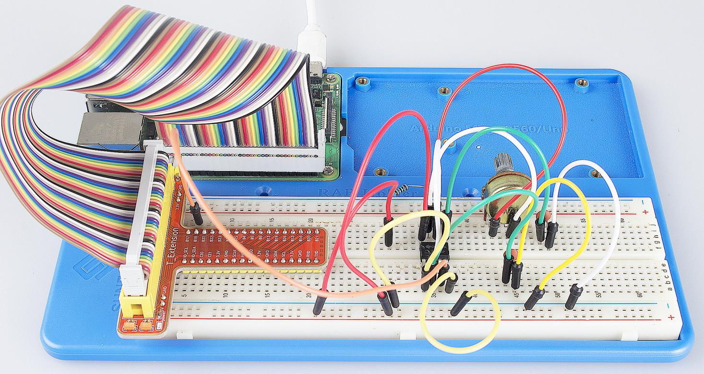

Lesson 9 Ne555
===================

Introduction
-----------------

If you ask anyone in the know to rank the most commonly and widely used
IC, the famous 555 time base IC would certainly be at the top of the
list. The 555 – a mixed circuit composed of analog and digital circuits
– integrates analogue and logical functions into an independent IC, and
hence tremendously expands the application range of analog integrated
circuits. The 555 is widely used in various timers, pulse generators,
and oscillators.

Components
-----------------

\- 1 \* Raspberry Pi

\- 1 \* Breadboard

\- 1 \* NE555

\- 2 \* 104 ceramic capacitor

\- 1 \* Potentiometer (50KΩ)

\- 1 \* Resistor (10KΩ)

\- 1 \* USB cable

\- Jumper wires

\- 1 \* T-Extension Board

\- 1 \* 40-Pin GPIO Cable

Principle
-----------------

The 555 IC was originally used as a timer, hence the name 555 time base
circuit. It is now widely used in various electronic products because of
its reliability, convenience, and low price. The 555 is a complex hybrid
circuit with dozens of components such as a divider, comparator, basic
R-S trigger, discharge tube, and buffer.

555 chip pins are introduced as follows:

.. image:: media/image152.png
    :align: center

As shown in the picture, the 555 IC is dual in-line with the 8-pin
package. Thus:

-  Pin 1 (GND): the ground;

-  Pin 2 (TRIGGER): the input of lower comparator;

-  Pin 3 (OUTPUT): having two states of 0 and 1 decided by the input electrical level;

-  Pin 4 (RESET): output low level when supplied a low one;

-  Pin 5 (CONTROL VOLTAGE): changing the upper and lower level trigger values;

-  Pin 6 (THRESHOLD): the input of upper comparator;

-  Pin 7 (DISCHARGE): having two states of suspension and ground connection also decided by input, and the output of the internal discharge tube;

-  Pin 8 (VCC): the power supply;

The Schematic Diagram
------------------------------

.. image:: media/image153.png
    :align: center

Experimental Procedures
------------------------------

**Step 1:** Build the circuit.

.. image:: media/image154.png
    :align: center

For C Language Users:
^^^^^^^^^^^^^^^^^^^^^^^

**Step 2:** Go to the folder of the code.

.. raw:: html

    <run></run>
    
.. code-block::
    
    cd /home/pi/SunFounder_Super_Kit_V3.0_for_Raspberry_Pi/C

**Step 3:** Compile.

.. raw:: html

    <run></run>
    
.. code-block::
    
    make 09_ne555

**Step 4:** Run the executable file above.

.. raw:: html

    <run></run>
    
.. code-block::
    
    sudo ./09_ne555

.. note::

    If it does not work after running, please refer to :ref:`C code is not working?`

**Code**

.. code-block:: C

    #include <stdio.h>
    #include <string.h>
    #include <errno.h>
    #include <stdlib.h>
    #include <wiringPi.h>
    
    #define  Pin0  1
    
    static volatile int globalCounter = 0 ;
    
    void exInt0_ISR(void)  //GPIO0 interrupt service routine 
    {
        ++globalCounter;
    }
    
    int main (void)
    {
      if(wiringPiSetup() < 0){
          fprintf(stderr, "Unable to setup wiringPi:%s\n",strerror(errno));
        return 1;
      }
    
        printf("\n");
        printf("\n");
        printf("========================================\n");
        printf("|                  Ne555               |\n");
        printf("|    ------------------------------    |\n");
        printf("| Output pin of ne555 connect to gpio1;|\n");
        printf("|                                      |\n");
        printf("|  Count the pulses procude by NE555.  |\n");
        printf("|                                      |\n");
        printf("|                            SunFounder|\n");
        printf("========================================");
        printf("\n");
        printf("\n");
        
        delay(2000);  
      pinMode(Pin0,INPUT);
      pullUpDnControl(Pin0,PUD_UP);
      wiringPiISR(Pin0, INT_EDGE_FALLING, &exInt0_ISR);
      
       while(1){
          printf("Current pluse number is : %d, %d\n", globalCounter,digitalRead(Pin0));
          dealy(100);
        }
    
      return 0;
    }

**Code Explanation**

.. code-block:: C
    
    static volatile int globalCounter = 0 ; 
    // a static integer variable to store the pulse count

    void exInt0_ISR(void) 
    { 
        //GPIO0 interrupt service routine 
        ++globalCounter;

    }

    wiringPiISR(Pin0, INT_EDGE_FALLING, &exInt0_ISR); /* set an interrupt
    here and the signal is falling edge for Pin 0. When the interrupt happens, 
    execute the function exInt0_ISR(), and the pulse count will add 1.*/

    while(1)
    { 
        // if no interrupt happens, the pulse count will stay and just print it.

        printf("Current pulse number is : %d\n", globalCounter);
        delay(100);

    }

For Python Users:
^^^^^^^^^^^^^^^^^^^^^^

**Step 2:** Get into the folder of the code.

.. raw:: html

    <run></run>

.. code-block:: 
    
    cd /home/pi/SunFounder_Super_Kit_V3.0_for_Raspberry_Pi/Python

**Step 3:** Run.

.. raw:: html

    <run></run>
    
.. code-block:: 
    
    sudo python3 09_ne555.py

**Code**

.. raw:: html

    <run></run>
    
.. code-block:: python

    import RPi.GPIO as GPIO
    import time
    from sys import version_info
    
    if version_info.major == 3:
        raw_input = input
    
    
    # ne555 pin3 connect to BCM GPIO18
    SigPin = 18    # BCM 18
    
    g_count = 0
    
    def print_msg():
        print ("========================================");
        print ("|                  Ne555               |");
        print ("|    ------------------------------    |");
        print ("| Output pin of ne555 connect to gpio18;|");
        print ("|                                      |");
        print ("|  Count the pulses procude by NE555.  |");
        print ("|                                      |");
        print ("|                            SunFounder|");
        print ("======================================\n");
        print ("Program is running...")
        print ("Please press Ctrl+C to end the program...")
        #raw_input ("Press Enter to begin\n")
    
    def count(ev=None):
        global g_count
        g_count += 1
    
    def setup():
        GPIO.setmode(GPIO.BCM)       # Numbers GPIOs by physical location
        GPIO.setup(SigPin, GPIO.IN, pull_up_down=GPIO.PUD_UP)    # Set Pin's mode is input, and pull up to high level(3.3V)
        GPIO.add_event_detect(SigPin, GPIO.RISING, callback=count) # wait for rasing
    
    def main():
        print_msg()
        while True:
            print ("g_count = %d" % g_count)
            time.sleep(0.001)
    
    def destroy():
        GPIO.cleanup()    # Release resource
    
    if __name__ == '__main__':     # Program start from here
        setup()
        try:
            main()
        except KeyboardInterrupt:  # When 'Ctrl+C' is pressed, the child program destroy() will be  executed.
            destroy()

**Code Explanation**

.. code-block:: python

    g_count = 0 # a global variable used to store the pulse count

    def count(ev=None): # define a function to be run when an interrupt happens

        global g_count # this function will change the value of the global
        # variable g_count, thus here we add global before it.

        g_count += 1

    GPIO.add_event_detect(SigPin, GPIO.RISING, callback=count) # set an
    # interrupt here and the interrupt signal is a rising edge for Pin Sig. It
    # will run the function count() accordingly

    while True: 　　　　# wait for the interrupt

        print ("g_count = %d" % g_count) # print the information

        time.sleep(0.001)

Now you can see the number of square waves printed. Spin the
potentiometer and the value will decrease or increase.

