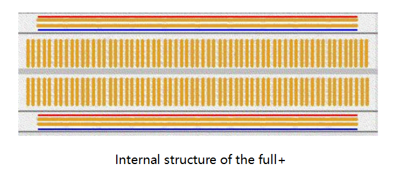

Components Introduction
==========================

**Resistor**

Resistor is an electronic element that can limit the branch current. A
fixed resistor is one whose resistance cannot be changed, when that of a
potentiometer or variable resistor can be adjusted.

The resistors in this kit are fixed ones. It is essential in the circuit
to protect the connected components. Figure (a) below shows a 220Ω
resistor. Ω is the unit of resistance and the larger includes KΩ, MΩ,
etc. Their relationship can be shown as follows: 1 MΩ=1000 KΩ，1 KΩ =
1000 Ω, which means 1 MΩ = 1000,000 Ω = 10^6 Ω. Figure (b) and (c) show
two generally used circuit symbols for resistor. Normally, the
resistance is marked on it. So if you see these symbols in a circuit, it
stands for a resistor.

The resistance can be marked directly, in color code, and by character.
The resistors offered in this kit are marked by different colors.
Namely, the bands on the resistor indicate the resistance.

When using a resistor, we need to know its resistance first.
Here are two methods: you can observe the bands on the resistor, or use
a multimeter to measure the resistance. You are recommended to use the
first method as it is more convenient and faster. If you are not sure
about the value, use the multimeter.

In the kit, a Resistor Color Code Calculator card is provided as shown
below:

As shown in the card, each color stands for a number.

+-------+-------+-----+--------+--------+-------+------+--------+------+-------+------+--------+
| Black | Brown | Red | Orange | Yellow | Green | Blue | Violet | Grey | White | Gold | Silver |
+-------+-------+-----+--------+--------+-------+------+--------+------+-------+------+--------+
| 0     | 1     | 2   | 3      | 4      | 5     | 6    | 7      | 8    | 9     | 0.1  | 0.01   |
+-------+-------+-----+--------+--------+-------+------+--------+------+-------+------+--------+

The 4- and 5-band resistors are frequently used, on which there are 4
and 5 chromatic bands. Let’s see how to read the resistance value of a
5-band resistor as shown below. Normally, when you get a resistor, you
may find it hard to decide which end to start for reading the color. The
tip is that the gap between the 4\ :sup:`th` and 5\ :sup:`th` band will
be comparatively larger. Therefore, you can observe the gap between the
two chromatic bands at one end of the resistor; if it's larger than any
other band gaps, then you can read from the opposite side.

.. image:: media/image218.png
   :align: center

So for this resistor, the resistance should be read from left to right.
The value should be in this format: 1\ :sup:`st` Band 2\ :sup:`nd` Band
3\ :sup:`rd` Band x 10\ :sup:`^Multiplier` (Ω) and the permissible error
is ±Tolerance%. So the resistance value of this resistor is 2(red)
2(red) 0(black) x 10^0(black) Ω = 220 Ω, and the permissible error is ±
1% (brown).

One more example. The resistance of the resistor below should be
1(brown) 0(black) 0(black) x 10^1(brown) Ω =100x10 Ω = 1000 Ω = 1KΩ, and
the permissible error is ± 1%(brown). Now try it by yourself!

You can also use a multimeter to measure the resistance value of these
resistors to double check whether you've read it correctly or not.

**Potentiometer**

Potentiometer is also a resistance component with 3 terminals and its
resistance value can be adjusted according to some regular variation.
Potentiometer usually consists of resistor and movable brush. When the
brush is moving along the resistor, there is a certain resistance or
voltage output depending on the displacement. Figure left is the
potentiometer and figure right is the corresponding circuit symbol. The
middle pin in left figure, represented by the arrow in right figure is
the movable brush.

.. image:: media/image220.png
   :align: center

The functions of the potentiometer in the circuit are as follows:

1. Serving as a voltage divider

..

   Potentiometer is a continuously adjustable resistor. When you adjust
   the shaft or sliding handle of the potentiometer, the movable contact
   will slide on the resistor. At this point, a voltage can be output
   depending on the voltage applied onto the potentiometer and the angle
   the movable arm has rotated to or the travel it has made.

2. Serving as a rheostat

3. When the potentiometer is used as a rheostat, connect the middle pin
   and one of the other 2 pins in the circuit. Thus you can get a
   smoothly and continuously changed resistance value within the travel
   of the moving contact.

4. Serving as a current controller

..

   When the potentiometer acts as a current controller, the sliding
   contact terminal must be connected as one of the output terminals.

**LED**

Semiconductor light-emitting diode is a type of component which can turn
electric energy into light energy via PN junctions. By wavelength, it
can be categorized into laser diode, infrared light-emitting diode and
visible light-emitting diode which is usually known as light-emitting
diode (LED).

.. image:: media/image223.png

Diode has unidirectional conductivity, so the current flow will be as
the arrow indicates in right figure. You can only provide the anode with
a positive power and the cathode with a negative. Thus the LED will
light up.

In this kit, LEDs of red, green, yellow and white are provided. An LED
has two pins. The longer one is the anode, and shorter one, the cathode.
Pay attention not to connect them inversely. There is fixed forward
voltage drop in the LED, so it cannot be connected with the circuit
directly because the supply voltage can outweigh this drop and cause the
LED to be burnt. The forward voltage of the red, yellow, and green LED
is 1.8 V and that of the white one is 2.6 V. Most LEDs can withstand a
maximum current of 20 mA, so we need to connect a current limiting
resistor in series.

The formula of the resistance value is as follows:

R stands for the resistance value of the current limiting resistor,
Vsupply for voltage supply, VD for voltage drop and I for the working
current of the LED.

If we provide 5 voltage for the red LED, the minimum resistance of the
current limiting resistor should be: (5V-1.8v)/20mA = 160Ω. Therefore,
you need a 160Ω or larger resistor to protect the LED. You are
recommended to use the 220Ω resistor offered in the kit.

**RGB LED**

An RGB LED is provided in this kit. RGB LEDs emit light in various
colors. An RGB LED packages three LEDs of red, green, and blue into a
transparent or semitransparent plastic shell. It can display various
colors by changing the input voltage of the three pins and superimpose
them, which, according to statistics, can create 16,777,216 different
colors.

RGB LEDs can be categorized into common anode and common cathode ones.
In this experiment, the latter is used. The common cathode, or CC, means
to connect the cathodes of the three LEDs. After you connect it with GND
and plug in the three pins, the LED will flash the corresponding color.

An RGB LED has 4 pins: the longest one is GND; the others are Red, Green
and Blue. Touch its plastic shell and you will find a cut. The pin
closest to the cut is the first pin, marked as Red, then GND, Green and
Blue in turn.

Or you can distinguish them in another way. As GND is the longest one
and can be defined directly, you just need to confirm the other three
pins. You can test it by giving them a small voltage. The forward
voltage drop from the three pins to the GND are respectively 1.8V (red),
2.5V (blue), and 2.3V (green). Thus, when you connect the same current
limiting resistor with the three pins and supply them with the same
voltage, the red one is the brightest, and then comes the green and the
blue one. Therefore, you may need to add a current limiting resistor
with different resistances to the three pins for these colors.

**Jumper Wires**

Wires that connect two terminals are called jumper wires. There are
various kinds of jumper wires. Here we focus on those used in
breadboard. Among others, they are used to transfer electrical signals
from anywhere on the breadboard to the input/output pins of a
microcontroller.

Jumper wires are fitted by inserting their "end connectors" into the
slots provided in the breadboard, beneath whose surface there are a few
sets of parallel plates that connect the slots in groups of rows or
columns depending on the area. The "end connectors" are inserted into
the breadboard, without soldering, in the particular slots that need to
be connected in the specific prototype.

There are three types of jumper wire: Female-to-Female, Male-to-Male,
and Male-to-Female. The reason we call it Male-to-Female is because it
has the outstanding tip in one end as well as a sunk female end.
Male-to-Male means both side are male and Female-to-Female means both
ends are female.

Male-to-Female Male-to-Male Female-to-Female

More than one type of them may be used in a project. The colors of the
jumper wires are different but it doesn’t mean their functions are
different accordingly; it's just designed so to better identify the
connection between each circuit. The Male-to-Male and Male-to-Female
jumper wires are included in the kit. But actually only some
Male-to-Male ones will be used in the experiments. You can use the
Male-to-Female wires in other experiments.

**Breadboard**

A breadboard is a construction base for prototyping of electronics. It
is used to build and test circuits quickly before finalizing any circuit
design. And it has many holes into which components like ICs and
resistors as well as jumper wires mentioned above can be inserted. The
breadboard allows you to easily plug in and remove components. If there
is going to be many changes or if you just want to make a circuit
quickly, it will be much quicker than soldering up your circuit.
Therefore, in lots of experiments, it is often used as a hub to connect
two or more devices.

Normally, there are two types of breadboard: full+ and half+. You can
tell their difference from the names. A half+ breadboard is half the
size of a full+ one and their functions are the same. Here take the
full+ breadboard.

This is the internal structure of a full+ breadboard. Although there are
holes on the breadboard, internally some of them are connected with
metal strips. Those holes are to insert pins of devices or wires. As
shown in the fig. (t) below, there are four long metal strips on the
long sides; the blue and red lines are marked just for clear
observation. But you can take the blue line as the GND and red one as
VCC for convenience. Every five holes in the middle are vertically
connected with metal strips internally which don’t connect with each
other. You can connect them horizontally with wires or components. A
groove is made in the middle on the breadboard for IC chips.

Now let’s make some simple experiment with the breadboard. Turn on an
LED as shown in the figure below. You can have a try and the LED will
light up. The breadboard makes it possible for you to plug and pull
components at any time without welding, which is very convenient for
tests.

**Copyright Notice**

All contents including but not limited to texts, images, and code in
this manual are owned by the SunFounder Company. You should only use it
for personal study, investigation, enjoyment, or other non-commercial or
nonprofit purposes, under the related regulations and copyrights laws,
without infringing the legal rights of the author and relevant right
holders. For any individual or organization that uses these for
commercial profit without permission, the Company reserves the right to
take legal action.