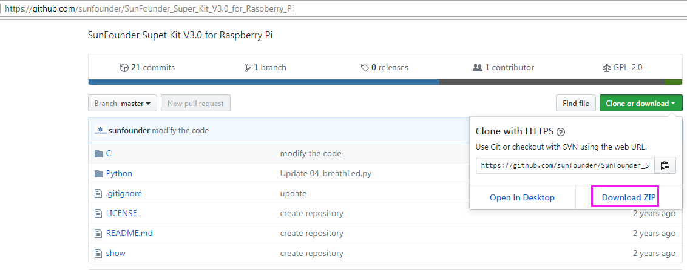

Download the Code
====================

We provide two methods for download:

**Method 1: Use git clone (Recommended)**

Log into Raspberry Pi’s console, just as previously shown.

Change directory to */home/pi*.

.. code-block::

    cd/home/pi/

.. Note::

     cd to change to the intended directory from the current path. Informally, here is to go to the path /home/pi/.

Clone the repository from GitHub.

.. code-block::

    git clone https://github.com/sunfounder/SunFounder_Super_Kit_V3.0_for_Raspberry_Pi.git

The advantage of this method is that, you can update the latest code any
time you want, using git pull under the folder.

**Method 2: Download the code.**

Download the source code from github:
https://github.com/sunfounder/SunFounder_Super_Kit_V3.0_for_Raspberry_Pi

