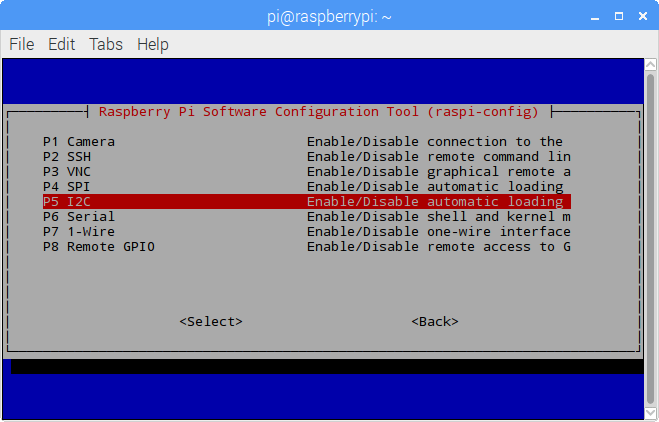

I2C Configuration
======================

**Step 1**: Enable the I2C port of your Raspberry Pi (If you have
enabled it, skip this; if you do not know whether you have done that or
not, please continue).

.. code-block::

    sudo raspi-config

**5 Interfacing options**

**P5 I2C**

**<Yes>**

.. image:: media/image209.png
   :align: center

**<Yes>**

**<Ok>**

**<Finish>**

**<Yes>** (If you do not see this page, continue to the next step)

**Step 2:** Check whether the i2c modules are loaded and active.

.. code-block::

    lsmod | grep i2c

Then the following codes will appear (the number may be different)

.. code-block::

    i2c_dev    6276 0

    i2c_bcm2708     4121 0

**Step 3:** Install i2c-tools.

.. code-block::

    sudo apt-get install i2c-tools

**Step 4:** Check the address of the I2C device.

.. code-block::

    i2cdetect -y 1      # For Raspberry Pi 2 and higher version

    i2cdetect -y 0      # For Raspberry Pi 1

    pi@raspberrypi ~ $ i2cdetect -y 1

        0  1  2  3   4  5  6  7  8  9   a  b  c  d  e  f

    00:           -- -- -- -- -- -- -- -- -- -- -- -- --

    10: -- -- -- -- -- -- -- -- -- -- -- -- -- -- -- --

    20: -- -- -- -- -- -- -- -- -- -- -- -- -- -- -- --

    30: -- -- -- -- -- -- -- -- -- -- -- -- -- -- -- --

    40: -- -- -- -- -- -- -- -- 48 -- -- -- -- -- -- --

    50: -- -- -- -- -- -- -- -- -- -- -- -- -- -- -- --

    60: -- -- -- -- -- -- -- -- -- -- -- -- -- -- -- --

    70: -- -- -- -- -- -- -- --

If there's an I2C device connected, the results will be similar as shown
above - since the address of the device is 0x48, 48 is printed.

**Step 5:**

**For C language users:** Install libi2c-dev.

.. code-block::

    sudo apt-get install libi2c-dev

**For Python users:** Install smbus for I2C.

.. code-block::

    sudo apt-get install python3-smbus