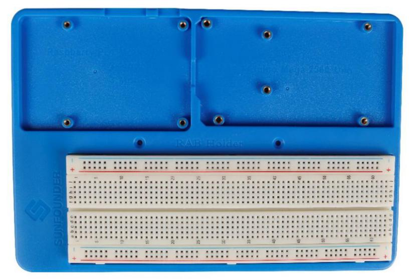
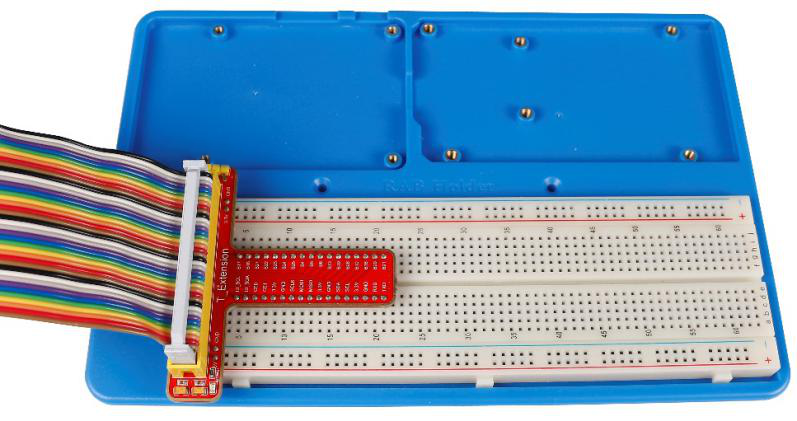
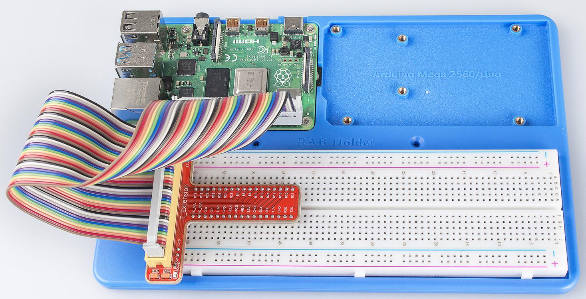
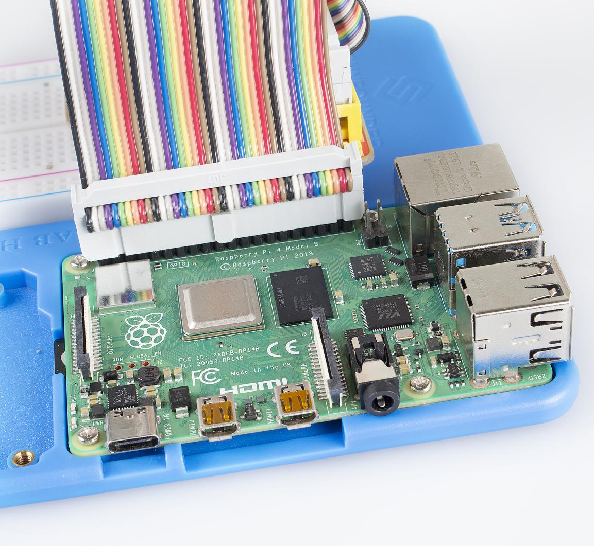

RAB Holder	
============

RAB Holder is a basic but indispensable component for your experiment.
It makes your experiment easier and can be used for fixing a bread
board, an Arduino board like Uno board or Mega2560, or a Raspberry Pi
board.

Before starting the experiment, you need to assemble the Raspberry Pi
and the breadboard on the RAB Holder first.

Remove the sticker from the back of the breadboard first, and fix the
breadboard on the RAB Holder. Pay attention to place it in such a
position as shown in the figure below, so that the 3.3V pin and 5V pin
on the T-Extension Board align with the bus strips besides the two red
lines when we insert the T-Extension Board later.

Then insert the T-Extension Board into the Breadboard, and insert the
40-pin GPIO Cable into the board.

Then place the Raspberry Pi in the holder, fasten it with M2.5x5 screws.
Since it may be a little difficult to fasten it, be careful to operate.

Pay attention to the direction when plugging in the 40-pin GPIO Cable
into the Raspberry Pi pins. The black wire at the edge should be close
to the TF card slot.

.. note::

    **DO NOT** connect them inversely, or the Raspberry Pi will be short cut!

