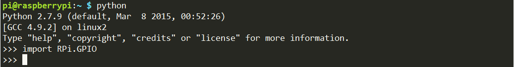
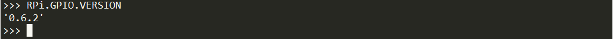

RPi.GPIO
=============

If you are a Python user, you can program GPIOs with API provided by
RPi.GPIO.

RPi.GPIO is a module to control Raspberry Pi GPIO channels. This package
provides a class to control the GPIO on a Raspberry Pi. For examples and
documents, visit
http://sourceforge.net/p/raspberry-gpio-python/wiki/Home/.

Test whether RPi.GPIO is installed or not, type in python:

.. raw:: html

    <run></run>
    
.. code-block::

    python

.. image:: media/image93.png

In Python CLI, input “import RPi.GPIO”, If no error prompts, it means
RPi.GPIO is installed.

.. raw:: html

    <run></run>
    
.. code-block::

    import RPi.GPIO

Then, type in RPi.GPIO.VERSION to check its version.

.. raw:: html

    <run></run>
    
.. code-block::

    RPi.GPIO.VERSION

If you want to quit python CLI, type in:

.. raw:: html

    <run></run>
    
.. code-block::

    exit()
    
.. image:: media/image95-1.png