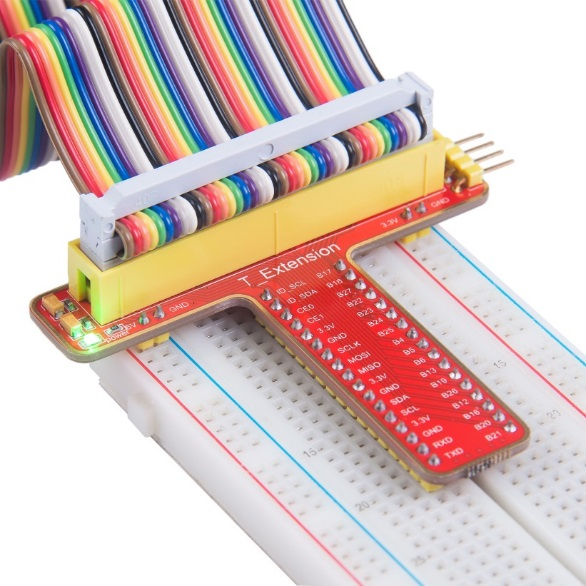
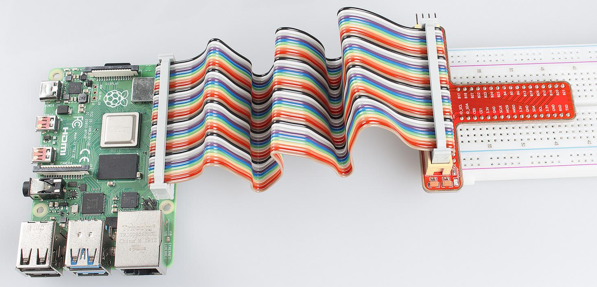

T_Extension Board
===================

The function of the extension board is to lead out pins of the Raspberry
Pi to breadboard by GPIO Extension Board to avoid GPIO damage caused by
frequent plugging in or out. For plugging convenience, we designed it in
T-shape and name it T-Shape Extension Board.

This is our 40-pin GPIO Extension Board and GPIO cable for Raspberry Pi
model B+, 2 model B, 3 model B and 4 model B.

For your better understanding of every pins, we have drawn a table for
you to know the Name, BCM and wiring pi of each pin.

