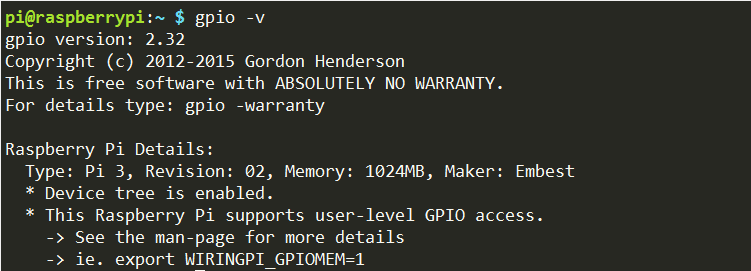
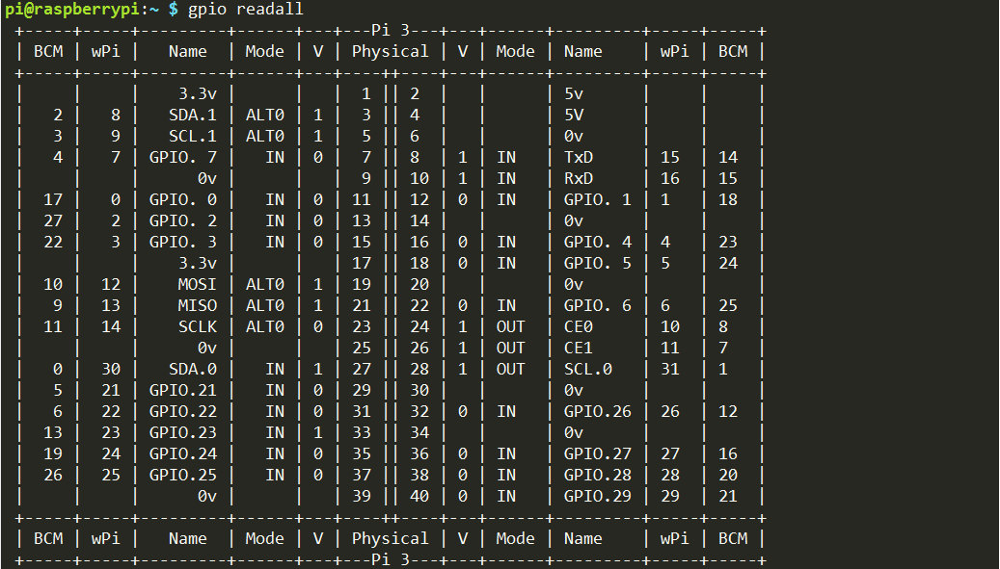

WiringPi 
============

wiringPi is a C language GPIO library applied to the Raspberry Pi
platform. It complies with GUN Lv3. The functions in wiringPi are
similar to those in the wiring system of Arduino. They enable the users
familiar with Arduino to use wiringPi more easily.

wiringPi includes lots of GPIO commands which enable you to control all
kinds of interfaces on Raspberry Pi. You can test whether the wiringPi
library is installed successfully or not by the following instructions.

.. raw:: html

    <run></run>
    
.. code-block::

    gpio -v

If the message above appears, the wiringPi is installed successfully.

.. raw:: html

    <run></run>
    
.. code-block::

    gpio readall

For more details about wiringPi, you can refer to:
http://wiringpi.com/download-and-install/.